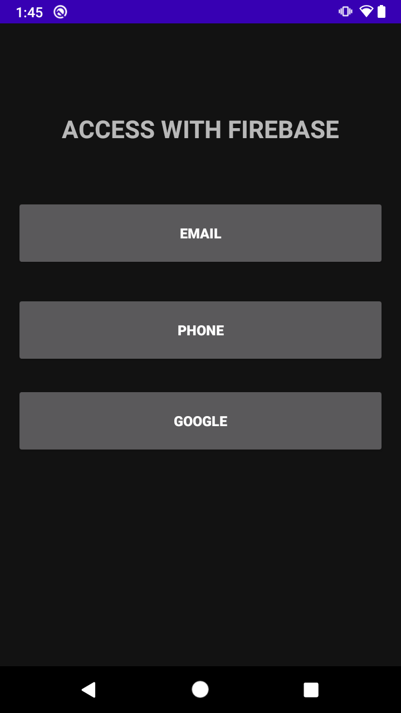
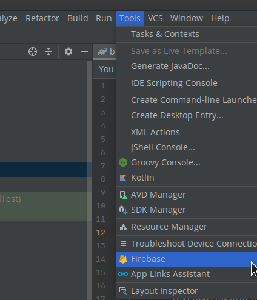
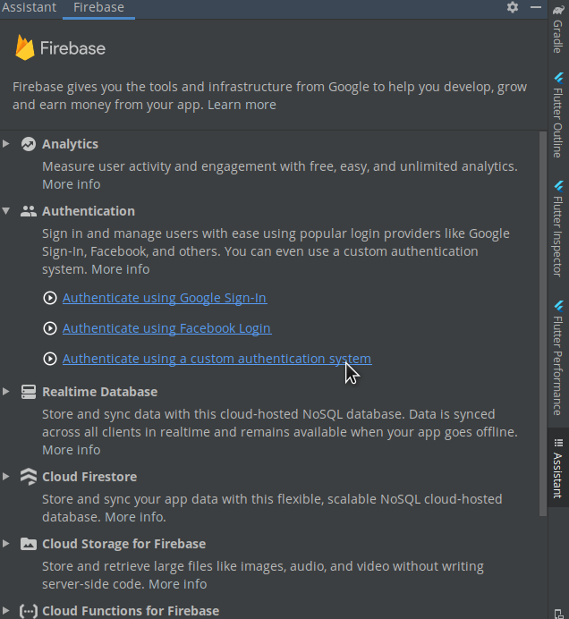
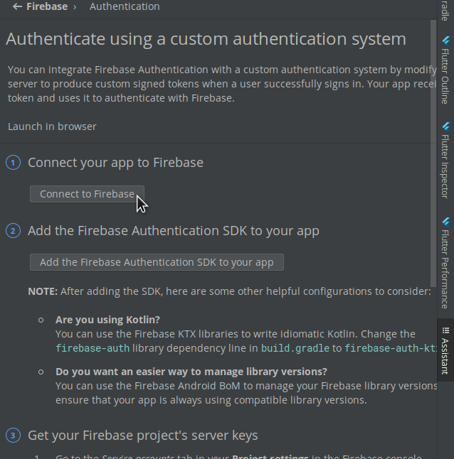
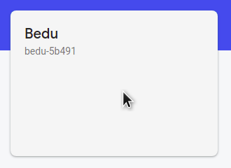
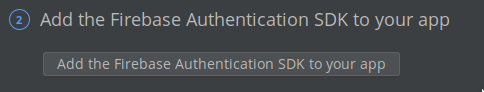
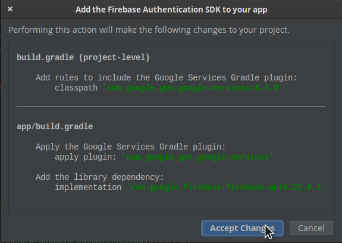

# Ejemplo 01: Implementar Firebase Authentication

## Objetivo

* Implementar y configurar Firebase Authentication en un proyecto base.

## Desarrollo

A partir de un proyecto de Android previamente creado se implementará el BaaS de Firebase Authentication para integrar sus servicios de registro e inicio de sesión.

Usaremos el [Proyecto base](./base) y le modificaremos lo que se requiera. Para hacerlo realiza los siguientes pasos:

1. Ejecutamos el proyecto base con Android Studio. Este desplegará la siguiente interfaz.

    

2. Ahora, agregaremos las librerías de Firebase. Para ello hacemos clic en la siguiente ruta: **Tools -> Firebase**

    

3. El resultado será la siguiente ventana. Es necesario identificar la opción de Authentication, hacer clic en ella, y después hacer clic en la tercera opción, enlistada como **Authentication using a custom authentication system**.

    

4. Aparecerá la siguiente ventana. Se debe hacer clic en **Connect to Firebase**. 

    

    

5. El resultado del botón abrirá el navegador. En la siguiente ventana debe seleccionarse el proyecto (el cual denominamos Bedu), y posteriormente es necesario hacer clic en **Conectar**.

    

6. Listo, hasta este paso la app ya se encuentra conectada a Firebase.

    

7. Ahora debe seguirse la ruta hasta el paso 3. Ahí debe seleccionarse **Add the Firebase Authentication SDK to your app** y luego se aceptan los cambios. 

    

    Esto Agrega *Play Services y Auth*

    

8. Ahora debemos dirigirnos a Firebase Console y activar **Authentication**.

    

¡Felicidades! Ya implementaste Firebase Authentication en tu proyecto Android.

 

[Siguiente ](../Ejemplo-02/README.md)(Ejemplo 2)
