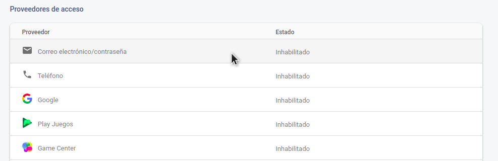
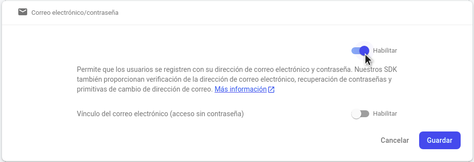
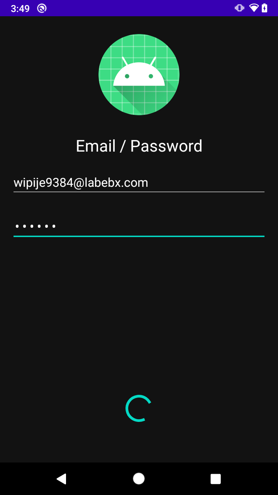
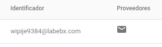

# Ejemplo 02: Registro con correo y contraseña

## Objetivo

* Operar el registro con una cuenta de correo electrónico y una contraseña mediante la conexión de la interfaz con las llamadas de Auth, y establecer la notificación al usuario con las respuestas de Auth.

## Desarrollo

A partir del proyecto de Android previamente creado se simulará la creación de una cuenta con un correo electrónico y una contraseña. 

Para hacerlo realiza los siguientes pasos:

1. Entra a Firebase Console. Dentro del menú Authentication haz clic en *Configurar el método de acceso*, como se visualiza en la siguiente imagen.

    

2. Selecciona Correo electrónico / contraseña como método de acceso.

    

3. Posteriormente es necesario habilitar el primer check, y con el segundo desactivado haremos clic en Guardar como se visualiza en la imagen siguiente.

    

4. Nos dirigiremos al Gradle del proyecto. Ahí agregamos las siguientes dependencias y después hacemos clic en **Sync Now**.

    ```kotlin
    implementation platform('com.google.firebase:firebase-bom:28.0.1')
    implementation 'com.google.firebase:firebase-auth-ktx'
    ```

5. Ahora modificamos la clase **MainActivity** de la siguiente manera.

    Inicializando FirebaseApp

    ```kotlin
    //Dentro de onCreate
    FirebaseApp.initializeApp(this)
    ```

6. Después modificamos **EmailActivity** de la siguiente manera.

    ```kotlin
    //Declaramos la variable
    private lateinit var auth: FirebaseAuth
    ```

    ```kotlin
    //Dentro de onCreate
    auth = Firebase.auth
    ```

7. En suma, agregamos la siguiente llamada a la función **createAccount** para registrar el correo y la contraseña que escribió el usuario en la interfaz.

    ```kotlin
    auth.createUserWithEmailAndPassword(email, password)
      .addOnCompleteListener(this) { task ->
          if (task.isSuccessful) {
            Log.d(TAG, "createUserWithEmail:success")
            val user = auth.currentUser
            updateUI(user, null)
          } else {
            Log.w(TAG, "createUserWithEmail:failure", task.exception)
            updateUI(null, task.exception)
          }
      }
      ```

8. Asimismo, en ambas respuestas, **(success - failure)**, llamamos a la función **updateUI**, la cual se encargará de mostrar los mensajes, así que la reemplazamos con el siguiente bloque de código.

      ```kotlin
      private fun updateUI(user: FirebaseUser?, exception: Exception?) {
        if (exception != null) {
          binding.loading.visibility = View.GONE
          binding.btnLogin.visibility = View.VISIBLE
          Utility.displaySnackBar(binding.root, exception.message.toString(), this, R.color.red)
        } else {
          Utility.displaySnackBar(binding.root, "Login was successful", this, R.color.green)
          binding.loading.visibility = View.GONE
          binding.btnLogin.visibility = View.VISIBLE
        }
      }
      ``` 

9. Es momento de ejecutar la app y registrar una cuenta, como en la siguiente imagen.

    

    Después de unos segundos deberíamos ver el siguiente mensaje en la app.

    

10. Además, verifica el registro del usuario en la pestaña users de Firebase Console. Ahí debería figurar, como en la siguiente imagen.

    

¡Felicidades! Ahora tu app puede registrar usuarios sin agregar código en el servidor.

</br>

[Siguiente ](../Reto-01/README.md)(Reto 1)