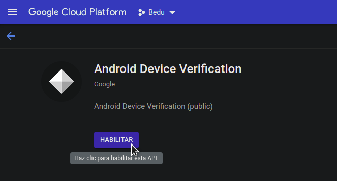
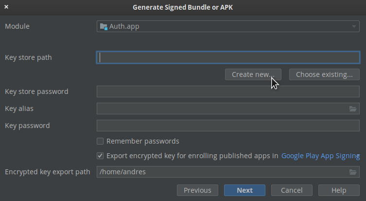
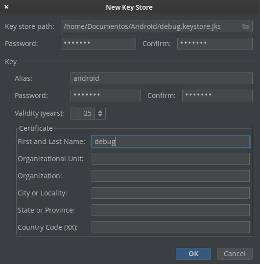
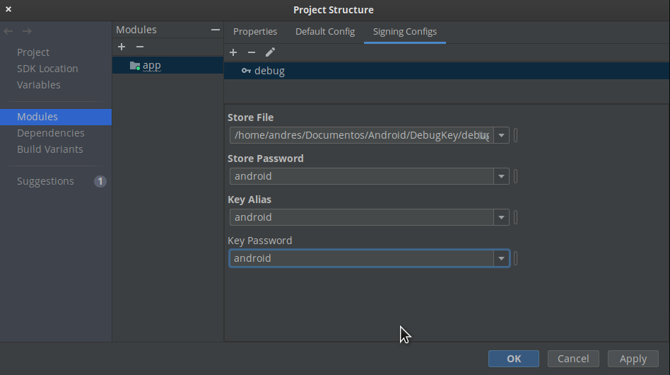
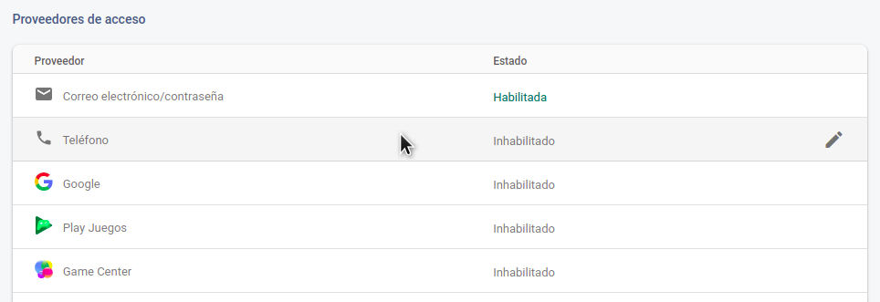
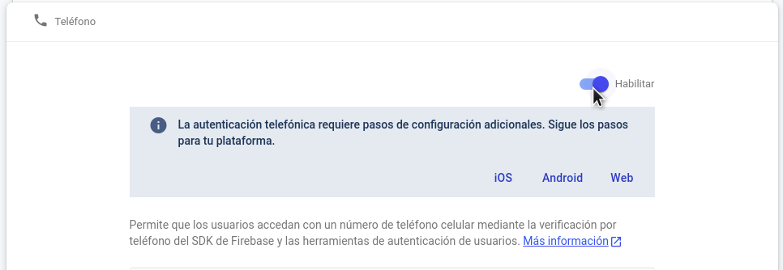
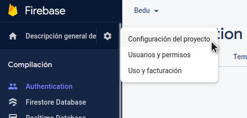
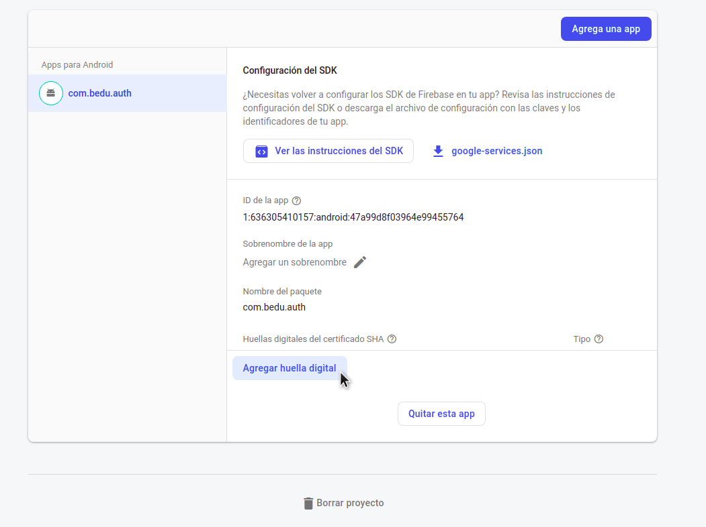
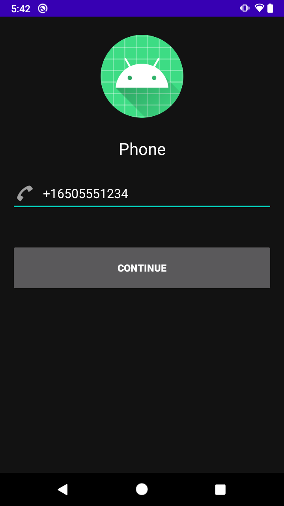
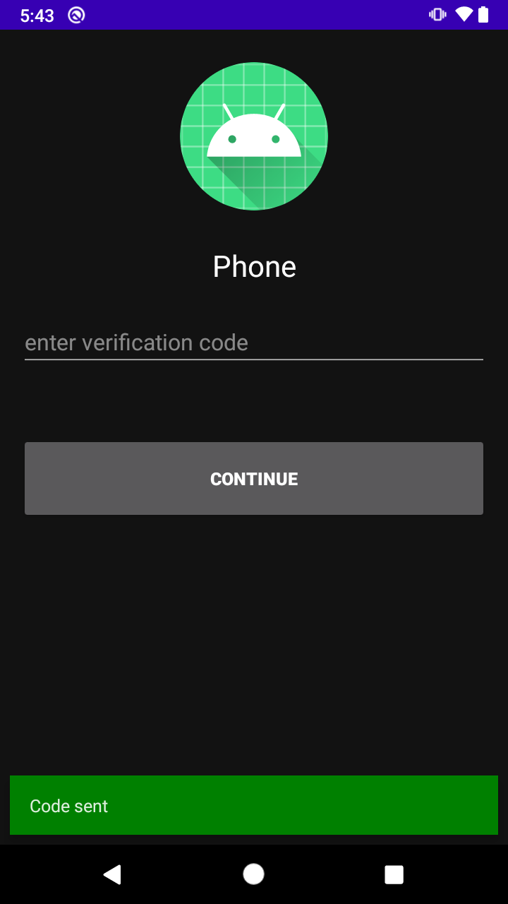

# Ejemplo 03: Acceder con número telefónico

## Objetivo

* Establecer el registro de una cuenta con número telefónico y la simulación del inicio de sesión con el mismo método.

## Desarrollo

Con las funciones de creación de usuarios y de inicio de sesión de Auth, ahora se simulará el método del número telefónico.

Para hacerlo realiza los siguientes pasos:

1. Antes de modificar el código deben generarse las huellas digitales de nuestro proyecto y activar API DeviceCheck. En **Google Cloud Console**, habilita la [API de Android DeviceCheck](https://console.cloud.google.com/apis/library/androidcheck.googleapis.com?authuser=0) en tu proyecto. Se usará la clave de API de Firebase predeterminada, y se debe tener acceso a la API de DeviceCheck. Esto se ejemplifica en la siguiente imagen.

    

2. Después, en Android Studio hacemos clic en la siguiente ruta: *Build > Generate Signed Bundle or APK*. Ahí es necesario hacer clic en *Next*, como se visualiza en la siguiente imagen.

    

3. Posteriormente, al ingresar datos de identidad se recomienda agregar la siguiente información, ya que esta llave sólo se usará para pruebas.

    **Contraseña**: android

    **Alias**: android

    **Name**: debug

    

4. Al estar creada la llave, esta tendrá el nombre de **debug.keystore.jks**. Se debe eliminar la extensión **.jks**, por lo que quedará del siguiente modo: **debug.keystore**, como se aprecia en la imagen siguiente.

    

5. Después debe hacerse clic en la siguiente ruta: File > Project Structure > Modules > app > Signing Configs y una vez dentro es necesario buscar el archivo de la llave, agregar los datos de usuario y hacer clic en OK. Este proceso se representa en la siguiente imagen.

    

6. Luego, en la pestaña de *Default Config*, en la opción de *Signing Config*, seleccionamos ***$signingConfigs.debug***. Después debe hacerse clic en OK, como se visualiza en la imagen.

     

    Esto agrega la siguiente línea en el gradle

    ```kotlin
    signingConfigs {
      debug {
        storeFile file('/home/andres/Documentos/Android/DebugKey/debug.keystore')
        storePassword 'android'
        keyAlias 'android'
      }
    }
    ```

7. Así, para generar la huella ejecutamos la siguiente línea en la terminal.

    ```hash
    /opt/android-studio/jre/bin/keytool -list -v -keystore /home/andres/Documentos/Android/DebugKey/debug.keystore -alias android -storepass android -keypass android
    ```

    > Pro-tip: la primera parte es la ruta donde está instalado **keytool**, luego la ruta donde está la llave, y después los datos de ésta.

    La salida esperada es:

    

    > Pro-tip: guarda la clave SHA1 y SHA256.

8. Ahora, configuraremos el método de acceso en Firebase Console. En el menú Authentication debe hacerse clic en la pestaña  *Sign-in method* y habilitarse *Teléfono*. 

    

9. Debe hacerse clic para habilitar el check, como se visualiza en la imagen.

    

    Este método requiere unos pasos extra de configuración, ya que la verificación trabaja de dos maneras. Estas formas se explicaron como último subtema en tu Prework. 

10. Es necesario agregar las huellas digitales de nuestra app. Para ello primero se debe dirigir hacia la configuración del proyecto en Firebase.

    

    Al final de la configuración figura un botón para *Agregar las huellas*, como se aprecia en la imagen siguiente.

    

11. Deben agregarse las dos huellas generadas, y el resultado debe ser el siguiente.

    

12. Una vez configuradas las huellas es necesario dirigirse al código. Se modificará **PhoneActivity** de la siguiente manera.

    ```kotlin
    //Declaramos las variables
    private lateinit var auth: FirebaseAuth

    private var storedVerificationId: String? = ""
    private lateinit var resendToken: PhoneAuthProvider.ForceResendingToken
    private lateinit var callbacks: PhoneAuthProvider.OnVerificationStateChangedCallbacks
    ```

    ```kotlin
    //Dentro de onCreate
    auth = Firebase.auth
    ```

13. Después, en el clic del botón deben enviarse las variables declaradas, como se presenta a continuación.

    ```kotlin
    ...
    resendVerificationCode(phone, resendToken)
    ...
    storedVerificationId?.let { it1 -> verifyPhoneNumberWithCode(it1, code) }
    ...
    ```
14. Después se agrega el callback de *responses* de la siguiente forma.

    ```kotlin
    callbacks = object : PhoneAuthProvider.OnVerificationStateChangedCallbacks() {

      override fun onVerificationCompleted(credential: PhoneAuthCredential) {
        Log.d(TAG, "onVerificationCompleted:$credential")
        signInWithPhoneAuthCredential(credential)
      }

      override fun onVerificationFailed(e: FirebaseException) {
        Log.w(TAG, "onVerificationFailed", e)

        binding.edtPhone.visibility = View.VISIBLE
        binding.btnContinue.visibility = View.VISIBLE
        binding.loading.visibility = View.GONE

        when (e) {
          is FirebaseAuthInvalidCredentialsException -> {
            // Invalid request
            Utility.displaySnackBar(
              binding.root,
              "Invalid request",
              this@PhoneActivity,
              R.color.red
            )
          }
          is FirebaseTooManyRequestsException -> {
            // The SMS quota for the project has been exceeded
            Utility.displaySnackBar(
              binding.root,
              "The SMS quota for the project has been exceeded",
              this@PhoneActivity,
              R.color.red
            )
          }
          else -> {
            Utility.displaySnackBar(
              binding.root,
              e.message.toString(),
              this@PhoneActivity,
              R.color.red
            )
          }
        }
      }

      override fun onCodeSent(
        verificationId: String,
        token: PhoneAuthProvider.ForceResendingToken
      ) {
        Log.d(TAG, "onCodeSent:$verificationId")

        binding.btnContinue.visibility = View.VISIBLE
        binding.edtCode.visibility = View.VISIBLE
        binding.loading.visibility = View.GONE

        Utility.displaySnackBar(
          binding.root,
          "Code sent",
          this@PhoneActivity,
          R.color.green
        )

        storedVerificationId = verificationId
        resendToken = token
      }
    }
    ```

15. Posteriormente se cambia el tipo de variable para token en la función *resendVerificationCode*, como en el siguiente código.

    ```Kotlin
    token: PhoneAuthProvider.ForceResendingToken?
    ```

16. Luego modificamos la función *startPhoneNumberVerification*  con el siguiente código:

    ```Kotlin
    val options = PhoneAuthOptions.newBuilder(auth)
      .setPhoneNumber(phoneNumber)       // Phone number to verify
      .setTimeout(60L, TimeUnit.SECONDS) // Timeout and unit
      .setActivity(this)                 // Activity (for callback binding)
      .setCallbacks(callbacks)          // OnVerificationStateChangedCallbacks
      .build()
    PhoneAuthProvider.verifyPhoneNumber(options)
    ```

17. En este paso se agrega la siguiente función para validar las credenciales: **createAccount**, como de la siguiente forma.

    ```kotlin
    private fun signInWithPhoneAuthCredential(credential: PhoneAuthCredential) {
      auth.signInWithCredential(credential)
        .addOnCompleteListener(this) { task ->
          if (task.isSuccessful) {
            // Sign in success, update UI with the signed-in user's information
            Log.d(TAG, "signInWithCredential:success")

            val user = task.result?.user
            updateUI(user, null)
          } else {
            // Sign in failed, display a message and update the UI
            Log.w(TAG, "signInWithCredential:failure", task.exception)
            if (task.exception is FirebaseAuthInvalidCredentialsException) {
              // The verification code entered was invalid

              binding.loading.visibility = View.GONE
              binding.btnContinue.visibility = View.VISIBLE
              binding.btnContinue.text = "Resend code"

              Utility.displaySnackBar(
                  binding.root,
                  "The verification code entered was invalid",
                  this@PhoneActivity,
                  R.color.red
              )
            } else {
                task.exception?.let { updateUI(null, it) }
            }
              // Update UI
            }
          }
    }
      ```

18. Asimismo, en ambas respuestas, *(success - failure)*, llamamos a la función *updateUI*, la cual se encargará de mostrar los mensajes, así que la reemplazamos con el siguiente bloque de código.

      ```kotlin
      private fun updateUI(user: FirebaseUser?, exception: Exception?) {
        binding.edtPhone.visibility = View.VISIBLE
        if (exception != null) {
          binding.loading.visibility = View.GONE
          binding.btnContinue.visibility = View.VISIBLE
          Utility.displaySnackBar(binding.root, exception.message.toString(), this, R.color.red)
        } else {
          Utility.displaySnackBar(binding.root, "Login was successful", this, R.color.green)
          binding.loading.visibility = View.GONE
          binding.btnContinue.visibility = View.VISIBLE
        }
      }
      ``` 

19. Ahora debe ejecutarse la app con un número telefónico, como se aprecia en la imagen.

    

20. La respuesta después de unos segundos debería ser la siguiente pantalla.

    

    Además, si utilizaste tu número de teléfono deberías de recibir un mensaje de texto con el código.

¡Felicidades! Ahora tu app puede enviar códigos de verificación.
El siguiente reto te espera con el logro de validar el código y concluir el registro.


</br>

[Siguiente ](../Reto-02/README.md)(Reto 2)