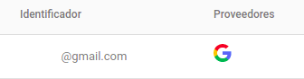
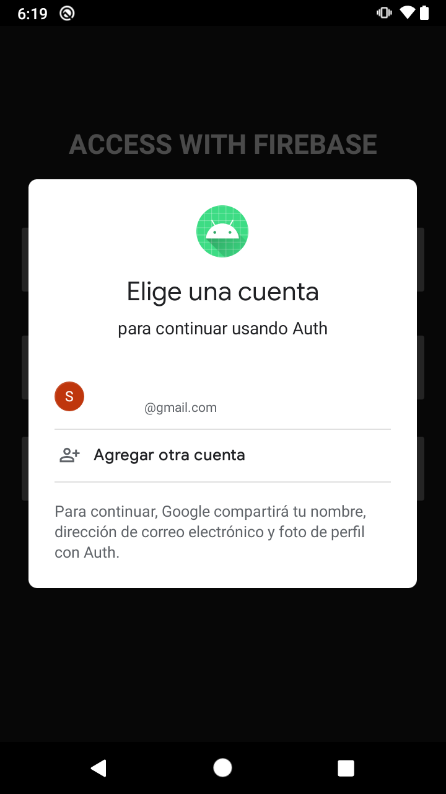

# Postwork 1 - Firebase Authentication - Simplifica el registro e inicio de sesión

## Objetivo

* Establecer el inicio de sesión en la app mediante una cuenta de Google.
* Simular el inicio de sesión con el método de autenticación de la cuenta de Google.

## Desarrollo

En los ejemplos de esta sesión aprendimos a iniciar sesión y registrar usuarios sin agregar código del lado del servidor. Para el Postwork 01 queremos poner en práctica lo aprendido. 

El proyecto base tiene el botón de Google. Al hacer clic sobre él, este debe permitir iniciar sesión con algún correo de Google. Te recomendamos apoyarte con la documentación oficial.

[Haz clic aquí para consultar la documentación.](https://firebase.google.com/docs/auth/android/google-signin)

### Indicaciones generales:
- Habilita el inicio por Google desde Firebase Console previo a la edición de código.
- Establece la siguiente dependencia: 
*Implementation 'com.google.android.gms:play-services-auth:19.0.0'*
Es posible hacer la implementación en el *MainActivity*
- Al final ejecuta la app e inicia sesión con la cuenta de Google. Para concluir verifica que tu correo de login esté en el panel de usuarios en Firebase Console, como se aprecia en la siguiente imagen. 

#### A continuación se muestra una propuesta de flujo:




</br>


<details>
  <summary>Solución</summary>
    
  ```kotlin
  // Variables
  private lateinit var auth: FirebaseAuth

  private lateinit var googleSignInClient: GoogleSignInClient
  ```

  ```kotlin
  // Dentro de onCreate
  FirebaseApp.initializeApp(this)

  val gso = GoogleSignInOptions.Builder(GoogleSignInOptions.DEFAULT_SIGN_IN)
      .requestIdToken(getString(R.string.default_web_client_id))
      .requestEmail()
      .build()

  googleSignInClient = GoogleSignIn.getClient(this, gso)

  auth = Firebase.auth
  ```

  ```kotlin
  // onClick btnGoogle
  binding.btnGoogle.setOnClickListener {
    val signInIntent = googleSignInClient.signInIntent
    startActivityForResult(signInIntent, RC_SIGN_IN)
  }
  ```

  ```kotlin
  // Funciones nuevas
  override fun onActivityResult(requestCode: Int, resultCode: Int, data: Intent?) {
        super.onActivityResult(requestCode, resultCode, data)

        // Result returned from launching the Intent from GoogleSignInApi.getSignInIntent(...);
        if (requestCode == RC_SIGN_IN) {
            val task = GoogleSignIn.getSignedInAccountFromIntent(data)
            try {
                // Google Sign In was successful, authenticate with Firebase
                val account = task.getResult(ApiException::class.java)!!
                Log.d(TAG, "firebaseAuthWithGoogle:" + account.id)
                firebaseAuthWithGoogle(account.idToken!!)
            } catch (e: ApiException) {
                // Google Sign In failed, update UI appropriately
                Log.w(TAG, "Google sign in failed", e)
                Utility.displaySnackBar(binding.root, "Google sign in failed", this, R.color.red)
            }
        }
    }

    private fun firebaseAuthWithGoogle(idToken: String) {
      val credential = GoogleAuthProvider.getCredential(idToken, null)
      auth.signInWithCredential(credential)
        .addOnCompleteListener(this) { task ->
          if (task.isSuccessful) {
            // Sign in success, update UI with the signed-in user's information
            Log.d(TAG, "signInWithCredential:success")
            val user = auth.currentUser
            updateUI(user, null)
          } else {
            // If sign in fails, display a message to the user.
            Log.w(TAG, "signInWithCredential:failure", task.exception)
            updateUI(null, task.exception)
          }
        }
    }

    private fun updateUI(user: FirebaseUser?, exception: Exception?) {
      binding.btnGoogle.visibility = View.VISIBLE
      if (exception != null) {
        binding.loading.visibility = View.GONE
        binding.btnGoogle.visibility = View.VISIBLE
        Utility.displaySnackBar(binding.root, exception.message.toString(), this, R.color.red)
      } else {
        Utility.displaySnackBar(binding.root, "Login was successful: ", this, R.color.green)
        binding.loading.visibility = View.GONE
        binding.btnGoogle.visibility = View.VISIBLE
      }
    }
  ```

  Ejecuta la app e inicia con Google, al final deberías de ver tu correo en el panel de usuarios en Firebase Console

</details>

</br>
</br>

[Regresar ](../README.md)(Sesión 01)

[Siguiente ](../../Sesion-02/README.md)(Sesión 02)

