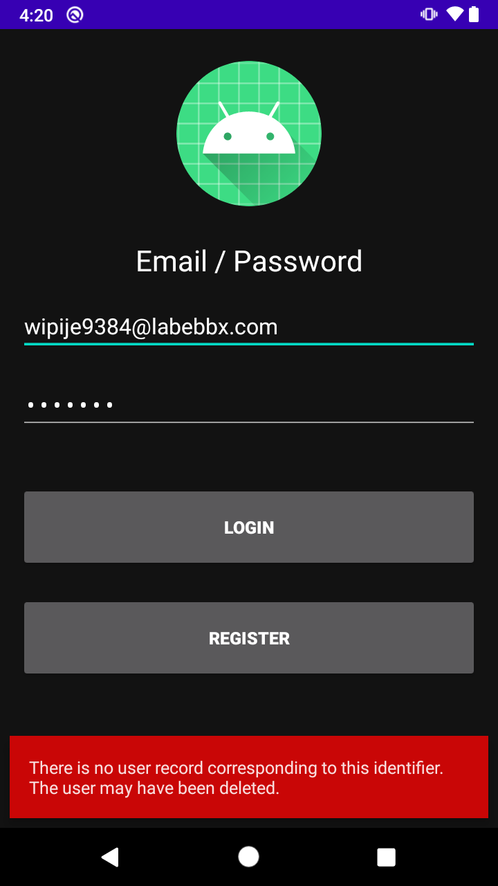
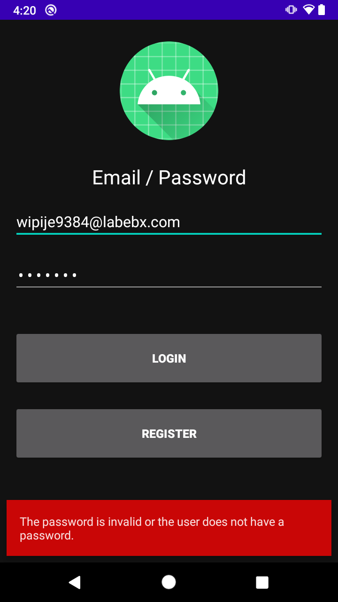
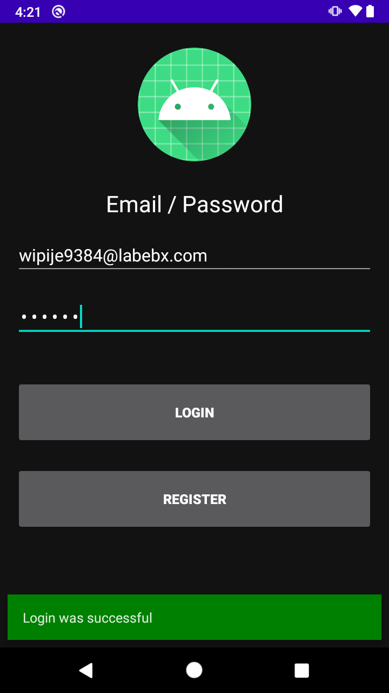

# Reto 01: Iniciar sesión

## Objetivo

* Implementar el inicio de sesión en el proyecto Android y simularlo con respuestas de mensajes de registro no encontrado, contraseña errónea y bienvenido.

## Desarrollo

En el ejemplo 2 se agregó la función para crear usuarios, por lo que ahora se implementará el inicio de sesión y se simulará con todos los escenarios de respuesta.

Para hacerlo realiza los siguientes pasos:

1. Agregar inicio de sesión con Auth. Para ello ve a la clase EmailActivity y modifica la función signIn. El código es muy similar a la función createAccount, debe cambiarse de *createUserWithEmailAndPassword* a *signInWithEmailAndPassword*.

Los resultados esperados deben ser similares a los de las siguientes imágenes.








</br>

<details>
    <summary>Solución</summary>
    
```kotlin
private fun signIn(email: String, password: String) {
  auth.signInWithEmailAndPassword(email, password)
    .addOnCompleteListener(this) { task ->
      if (task.isSuccessful) {
        Log.d(TAG, "signInWithEmail:success")
        val user = auth.currentUser
        updateUI(user, null)
      } else {
        Log.w(TAG, "signInWithEmail:failure", task.exception)
        task.exception?.let { updateUI(null, it) }
      }
    }
}
```
</details>

</br>

> Las llamadas a Firebase retornan excepciones, y por eso no fue necesario agregar los mensajes de manera manual **task.exception**.


</br>

[Siguiente ](../Ejemplo-03/README.md)(Ejemplo 3)