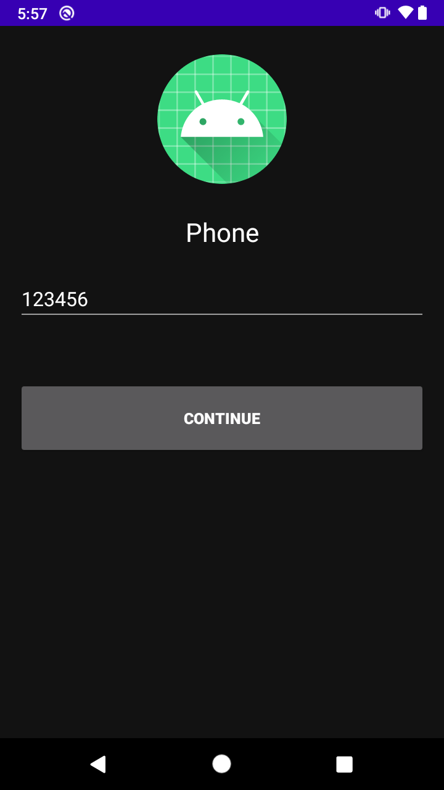
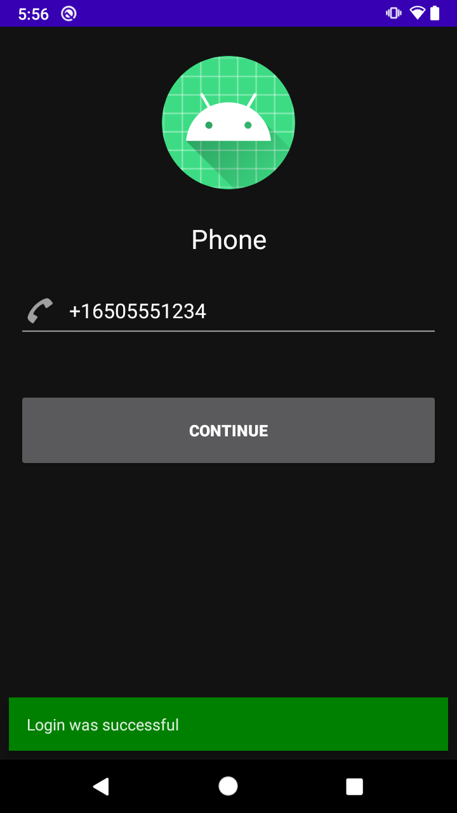
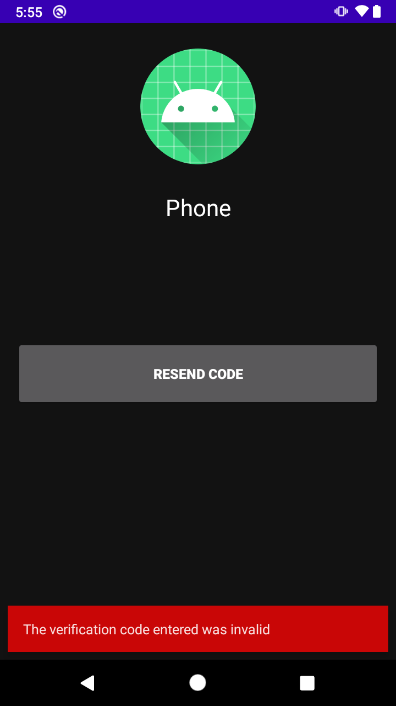
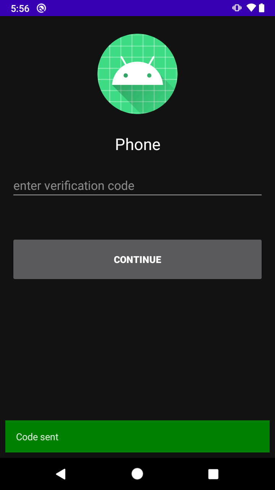

# Reto  02: Verificar y reenviar código

## Objetivo

* Operar el registro de una cuenta con número telefónico y la simulación del inicio de sesión con el mismo método mediante la validación del código de Auth y/o con la solicitud de un código nuevo.

## Desarrollo

En el ejemplo 3 solicitamos el código para registrar un usuario con el número telefónico y ahora se concluirá el registro de manera satisfactoria y se simulará este método.
Para hacerlo realiza los siguientes pasos:

1. Crear PhoneAuthProvider con el código de verificación y el code que se recibió vía SMS. Después solicitar la comprobación con la función **signInWithPhoneAuthCredential**, y el resto lo hará *updateUI*.

    > Para ello se debe crear Provider > PhoneAuthProvider.getCredential(verificationId, userCode)

    Los resultados esperados deben ser similares a los siguientes:

    

    

    </br>

    <details>
      <summary>Solución</summary>
        
      ```kotlin
      private fun verifyPhoneNumberWithCode(verificationId: String, code: String) {
        val credential = PhoneAuthProvider.getCredential(verificationId, code)
        signInWithPhoneAuthCredential(credential)
      }
      ```
    </details>

  </br>

</br>

2. Si el código expiró o está mal escrito es necesario agregar una acción al botón actual para solicitar un nuevo código. para ello se debe agregar la petición en la función **resendVerificationCode**.

    > Pro-tip: Esta llamada es muy similar a **startPhoneNumberVerification**.

    Los resultados esperados deben ser similares a los siguientes:

    

    

    

    </br>

    <details>
      <summary>Solución</summary>
        
      ```kotlin
      private fun resendVerificationCode(
        phoneNumber: String,
        token: PhoneAuthProvider.ForceResendingToken?
      ) {
        val optionsBuilder = PhoneAuthOptions.newBuilder(auth)
          .setPhoneNumber(phoneNumber)       // Phone number to verify
          .setTimeout(60L, TimeUnit.SECONDS) // Timeout and unit
          .setActivity(this)                 // Activity (for callback binding)
          .setCallbacks(callbacks)          // OnVerificationStateChangedCallbacks
        if (token != null) {
          optionsBuilder.setForceResendingToken(token) // callback's ForceResendingToken
        }
        PhoneAuthProvider.verifyPhoneNumber(optionsBuilder.build())
      }
      ```
    </details>

    </br>

3. El último paso es la comprobación de que el registro fue correcto, como se aprecia en la siguiente imagen.

    

</br>
</br>

[Siguiente ](../Postwork/README.md)(Postwork)

