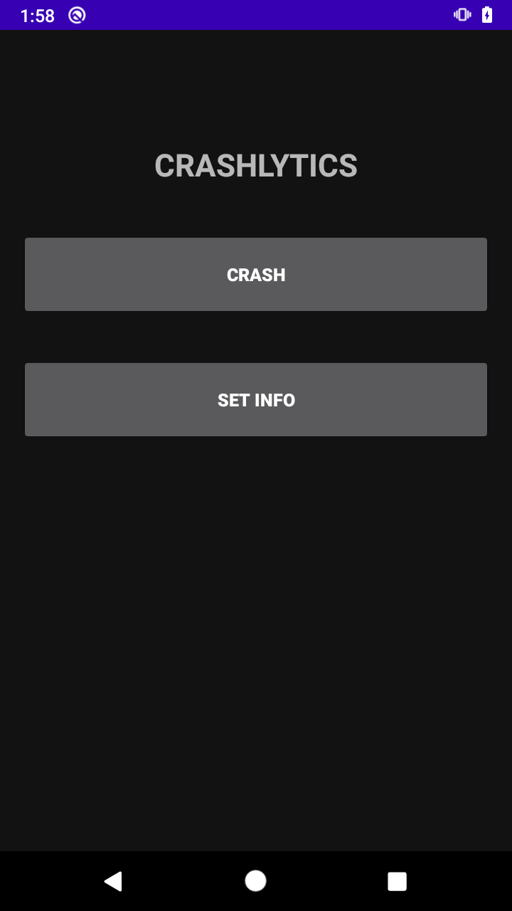
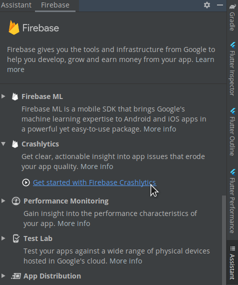
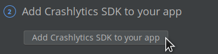
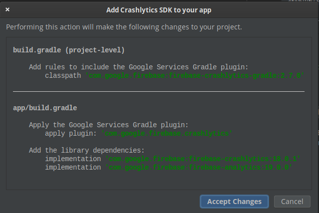
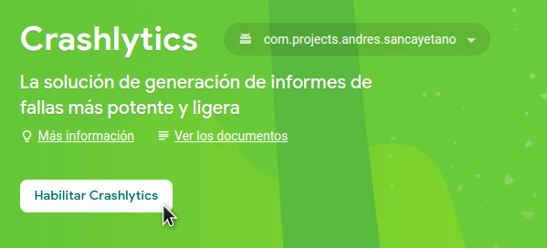

# Ejemplo 01: Implementar Firebase Crashlytics

## Objetivo

* Implementar y configurar Firebase Crashlytics en un proyecto base.

## Desarrollo

A partir de un proyecto de Android previamente creado se implementará el BaaS de Firebase Crashlytics para integrar sus servicios de gestión de errores.

Usaremos el [Proyecto base](./base) y le modificaremos lo que se requiera. Para hacerlo realiza los siguientes pasos:

1. Ejecutamos el proyecto base con Android Studio. Este desplegará la siguiente interfaz.

    

2. Ahora, agregaremos las librerías de Firebase. Para ello hacemos clic en la siguiente ruta: *Tools > Firebase*.

    

3. El resultado será la siguiente ventana. Es necesario identificar la opción de Crashlytics, hacer clic en ella, y después hacer clic en la primer opción, enlistada como *Get started with Firebase Crashlytics*.

    

    El proyecto debería estar conectado, ya que fue utilizado con firebase en la sesión anterior. 
    Nota: Si el proyecto no está conectado es necesario dirigirse al Ejemplo 1 del Work 1. Ahí se explica cómo conectarlo. 

    [Haz clic aquí para consultar el Ejemplo 1 del Work 1](https://github.com/beduExpert/Android-Avanzado-2021/tree/main/Sesion-01/Ejemplo-01)

4. Ahora debe ejecutarse el paso 2 *Add Crashlytics SDK to your app*, como se aprecia en la imagen.

    

    Esta acción agrega *crashlytics y analytics* al gradle.

5. Posteriormente, es necesario hacer clic en el botón de aceptar los cambios. 

    

6. Ahora debemos dirigirnos a Firebase Console y habilitar *Crashlytics*, como se visualiza en la siguiente imagen.

    

¡Felicidades! Ya implementaste Firebase Crashlytics en tu proyecto Android.

 

[Siguiente ](../Ejemplo-02/README.md)(Ejemplo 2)