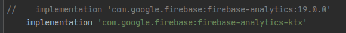
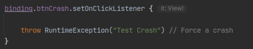
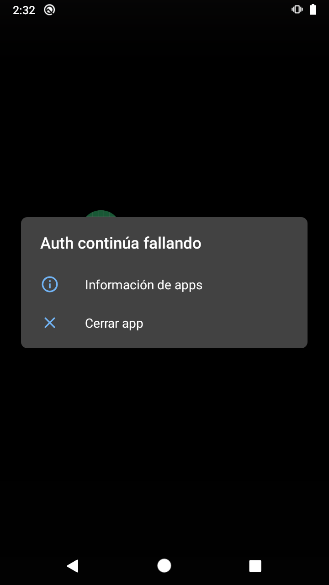

# Ejemplo 02: Provocar un error controlado

## Objetivo

- Producir un error en la app Android.
- Enviar el error generado en la Firebase Console Crashlytics.

## Desarrollo

A partir del proyecto de Android previamente creado se producirá un error desde un botón, provocando el cierre inesperado de la app para consultarlo en Crashlytics.

Para hacerlo realiza los siguientes pasos:

1. El asistente de Firebase en Android Studio importó la dependencia de analytics. Esta dependencia está en JAVA, y es posible trabajar con ella gracias a la interoperabilidad entre Java y Kotlin, pero Analytics está disponible en Kotlin, así que se recomienda implementarla en dicho lenguaje. Para ello es necesario entrar al Gradle, comentar la de JAVA y agregar la de Kotlin. El resultado debe ser el apreciado en la siguiente imagen.

    

    ```kotlin
    //    implementation 'com.google.firebase:firebase-analytics:19.0.0'
    implementation 'com.google.firebase:firebase-analytics-ktx'
    ``` 
2. Dentro del código debe abrirse la clase MainActivity del proyecto base, y debe agregarse el crash dentro del evento del botón btnCrash, como se observa en la siguiente imagen.

    

    ```kotlin
    binding.btnCrash.setOnClickListener {
      throw RuntimeException("Test Crash") // Force a crash
    }
    ```

3. Posteriormente, ejecutamos el proyecto y hacemos clic en el botón CRASH.

    

    El resultado será un cierre inesperado de la app.


</br>

[Siguiente ](../Reto-01/README.md)(Reto 1)