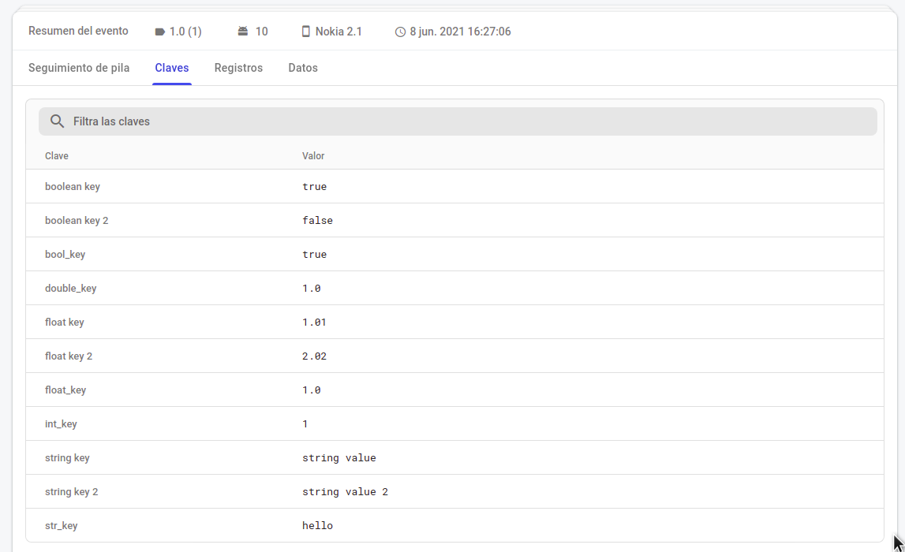
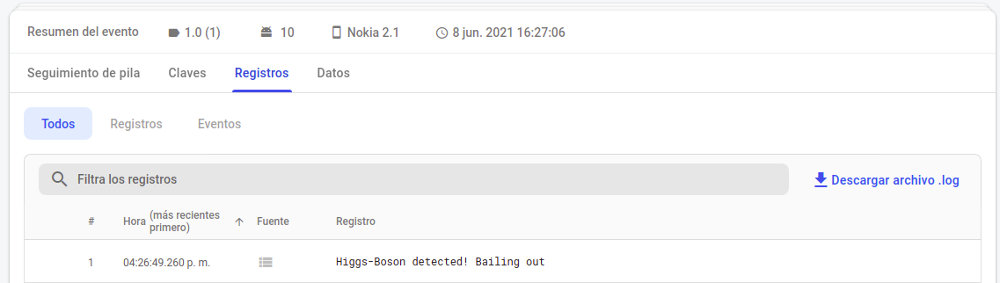

# Ejemplo 03: Funciones avanzadas

## Objetivo

- Implementar customKeys, envío de más información de errores controlados y registro de información de usuario para la gestión de errores en Crashlytics.

## Desarrollo

Ahora agregaremos más información a Crashlytics para tener más datos que ayuden a resolver los casos de errores mediante la gestión de bugs. 

Para hacerlo realiza los siguientes pasos:

1. Las customKeys son variables que podemos enviar a Crashlytics para saber qué datos estaban cargados antes del error. Por ejemplo: si el crash fue provocado en el carrito de compra, es posible asignar los productos y cantidades que tenía agregadas. 

    El primer paso en enviar customKeys. Nuestra app tiene un segundo botón que dice SET INFO; este se encargará de agregar la información. Para ello debe agregarse el siguiente código dentro del setOnClickListener: 

    ```kotlin
    // Set a key to a string.            
    FirebaseCrashlytics.getInstance().setCustomKey("str_key", "hello")

    // Set a key to a boolean.
    FirebaseCrashlytics.getInstance().setCustomKey("bool_key", true)

    // Set a key to an int.
    FirebaseCrashlytics.getInstance().setCustomKey("int_key", 1)

    // Set a key to an long.
    FirebaseCrashlytics.getInstance().setCustomKey("int_key", 1L)

    // Set a key to a float.
    FirebaseCrashlytics.getInstance().setCustomKey("float_key", 1.0f)

    // Set a key to a double.
    FirebaseCrashlytics.getInstance().setCustomKey("double_key", 1.0)
    ```

2. Posteriormente compilamos la app y hacemos clic en SET INFO, y después en CRASH. La aplicación se detendrá.

3. Ahora es necesario dirigirse a Firebase Console Crashlytics y revisar el error. Este debería tener las customKeys en la pestaña de claves, como se aprecia en la siguiente imagen.

    

4. Hay otra forma de agregar los customKeys que permite agregarlas todas juntas. La diferencia con la expuesta en el paso 1 es que en dicho proceso debe agregarse una por una. Para enviarlas en una sola llamada agregamos el siguiente código en el mismo botón de setOnClickListener.

    ```kotlin
    FirebaseCrashlytics.getInstance().setCustomKeys(CustomKeysAndValues.Builder()
      .putString("string key", "string value")
      .putString("string key 2", "string  value 2")
      .putBoolean("boolean key", true)
      .putBoolean("boolean key 2", false)
      .putFloat("float key", 1.01f)
      .putFloat("float key 2", 2.02f)
      .build())
    ```

5. Posteriormente compilamos la app y hacemos clic en SET INFO, y después en CRASH. La aplicación se detendrá y es necesario dirigirse a la pestaña de claves en Crashlytics.

6. Ahora se registrará más información del usuario para el seguimiento de errores con los logs. Para ello agregamos la siguiente línea de código dentro del mismo evento.

    ```kotlin
    FirebaseCrashlytics.getInstance().log("Higgs-Boson detected! Bailing out")
    ```

7. Es posible agregar el userId y así averiguar más información. Para hacerlo se agrega la siguiente línea de código.

    ```kotlin
    FirebaseCrashlytics.getInstance().setUserId("12345")
    ```

8. Por último debe ejecutarse el proyecto, repetimos la operación de clic en SET INFO y en CRASH, dirigirse a Firebase, y ahí podrá visualizarse la información como en las siguientes pantallas.

    

    

Así es posible consultar información del usuario y el ID, que corresponde al enviado en el código.

¡Felicidades! Ahora tu app puede enviar información importante para la gestión de errores con Crashlytics.
El siguiente reto te espera con el logro de gestionar y tipificar los errores.

</br>

[Siguiente ](../Reto-02/README.md)(Reto 2)