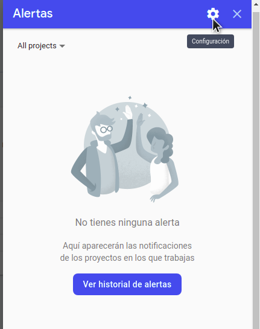
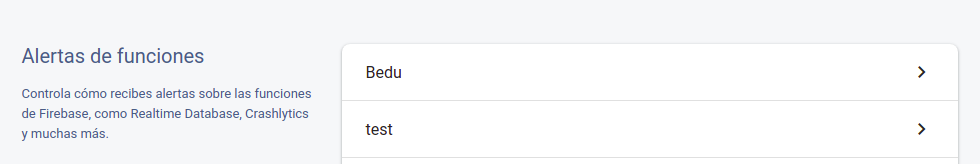
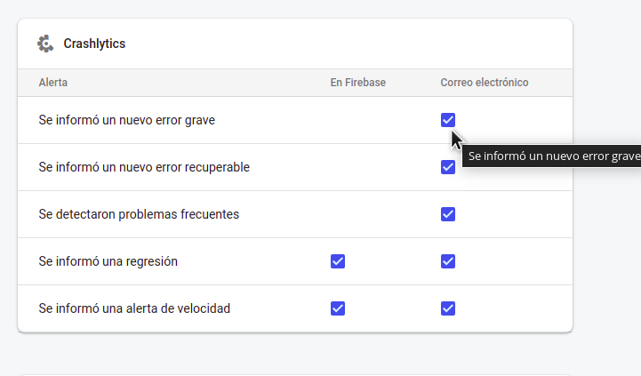
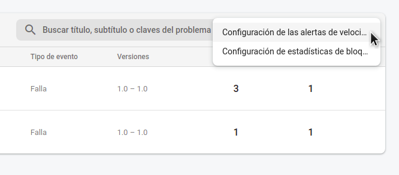

# Postwork 2 - Firebase Crashlytics - Reportes y seguimiento a errores

## Objetivo

- Habilitar notificaciones de errores en la app desde Firebase.
- Configurar alertas de velocidad y datos de fallos de la app desde Firebase.
- Configurar los informes de errores manual y automáticos desde Crashlytics.

## Desarrollo

En los ejemplos de esta sesión aprendimos a reconocer y gestionar los errores desde la consola de Firebase. Para el Postwork 02 queremos complementar lo aprendido.

### Crashlytics tiene la posibilidad de:
- Notificarnos por correo cuando se genera un error en la app.
- Notificar cuando un problema individual genera otro urgente en una versión de la app.
- Enviar todos los errores que se generen o solo enviarlos en algunas secciones de la app.

### Indicaciones generales:
1. Habilita en Crashlytics el envío de correos cuando se produzcan errores.
    - Tip: en la parte superior derecha está el icono de notificaciones.
2. Configura las alertas de velocidad, para recibir alertas cuando el error representa el 0.8% de las sesiones de los usuarios.
    - Tip: en el menú de problemas puedes encontrar la opción para esta configuración.
3. Configura tu proyecto para que sólo el MainActivity envíe los errores a Crashlytics.
    - Tip: consulta la documentación para personalizar los informes de fallas. [Haz clic aquí para consultar la documentación.](https://firebase.google.com/docs/crashlytics/customize-crash-reports?hl=es-419&platform=android#enable-reporting)

</br>

<details>
  <summary>Solución 1</summary>

  - Clic en la campana “Parte superior derecha del Dashboard de Crashlytics”.

    
  
  - Clic en el engranaje de configuración.
  
    

  - Selecciona tu proyecto.

    

  - Busca la sección de Crashlytics y habilita los check de Correo electrónico.
  - Genera un nuevo error en la app; tiene que ser diferente a los enviados antes y se le puede cambiar el texto.
  - Así, debe recibirse un correo con el error generado.

    

    

</details>

</br>

<details>
    <summary>Solución 2</summary>

- Las Alertas de velocidad y Configuración de datos de fallos se encuentran en el menú de la tabla de Problemas.
- Al hacer clic despliega el siguiente menú y se selecciona la primer opción: Configuración de las alertas de velocidad.

  

- En el siguiente modal puedes configurar el porcentaje permitido para el rango de tolerancia a incidencias repetidas por un periodo de tiempo.

  

- La configuración de fallos está en la segunda opción del menú. Esta opción sirve para compartir la información de los crashes de tu app.

  

</details>

</br>

<details>
    <summary>Solución 3</summary>

- Para no admitir la configuración automática, en el bloque application del archivo AndroidManifest.xml, agrega una etiqueta meta-data para desactivar la recopilación automática:

```xml
<meta-data
android:name="firebase_crashlytics_collection_enabled"
android:value="false" />
```

- Habilita la recopilación para usuarios específicos llamando a la anulación de recopilación de datos de Crashlytics durante el tiempo de ejecución.

El valor de anulación persiste en todos los lanzamientos de tu app para que Crashlytics pueda recopilar informes automáticamente. Si quieres inhabilitar los informes automáticos de fallas, pasa false como el valor de anulación. Cuando se configura en false, el valor nuevo no se aplica hasta la próxima ejecución de la app.

- Agrega el siguiente código en el método onCreate de tus activities para enviar los errores generados en esa vista: *FirebaseCrashlytics.getInstance().setCrashlyticsCollectionEnabled(true)*


</details>


</br>

[Regresar ](../README.md)(Sesión 02)

[Siguiente ](../../Sesion-03/README.md)(Sesión 03)