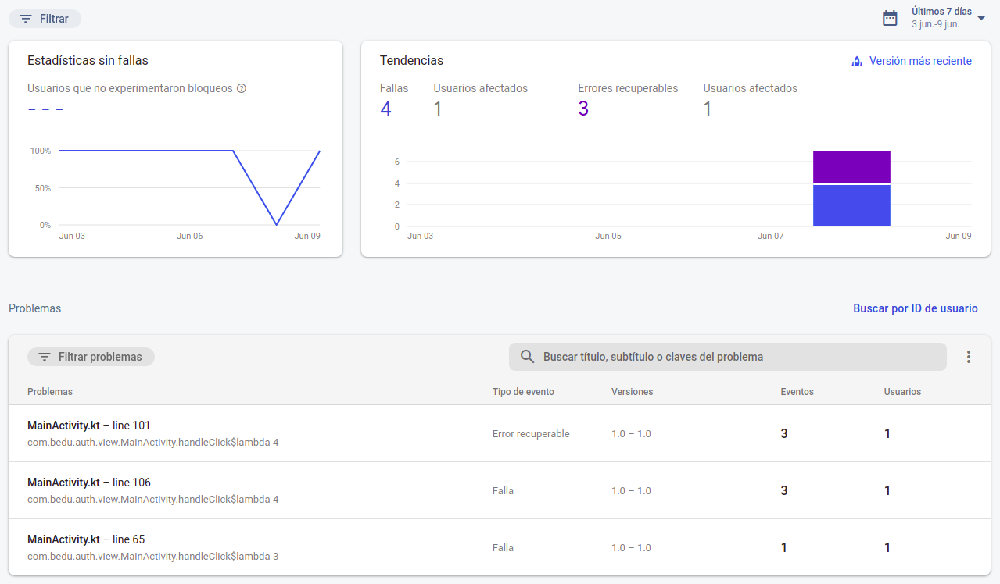
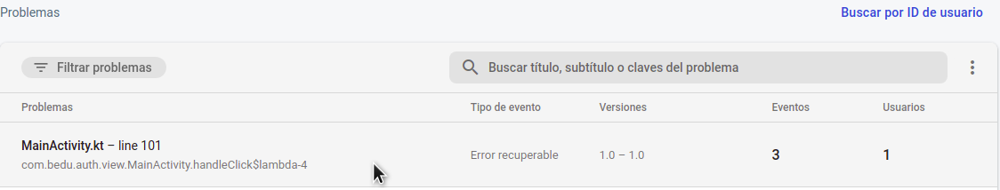
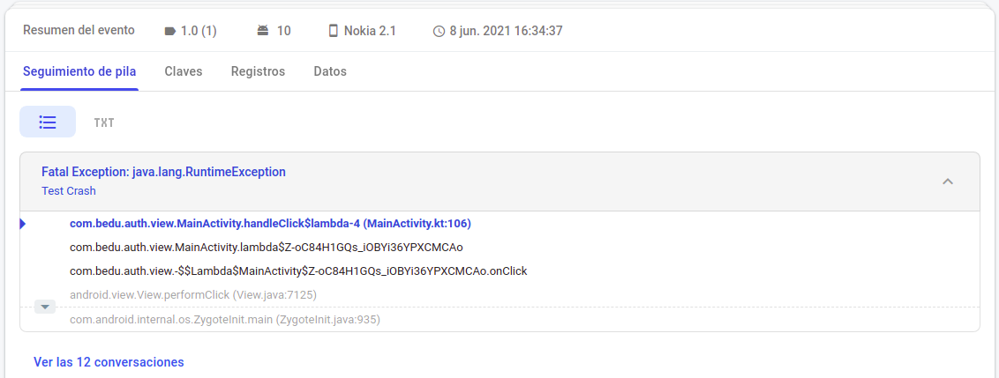

# Reto 01: Dashboard Crashlytics

## Objetivo

- Interpretar el Dashboard de Crashlytics para gestionar errores de una app Android.
- Discriminar los errores mediante las opciones de detección y seguimiento de Crashlytics.
- Consultar el error generado previamente en Crashlytics.

## Desarrollo

En el ejemplo 2 se provocó un error y es momento de reconocer e interpretar el dashboard de Crashlytics para saber cómo gestionar los errores.

Para hacerlo realiza los siguientes pasos:

1. Nos dirigimos a la Console de Crashlytics. Ahí veremos una pantalla muy similar a la siguiente.

    

2. Identifica las diferentes opciones de filtro de errores que ofrece el dashboard.

    

      
Solución

    - Filtrar por versión de app y tipo de error.
    - Seleccionar rango de fecha para visualizar errores por lapso de tiempo.
    - Filtrar por estado del problema, dispositivo y sistema operativo.
    - Buscar error por ID del usuario.

    > Nota: Más adelante revisamos cada una de estas opciones

    

     

3. Es momento de revisar el error generado previamente en nuestra app. Para ello haz clic en la tabla que se encuentra en la parte inferior, como se visualiza en la siguiente imagen.

    

4. Después consulta las diferentes opciones que ofrece el detalle del error.

    

      
Solución

    - Filtrar por versión de app, tipo de error, estado del problema, dispositivo y sistema operativo.
    - Número de veces que se ha producido el error y a cuántos usuarios ha afectado.
    - Filtrar por selección de rango de fecha.
    - Eventos.
        - Seguimiento de pila:
            - Muestra qué, en dónde y porqué surgió el error.
        - Claves:
            - Datos enviados por la app. Se encuentra vacío porque aún no se revisará esa parte.
        - Registros:
            - Clase o vista donde se provocó el error.
        - Datos:
            - Información del Dispositivo (Hardware y Software).

     

    > Nota: más adelante se utilizan cada una de estas opciones.

    

     

    

 

[Siguiente ](../Ejemplo-03/README.md)(Ejemplo 3)