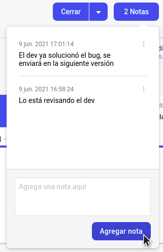
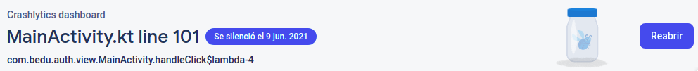
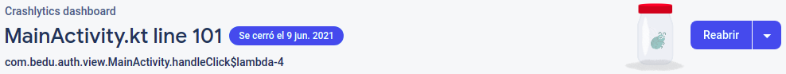

# Reto  02: Tipos de errores y su gestión

## Objetivo

- Implementar los dos tipos de errores y gestionarlos mediante las opciones del dashboard de Crashlytics.

## Desarrollo

Ya conociste el primer tipo de error: el producido en el Ejemplo 2. Este evento es de tipo Falla y es provocado cuando la app obtiene una excepción y no sabe cómo responder, por lo que el resultado es el cierre inesperado. 

El segundo tipo es Error recuperable. Este tipo sucede cuando agregamos un bloque de try / catch. Si el código dentro del try falla, es posible almacenar la excepción y Crashlytics enviará el error en algún momento, pues este error no tiene la misma prioridad que el otro y tardará más en enviarlo.

Notas: 
- Crashlytics guarda máximo 64 kb del log en memoria para evitar saturar la app.
- Los errores pueden tardar hasta 5 minutos en aparecer, por lo que debe tenerse paciencia si no aparecen rápido.

Ahora que reconoces los tipos de errores y las formas de gestionarlos, sigue las indicaciones expuestas a continuación para resolver el reto 2.

1. Genera un error recuperable dentro del clickListener del botón Crash.
2. Después, genera una falla en el mismo evento, de modo que cierre la app.
3. Gestiona los errores en Crashlytics:
    - **a)** Agrega notas (Comentarios) a los errores generados, previamente
    - **b)** Silencia el error indicando que ya corregiste el error y no tiene caso que te siga notificando, por lo que es posible cancelar los avisos.
    - **c)** Cierra el error indicando que ya fue solucionado.

    </br>

<details>
    <summary>Solución 1-2</summary>
    
  ```kotlin
  binding.btnCrash.setOnClickListener {
  //1
    try {
        Log.e(TAG, "handleClick: " + 0 / 0)
    } catch (e: Exception) {
        FirebaseCrashlytics.getInstance().recordException(e)
    }
  //2
    throw RuntimeException("Test Crash") // Force a crash
  }
  ```
</details>

  </br>

<details>
  <summary>Solución 3</summary>
a)
    

b)
    
    
c)
    
</details>

</br>

[Siguiente ](../Postwork/README.md)(Postwork)