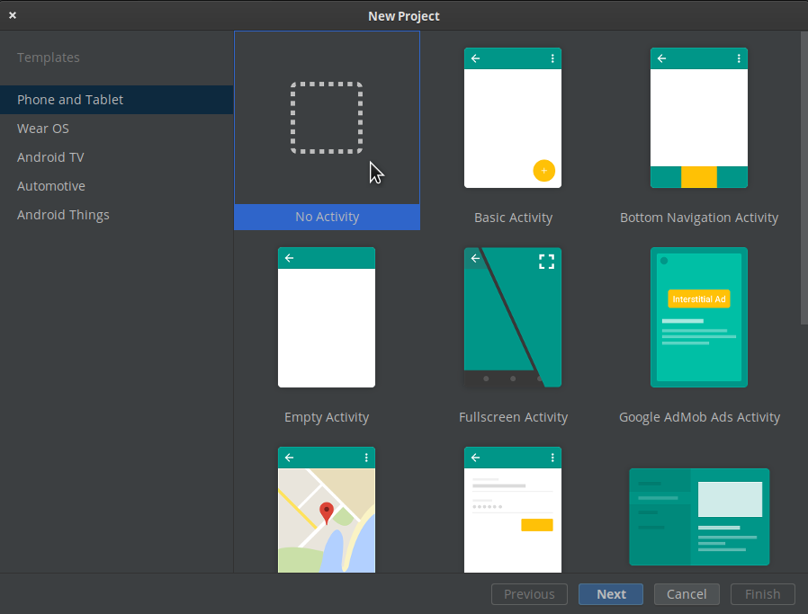
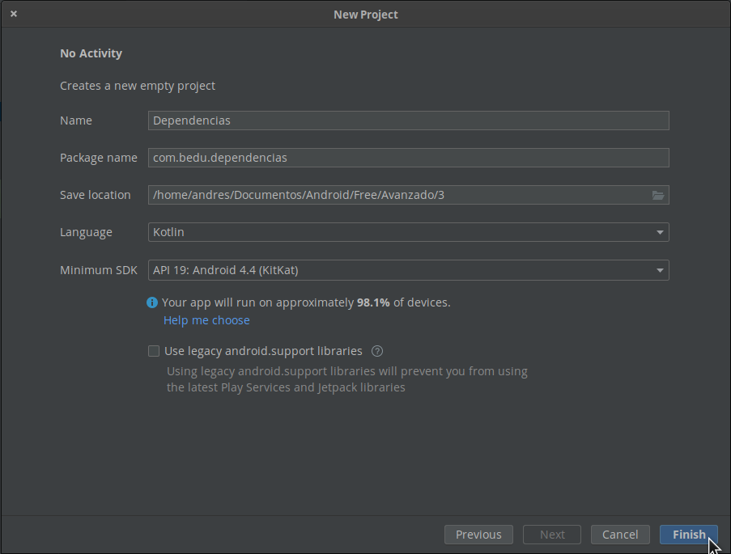
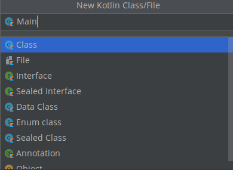
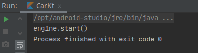

# Ejemplo 01: Dependencias manuales

## Objetivo

* Crear un proyecto Android con y sin la inyección de dependencias para comparar los beneficios en el desarrollo.

## Desarrollo

Se creará un proyecto Android desde cero, el cual evitará la inyección de dependencias. Después, se modificará para que implemente la inyección de dependencias con el propósito de evidenciar las propuestas de desarrollo de apps y así comparar sus beneficios.

Para hacerlo realiza los siguientes pasos:

1. Dirígete a Android Studio, crea un nuevo proyecto y selecciona la opción de No Activity, como se visualiza en la siguiente  imagen.

    

2. Nombra el proyecto como desees; te recomendamos llamarlo Dependencias. Posteriormente haz clic en Finish.

    

3. Después debe crearse una Clase de Kotlin, como se aprecia en la imagen. 

    

4. En la clase creada se debe agregar el siguiente código.

    ```Kotlin
    class Engine {
      fun start() {
          println("engine.start()")
      }
    }

    class Car {
        private val engine = Engine()

        fun start() {
            engine.start()
        }
    }

    fun main() {
        val car = Car()
        car.start()
    }
    ```

5. Ahora se ejecuta el proyecto y el resultado que se visualiza debería ser el siguiente.

    

    Este no es un ejemplo de inyección de dependencias porque la clase Car está construyendo su propio Engine, lo que puede ocasionar problemas a causa de las razones siguientes:

    - Car y Engine están estrechamente vinculados: una instancia de Car usa un tipo de Engine, y no se pueden utilizar subclases ni implementaciones alternativas con facilidad. Si el Car construyera su propio Engine, tendría que crear dos tipos de Car en lugar de solo reutilizar el mismo Car para motores de tipo Gas y Electric.
    - La dependencia estricta de Engine hace que las pruebas sean más difíciles. Car usa una instancia real de Engine, lo que impide utilizar un doble de prueba y modificar Engine para diferentes casos de prueba.

    </br>

6. Ahora modificaremos el código para implementar dependencias manualmente. Debe resultar de la siguiente forma.

    ```Kotlin
    class Engine {
        fun start() {
            println("engine.start()")
        }
    }

    class Car(private val engine: Engine) {
        fun start() {
            engine.start()
        }
    }

    fun main() {
        val engine = Engine()
        val car = Car(engine)
        car.start()
    }
    ```

7. Después debe ejecutarse el código. Resulta lo que se aprecia en la siguiente imagen.

    

    Al observar el resultado es el mismo, ¿entonces qué cambió?
    R: la función main usa Car. Debido a que Car depende de Engine, la app crea una instancia de Engine y luego la usa para construir una instancia de Car. 

    Los beneficios de este enfoque basado en DI, o inyección de dependencias, son los siguientes:

    - Reutilización de Car. Se pueden pasar diferentes implementaciones de Engine a Car. Por ejemplo, se puede definir una nueva subclase de Engine, llamada ElectricEngine para utilizar con Car. Si se usa DI sólo se debe pasar una instancia de la subclase actualizada de ElectricEngine y Car seguirá funcionando sin más cambios.
    - Prueba fácil de Car. Se pueden pasar [dobles de prueba](https://www.genbeta.com/desarrollo/desmitificando-los-dobles-de-test-mocks-stubs-and-friends) para probar diferentes situaciones. Por ejemplo, es posible crear un doble de prueba de Engine llamado FakeEngine, y configurarlo para diferentes pruebas.

    </br>

    Se puede pasar las dependencias por el constructor o con el método set. En el paso previo lo hicimos con el constructor, y en el siguiente paso lo haremos por el método set, denominado también inyección de campo.

8. Ahora es necesario modificar un poco el código para pasar dependencias por el método set, y se deja el código anterior comentado para tenerlo de referencia. El resultado debe ser el siguiente.

    ```Kotlin
    class Engine {
      fun start() {
          println("engine.start()")
      }
    }

    // Dependencias por el constructor
    class Car(private val engine: Engine) {
        fun start() {
            engine.start()
        }
    }
    // Dependencias por el método set
    class Car2{
        lateinit var engine: Engine

        fun start() {
            engine.start()
        }
    }

    fun main() {
        val engine = Engine()
        // Dependencias por el constructor
        val car = Car(engine)
        car.start()
        
        // Dependencias por el método set
        val car2 = Car2()
        car2.engine = Engine()
        car.start()
    }
    ```

</br>

[Siguiente ](../Ejemplo-02/README.md)(Ejemplo 2)