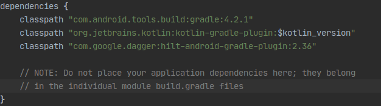
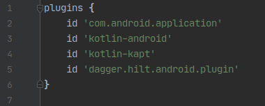
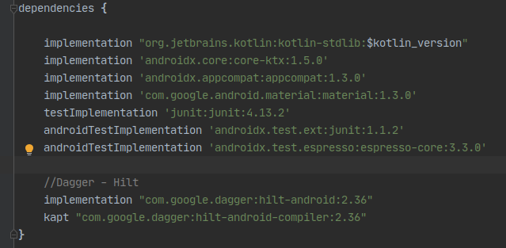
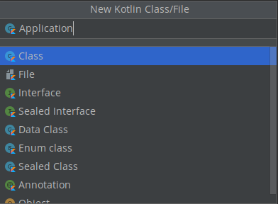
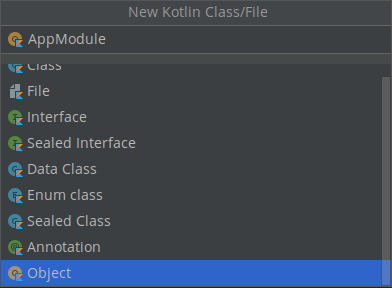
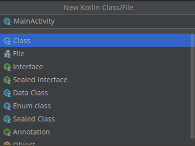
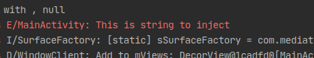
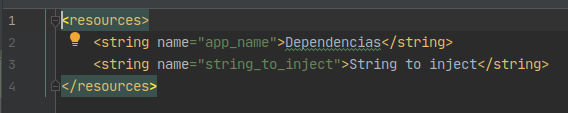
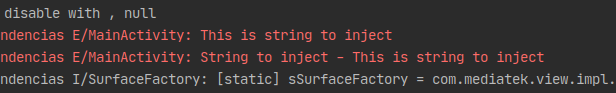

# Ejemplo 02: Implementar Dagger Hilt

## Objetivo

* Implementar la inyección de dependencias de manera automatizada mediante Dagger Hilt y evitar problemas de inyección manual.

## Desarrollo

En el ejemplo anterior se crearon, proporcionaron y administraron por cuenta propia las dependencias de las diferentes clases, sin recurrir a una biblioteca. Esto se denomina inyección de dependencias a mano o inyección de dependencias manual. 

En el ejemplo de Car sólo había una dependencia, pero si hay varias dependencias y clases la inyección manual resulta más difícil y tediosa, además de que presenta los siguientes problemas:

- En el caso de aplicaciones grandes, tomar las dependencias y conectarlas correctamente puede requerir una gran cantidad de código estándar. En una arquitectura de varias capas, para crear un objeto en una capa superior, se deben proporcionar todas las dependencias de las capas que se encuentran debajo de ella. Por ejemplo, para construir un automóvil real es posible que necesites un motor, una transmisión, un chasis y otras piezas; a su vez, el motor necesita cilindros y bujías.

- Cuando no se pueden construir dependencias antes de pasarlas (por ejemplo, si usas inicializaciones diferidas, o si solicitas permisos para objetos en los flujos de tu app), necesitas escribir y conservar un contenedor personalizado (o un grafo de dependencias) que administre las dependencias en la memoria desde el principio.

Debido a estos inconvenientes Hilt es la biblioteca de Jetpack recomendada para la inyección de dependencias en Android. Hilt establece una forma estándar de usar la inyección de dependencias en tu aplicación, pues proporciona contenedores para cada clase de Android en tu proyecto y administra sus ciclos de vida de forma automática.

Se basa en la popular biblioteca de inyección de dependencias Dagger y se beneficia de la corrección en tiempo de compilación, el rendimiento del entorno de ejecución, la escalabilidad, y la compatibilidad con Android Studio que proporciona.

Ahora utilizaremos el proyecto del ejemplo 1 y lo prepararemos para trabajar con Hilt.  Para hacerlo realiza los siguientes pasos.

1. Dirígete al Gradle del proyecto y agrega la siguiente línea de código, como se aprecia en la imagen.

    ```Gradle
    classpath "com.google.dagger:hilt-android-gradle-plugin:2.36"
    ```

    

2. Ahora debe abrirse el Gradle del módulo y ahí es necesario agregar las siguientes líneas de código, como se visualiza en las imágenes.

    ```Gradle
    id 'kotlin-kapt'
    id 'dagger.hilt.android.plugin'

    ...

    //Dagger - Hilt
    implementation "com.google.dagger:hilt-android:2.36"
    kapt "com.google.dagger:hilt-android-compiler:2.36"
    ```

    

    

3. Después se debe crear una clase que será llamada Application.

    

4. Es necesario que se le agregue el siguiente código.

    ```Gradle
    import android.app.Application
    import dagger.hilt.android.HiltAndroidApp

    @HiltAndroidApp
    class Application : Application()
    ```

    > Nota: con la anotación **@HiltAndroidApp** indicamos a Hilt que tiene que implementar la inyección de dependencias en nuestra app.

5. Posteriormente debe crearse el object **AppModule**. Este será el encargado de pasar las dependencias que se adhieran. Debe agregarse el siguiente código dentro de él, el cual contiene la primera dependencia.

    

    ```Gradle
    import dagger.Module
    import dagger.Provides
    import dagger.hilt.InstallIn
    import dagger.hilt.components.SingletonComponent
    import javax.inject.Named
    import javax.inject.Singleton

    @Module
    @InstallIn(SingletonComponent::class)
    object AppModule {

        @Singleton
        @Provides
        @Named("String1")
        fun provideTestString1() = "This is string to inject"

    }
    ```

    La explicación de las anotaciones usadas en el código son las siguientes.

    - **@Module.** Tiene la función de especificar que el objeto es un módulo y contiene dependencias.
    - **@InstallIn.** Indica a Hilt en qué clase de Android se usará o instalará cada módulo.
    - **@Singleton.** Expresa que la dependencia sólo se puede instanciar una vez.
    - **@Provides.** Indica que el valor resultante será enviado a quien lo implemente.
    - **@Named.** Expresa el nombre que se brinda a la dependencia, y quién lo quiera implementar tendrá que buscarla por el nombre que se defina dentro del named, o de lo contrario toma el valor de la función.

    </br>

6. Luego debe crearse el **MainActivity** que inyecta la dependencia del **AppModule**. Para ello se agrega el siguiente código de manera que resulte como se aprecia a continuación.

    ```Gradle
    import android.os.Bundle
    import android.util.Log
    import androidx.appcompat.app.AppCompatActivity
    import dagger.hilt.android.AndroidEntryPoint
    import javax.inject.Inject
    import javax.inject.Named

    @AndroidEntryPoint
    class MainActivity : AppCompatActivity() {

        @Inject
        @Named("String1")
        lateinit var testString: String

        override fun onCreate(savedInstanceState: Bundle?) {
            super.onCreate(savedInstanceState)
            setContentView(R.layout.activity_main)

            Log.e("MainActivity", testString)
        }
    }
    ```

    Con la anotación **@Inject** se indica a Hilt que inyecte la dependencia que se expresó en el Named.

    Ahora, para ejecutar el código necesitamos realizar algunos pasos extra que se indican a continuación.

7. Se crea el **activity_main** con el siguiente código XML.

    

    ```xml
    <?xml version="1.0" encoding="utf-8"?>
    <androidx.constraintlayout.widget.ConstraintLayout xmlns:android="http://schemas.android.com/apk/res/android"
        android:layout_width="match_parent"
        android:layout_height="match_parent">

    </androidx.constraintlayout.widget.ConstraintLayout>
    ```

    Hasta este punto nuestra app no posee interfaz, por lo que el XML se encuentra vacío.

8. Posteriormente modificamos el **AndroidManifest** para que implemente Hilt y acepte el **MainActivity** recién creado y se reemplaza el **Application** con el siguiente código XML.

    ```xml
    <application
            android:name=".Application"
            android:allowBackup="true"
            android:icon="@mipmap/ic_launcher"
            android:label="@string/app_name"
            android:roundIcon="@mipmap/ic_launcher_round"
            android:supportsRtl="true"
            android:theme="@style/Theme.Dependencias"
            android:fullBackupContent="false">
            <activity android:name=".MainActivity">
                <intent-filter>
                    <action android:name="android.intent.action.MAIN" />

                    <category android:name="android.intent.category.LAUNCHER" />
                </intent-filter>
            </activity>
    </application>
    ```

9. Ahora debe ejecutarse el proyecto. El **LogCat** debería mostrar la siguiente línea visualizada en la imagen. 

    

    Eso significa que la dependencia está funcionando correctamente.

    El módulo creado inyectará dependencias a todo el proyecto, por eso se agregó SingletonComponent en el InstallIn del AppModule.

10. Ahora se creará un módulo que inyecte dependencias a las **Activities** y se apegue a su ciclo de vida. Para realizarlo crea el Objeto **MainModule** con el siguiente código.

    ```Kotlin
    import android.content.Context
    import dagger.Module
    import dagger.Provides
    import dagger.hilt.InstallIn
    import dagger.hilt.android.components.ActivityComponent
    import dagger.hilt.android.qualifiers.ApplicationContext
    import dagger.hilt.android.scopes.ActivityScoped
    import javax.inject.Named

    @Module
    @InstallIn(ActivityComponent::class)
    object MainModule {

        @ActivityScoped
        @Provides
        @Named("String2")
        fun provideTestString2(
            @ApplicationContext context: Context,
            @Named("String1") testString1: String
        ) = "${context.getString(R.string.string_to_inject)} - $testString1"
    }
    ```

11. La anotación **@ActivityScoped** fue agregada para que este módulo trabaje con el ciclo de vida del **Activity**. Además, la dependencia solicita un **string** desde los recursos, el cual debemos crear. Para ello se le puede agregar el siguiente código, de modo que resulte como se aprecia en la siguiente imagen.

    

12. Ahora es necesario dirigirse al **MainActivity**, inyectar la dependencia e imprimirla en el **onCreate** mediante el siguiente código.

    ```Kotlin
    @Inject
    @Named("String2")
    lateinit var testString2: String

    …

    Log.e("MainActivity", testString2)
    ```

13. Posteriormente se ejecuta el proyecto. El resultado debería ser como el de la imagen, lo que representa que las dependencias, tanto del Application como del Activity, fueron inyectadas correctamente.

    

</br>
</br>

¡Felicidades! Ahora puedes inyectar dependencias en tu proyecto Android con Dagger Hilt.
El siguiente reto te espera para practicar lo aprendido.


</br>

[Siguiente ](../Reto-01/README.md)(Reto 1)