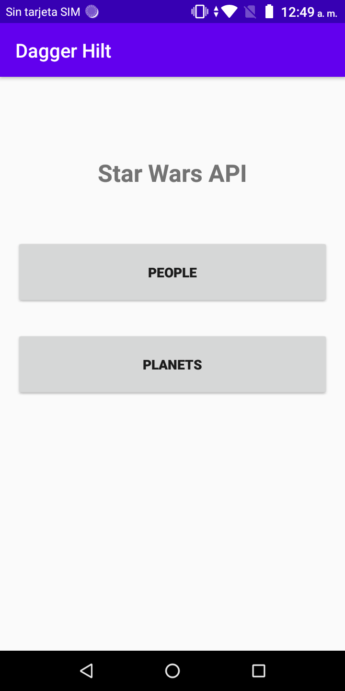
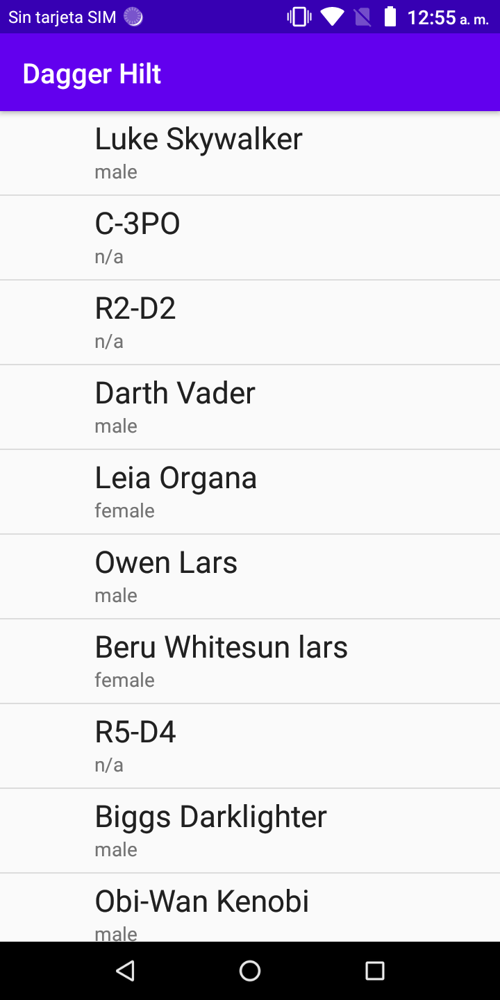

# Ejemplo 03: Consumir API

## Objetivo

* Distinguir dependencias que envíen peticiones para consumir servicios de API (Backend) y que al obtener la información la representen en la vista mediante Dagger Hilt y Retrofit.

## Desarrollo

Esta vez se trabajará el [Proyecto base](./base) con el propósito de distinguir cómo se aplicaron las dependencias para el consumo de servicios de una API, situación que permite la implementación de nuevos módulos (Pantallas) y el ahorro de código. 
Una vez identificado el modo, y analizado el funcionamiento del proyecto, será momento de ejemplificar lo aprendido al implementar el módulo restante. Para hacerlo realiza los siguientes pasos.

1. Ejecuta el proyecto base con Android Studio. Este desplegará la siguiente interfaz.

    

    Al hacer clic en el botón de **People** la app se conectará a la api [Swapi](https://swapi.dev/api/) y solicitará los personajes de StarWars mediante Retrofit y dependencias. Una vez que la API responda se visualizará la siguiente interfaz.

    

    Ahora conoces la interfaz y su navegación. A partir de  aquí se revisarán los módulos. Para ello realiza lo que se solicita en las instrucciones e identifica las funciones.

2. Al igual que en el proyecto del Ejemplo 2, Hilt necesita envolver la App para configurar e inyectar las dependencias, Esto se encuentra en la clase **App**.

    Hasta el momento el **MainActivity** sólo está encargado de abrir el PeopleActivity; por ahora el **PlanetsActivity** no tiene ninguna función.

3. La interfaz **ApiHelper** se encarga de asignar los servicios que se solicitarán al API. Sólo tiene una función, la que obtiene los personajes; su código es el siguiente.

    ```Kotlin
    interface ApiHelper {
        suspend fun getPeople(): Response<ResponsePeopleModel>
    }
    ```

4. Así como la interfaz **ApiHelper**, **ApiService** dispone de las funciones que se van a ejecutar del API. La única diferencia es que en esta clase se agrega el verbo HTTP y una parte de la URL del servicio, como se aprecia a continuación.

    ```Kotlin
    interface ApiService {
        @GET("people")
        suspend fun getPeople(): Response<ResponsePeopleModel>
    }
    ```

5. El **ApiHelperImpl** está encargado de implementar el **ApiHelper** y el **ApiService**, y aquí es donde empieza la magia de las dependencias, es decir, su operación. Para ello se requiere inyectar las dos interfaces, provocando la utilización de sus funciones. Hasta ahora sólo se tiene una en cada interfaz. El código debe resultar de la siguiente manera.

    ```Kotlin
    class ApiHelperImpl @Inject constructor(private val apiService: ApiService) : ApiHelper {

        override suspend fun getPeople(): Response<ResponsePeopleModel> = apiService.getPeople()

    }
    ```

6. Hasta el momento, las funciones empleadas usan el modelo **ResponsePeopleModel**. En este se encuentra la estructura del Json que se recibirá cuando se ejecute la petición, como se distingue a continuación.

    ```Kotlin
    data class ResponsePeopleModel(
        @Json(name = "count")
        val count: Int = 0,
        @Json(name = "next")
        val next: String = "",
        @Json(name = "previous")
        val previous: String = "",
        @Json(name = "results")
        val results: List<People> = ArrayList()
    )
    ```

7. La clase **MainRepository** inyecta las dependencias, conectándolas con la vista, como se visualiza.

    ```Kotlin
    class MainRepository @Inject constructor(private val apiHelper: ApiHelper) {

        suspend fun getPeople() =  apiHelper.getPeople()

    }
    ```

8. El **ApplicationModule** contiene todas la dependencias que utiliza nuestra app. En este momento se revisará una a una:

    - **provideBaseUrl**
        - Obtiene la URL base del API a consultar.
    - **provideOkHttpClient**
        - Configura el cliente para realizar las peticiones con Retrofit.
    - **provideRetrofit**
        - Inicializa a retrofit pasándole el okHttpCliente previamente creado y la URL base del proyecto.
    - **provideApiService y provideApiHelper**
        - Son enviados como parámetro en el constructor del ApiHelperImpl para realizar las peticiones. Nota: en una comparación analógica, este sería el motor visto en el ejemplo 1.

    </br>

    Las contiene de la siguiente forma.

    ```Kotlin
    @Module
    @InstallIn(SingletonComponent::class)
    class ApplicationModule {

        @Provides
        fun provideBaseUrl() = BuildConfig.BASE_URL

        @Provides
        @Singleton
        fun provideOkHttpClient() = if (BuildConfig.DEBUG) {
            val loggingInterceptor = HttpLoggingInterceptor()
            loggingInterceptor.setLevel(HttpLoggingInterceptor.Level.BODY)
            OkHttpClient.Builder()
                .addInterceptor(loggingInterceptor)
                .build()
        } else OkHttpClient
            .Builder()
            .build()


        @Provides
        @Singleton
        fun provideRetrofit(
            okHttpClient: OkHttpClient,
            BASE_URL: String
        ): Retrofit =
            Retrofit.Builder()
                .addConverterFactory(MoshiConverterFactory.create())
                .baseUrl(BASE_URL)
                .client(okHttpClient)
                .build()

        @Provides
        @Singleton
        fun provideApiService(retrofit: Retrofit): ApiService = retrofit.create(ApiService::class.java)

        @Provides
        @Singleton
        fun provideApiHelper(apiHelper: ApiHelperImpl): ApiHelper = apiHelper

    }
    ```

9. Después se debe dirigir al **PeopleViewModel**. Al ser un **viewModel** requiere que se le agregue la anotación **@HiltViewModel**, y con **@Inject** se implementan las dependencias que necesita para realizar las peticiones. En primer lugar está el **MainRepository**, y posteriormente el **NetworkHelper**. El segundo tiene la responsabilidad de comprobar la conexión a internet y retorna un booleano para indicar el estatus de la conexión.

10. El **viewModel** de **People** contiene la variable _people, utilizada para enviar el resultado de la llamada al servicio web. Además contiene tres funciones, dos de ellas, **init** y **onRefresh**, se encargan de llamar a la tercera, la que lanza la petición al servicio web y espera que este complete su ejecución. Al terminar envía los resultados, sean positivos o negativos, al **PeopleActivity**, que se ocupará de pintar los datos. El código resulta de la siguiente manera.

    ```Kotlin
    @HiltViewModel
    class PeopleViewModel @Inject constructor(
        private val mainRepository: MainRepository,
        private val networkHelper: NetworkHelper
    ) : ViewModel() {

        private val _people = MutableLiveData<Resource<List<People>>>()
        val people: LiveData<Resource<List<People>>>
            get() = _people

        init {
            fetchUsers()
        }

        fun onRefresh() {
            fetchUsers()
        }

        private fun fetchUsers() {
            viewModelScope.launch {
                _people.postValue(Resource.loading(null))
                if (networkHelper.isNetworkConnected()) {
                    mainRepository.getPeople().let {
                        if (it.isSuccessful) {
                            _people.postValue(Resource.success(it.body()?.results))
                        } else _people.postValue(Resource.error(it.errorBody().toString(), null))
                    }
                } else _people.postValue(Resource.error("No internet connection", null))
            }
        }
    }
    ```

11. **PeopleActivity** carga la vista que incluye la lista y la función de **swipeRefresh**, así como el adaptador que está esperando cambios para actualizar la vista. 
No se abordará el funcionamiento de estos elementos pues se revisaron en el módulo anterior. Si deseas consultar información al respecto dirígete al siguiente vínculo.

    [Haz clic aquí si deseas consultar la documentación oficial sobre listas dinámicas RecyclerView.](https://developer.android.com/guide/topics/ui/layout/recyclerview?hl=es-419)

    El **Activity** de **People** agrega **observe** por medio del **viewModel** para escuchar los eventos de People y así pintar la vista. El código que resulta es el siguiente.

    ```Kotlin
    @AndroidEntryPoint
    class PeopleActivity : AppCompatActivity() {

        private val peopleViewModel : PeopleViewModel by viewModels()
        private lateinit var adapter: PeopleAdapter

        override fun onCreate(savedInstanceState: Bundle?) {
            super.onCreate(savedInstanceState)
            setContentView(R.layout.activity_recycler)
            setupUI()
            setupObserver()
        }

        private fun setupUI() {
            recyclerView.layoutManager = LinearLayoutManager(this)
            adapter = PeopleAdapter(arrayListOf())
            recyclerView.addItemDecoration(
                DividerItemDecoration(
                    recyclerView.context,
                    (recyclerView.layoutManager as LinearLayoutManager).orientation
                )
            )
            recyclerView.adapter = adapter
            swipeRefreshLayout.setOnRefreshListener {
                peopleViewModel.onRefresh()
            }
        }

        private fun setupObserver() {
            peopleViewModel.people.observe(this, Observer {
                swipeRefreshLayout.isRefreshing = false
                when (it.status) {
                    Status.SUCCESS -> {
                        progressBar.visibility = View.GONE
                        it.data?.let { people -> renderList(people) }
                        recyclerView.visibility = View.VISIBLE
                    }
                    Status.LOADING -> {
                        progressBar.visibility = View.VISIBLE
                        recyclerView.visibility = View.GONE
                    }
                    Status.ERROR -> {
                        //Handle Error
                        progressBar.visibility = View.GONE
                        Toast.makeText(this, it.message, Toast.LENGTH_LONG).show()
                    }
                }
            })
        }

        private fun renderList(people: List<People>) {
            adapter.addData(people)
            adapter.notifyDataSetChanged()
        }
    }
    ``` 

12. **Resource** y **Status** sólo contienen las respuestas posibles para las peticiones lanzadas al API:

    - SUCCESS
    - ERROR
    - LOADING

</br>
</br>

¡Felicidades! Hemos concluido con la revisión de la estructura y funcionamiento de la app de Star Wars. Si tienes alguna inquietud comunícala a tu experto.

El siguiente reto te espera con el logro de implementar el módulo de Planets reutilizando el código existente.

</br>
</br>

[Siguiente ](../Reto-02/README.md)(Reto 2)