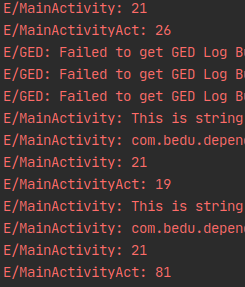

# Reto 01: Agregando dependencias

## Objetivo

* Formular el código de un proyecto Android con dependencias a nivel de Application y de Activity, y respetando el ciclo de vida.

## Desarrollo

En el ejemplo 2 se implementó la inyección de dependencias a nivel Application y Activity, y es momento de  practicar lo aprendido. Para resolver el reto 1 sigue las instrucciones expuestas a continuación.

1. Agrega una dependencia a nivel de **Application** que genere un número aleatorio entre 0 y 100. Imprímelo en el **onResume** del **MainActivity**.
2. Agrega una dependencia a nivel de **Activity** que genere un número aleatorio entre 0 y 100. Imprímelo en el **onResume** del **MainActivity**.
3. Crea otro **Activity** con el nombre **“OtherActivity”** y ábrelo desde un botón en el **MainActivity**.  Después aplica las siguientes reglas al mismo:
    - Al abrir el **OtherActivity** debe finalizarse el **MainActivity**.
    - Sobreescribe el **onBackPressed** del nuevo **Activity**, provocando que abra el **MainActivity** y se finalice.
4. Identifica y comenta el comportamiento con los números generados en los puntos 1 y 2.

</br>
</br>

<details>
    <summary>Solución 1</summary>

  AppModule

  ```Kotlin
  @Singleton
  @Provides
  @Named("randomNum")
  fun provideRandomNum() = (0..100).random().toString()

  MainActivity -> onResume

  Log.e("MainActivity", randomNum)
  ```

</details>

</br>

<details>
    <summary>Solución 2</summary>

  MainModule
  
  ```Kotlin
  @ActivityScoped
  @Provides
  @Named("randomNumAct")
  fun provideRandomNumAct() = (0..100).random().toString()

  MainActivity -> onResume

  Log.e("MainActivityAct", randomNumAct)
  ```
</details>

</br>

<details>
    <summary>Solución 3</summary>

activity_other.xml
```xml
<?xml version="1.0" encoding="utf-8"?>
<androidx.constraintlayout.widget.ConstraintLayout xmlns:android="http://schemas.android.com/apk/res/android"
    android:layout_width="match_parent"
    android:layout_height="match_parent">

</androidx.constraintlayout.widget.ConstraintLayout>
```

OtherActivity
```kotlin
import android.content.Intent
import android.os.Bundle
import androidx.appcompat.app.AppCompatActivity

class OtherActivity : AppCompatActivity() {

    override fun onCreate(savedInstanceState: Bundle?) {
        super.onCreate(savedInstanceState)
        setContentView(R.layout.activity_other)
    }

    override fun onBackPressed() {
        super.onBackPressed()
        startActivity(Intent(this, MainActivity::class.java))
        finish()
    }
}
```

MainActivity
```Kotlin
@Inject
@Named("randomNum")
lateinit var randomNum: String

@Inject
@Named("randomNumAct")
lateinit var randomNumAct: String

override fun onCreate(savedInstanceState: Bundle?) {
  super.onCreate(savedInstanceState)
  setContentView(R.layout.activity_main)

  findViewById<Button>(R.id.button).setOnClickListener {
      startActivity(Intent(this, OtherActivity::class.java))
      finish()
  }

  Log.e("MainActivity", testString)
}

override fun onResume() {
  super.onResume()
  Log.e("MainActivity", randomNum)
  Log.e("MainActivityAct", randomNumAct)
}
```

</details>

</br>

<details>
    <summary>Solución 4</summary>



La primera vez que se entra a MainActivity se generan los dos números, pero al estar navegando entre las dos Actividades se observa que sólo cambia el valor del MainModule, pues este depende del ciclo del Main, y como se está finalizando, eso hace que se genere de nuevo, y el del AppModule permanece con el valor de 21, ya que sólo se generará de nuevo cuando se finalice la app.

</details>

</br>
</br>

[Siguiente ](../Ejemplo-03/README.md)(Ejemplo 3)
