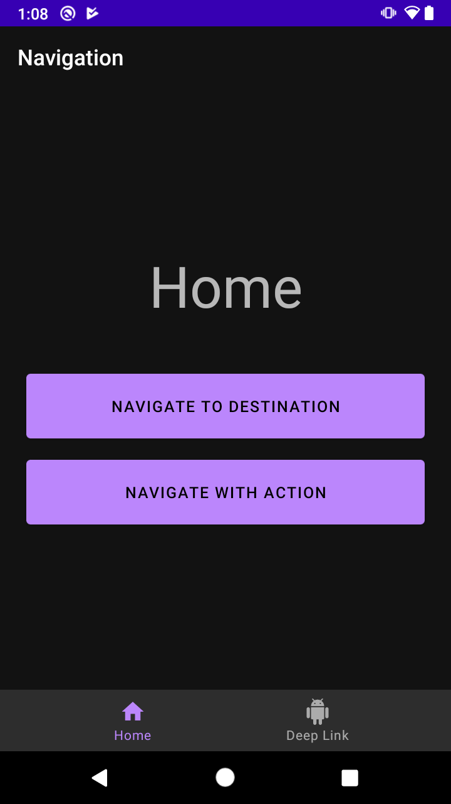
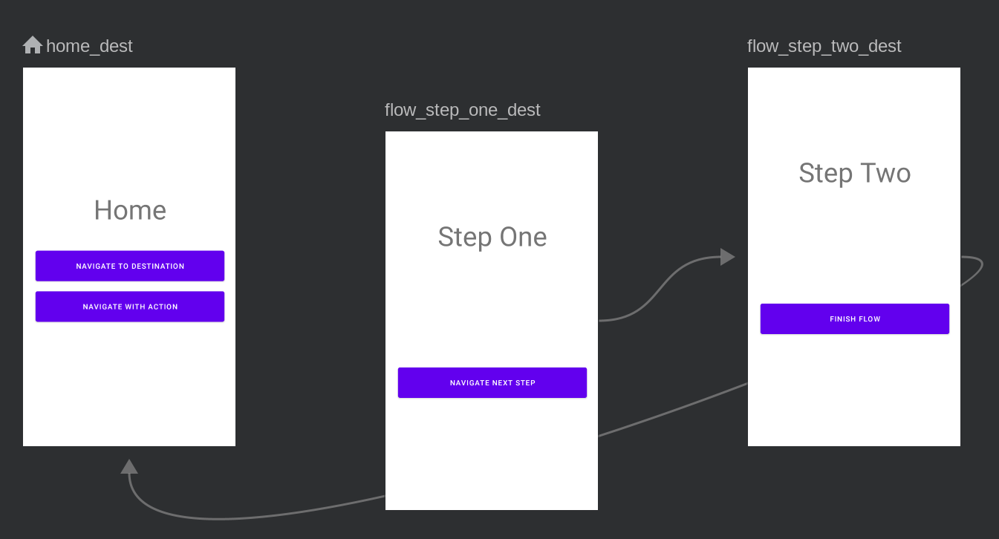
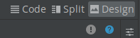
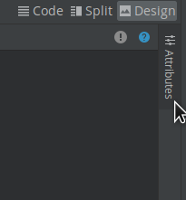
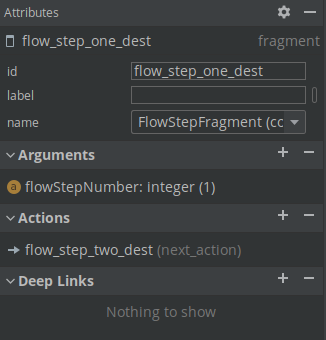

# Ejemplo 01: Gráfico de navegación

## Objetivo

* Implementar el gráfico de navegación mediante su descripción de funciones e interfaz para usarlo desde Android Studio.

## Desarrollo

A partir de un proyecto de Android previamente creado, se revisarán las herramientas de navegación introducidas con Android Jetpack Navigation. Usaremos el [Proyecto base](./base) y le modificaremos lo que se requiera. 

Para hacerlo realiza los siguientes pasos:

1. Ejecutamos el proyecto base con Android Studio. Este desplegará la siguiente interfaz.

    

2. Nos dirigimos a los recursos del proyecto base y abrimos el mobile_navigation.xml

    

    Este recurso define todas las rutas posibles que nuestro usuario puede tomar dentro de nuestra app. 

    > Nota: Las flechas entre los destinos se denominan Acciones, y las vistas previas Destinos.

    

3. Android studio nos presenta tres opciones de visualización, “Como en cualquier XML”.

    

4. En el modo Design haz clic en la pantalla Step one, lo que despliega la opción Attributes.

    

    En esta sección se especifican los argumentos / parámetros que recibe la vista, así como a qué destino es posible navegar. En esta pantalla vemos que recibe un **integer** y el destino es **Step Two**.

    

    Ten presente que:
    - **\<navigation>** es el nodo raíz de cada gráfico de navegación.
    - **\<navigation>** contiene uno o más destinos, representados con elementos **\<activity>** o **\<fragment>**.
    - **app:startDestination** es un atributo que especifica el destino que se inicia de forma predeterminada cuando el usuario abre la app por primera vez.

    </br>

    Ahora veamos un destino de fragmento.

    ```xml
    <fragment
      android:id="@+id/flow_step_one_dest"
      android:name="com.bedu.navigation.FlowStepFragment"
      tools:layout="@layout/flow_step_one_fragment">
      <argument
          android:name="flowStepNumber"
          android:defaultValue="1"
          app:argType="integer" />

      <action
          android:id="@+id/next_action"
          app:destination="@+id/flow_step_two_dest" />
    </fragment>
    ```

    Revisemos algunas de las etiquetas del XML presentado anteriormente:

    - **android:id** define un ID para el fragmento, que puedes usar en otra parte del archivo XML y de tu código para hacer referencia al destino.
    - **android:name** declara el nombre de clase completamente calificado del fragmento para crear una instancia cuando navegas a ese destino.
    - **tools:layout** especifica cuál es el diseño que se debe mostrar en el editor gráfico.

    </br>

</br>

[Siguiente ](../Ejemplo-02/README.md)(Ejemplo 2)