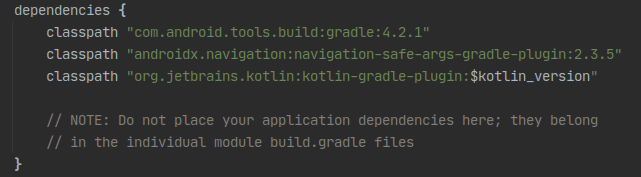
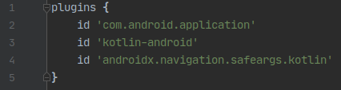
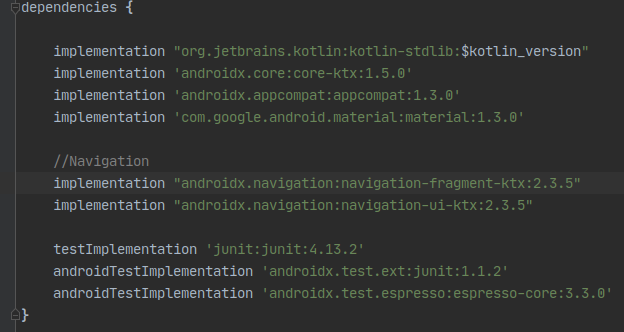
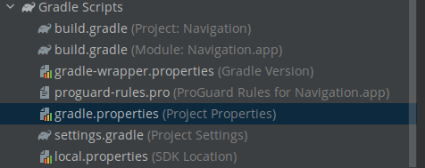

# Ejemplo 02: Implementar Navigation y SafeArgs

## Objetivo

* Implementar Navigation y SafeArgs introducidos en Android Jetpack.

## Desarrollo

En el ejemplo anterior revisamos de manera general las opciones que nos provee el gráfico de navegación, ahora veremos cómo instalar las dependencias “Librerías” de Navigation y SafeArgs.

### Safe Args

El componente de Navigation tiene un complemento de Gradle llamado Safe Args que genera clases de objeto y compilador simples. Así, permite una navegación de tipo seguro y acceso a cualquier argumento asociado. Si no usas Gradle no es posible usar el complemento Safe Args; en esos escenario puedes utilizar Bundles para pasar datos de forma directa.

El proyecto base de esta sesión ya tiene implementadas las dependencias, pero se distinguirá cómo se implementaron. Realiza los siguientes pasos para hacerlo.

1. Dirígete al Gradle del proyecto y agrega la siguiente línea de código, como se aprecia en la imagen.

    ```gradle
    classpath "androidx.navigation:navigation-safe-args-gradle-plugin:2.3.5"
    ```

    

2. Ahora debe abrirse el Gradle del módulo, y ahí es necesario agregar las siguientes líneas de código, como se visualiza en las imágenes.

    ```gradle
    id 'androidx.navigation.safeargs.kotlin'

    ...

    //Navigation
    implementation "androidx.navigation:navigation-fragment-ktx:2.3.5"
    implementation "androidx.navigation:navigation-ui-ktx:2.3.5"
    ```

    

    

    Este recurso define todas las rutas posibles que nuestro usuario puede tomar dentro de nuestra app. 

    > Nota: Las flechas entre los destinos se denominan Acciones, y las vistas previas Destinos.

    

3. Por último nos dirigimos al gradle.properties  y agregamos la siguiente línea, siempre y cuando no se encuentre ya activada.

    ```gradle
    android.useAndroidX=true
    ```

    

¡Listo! Así fue como se implementaron las librerías en el proyecto base.

</br>

[Siguiente ](../Ejemplo-03/README.md)(Ejemplo 3)