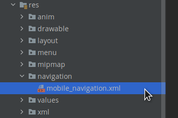
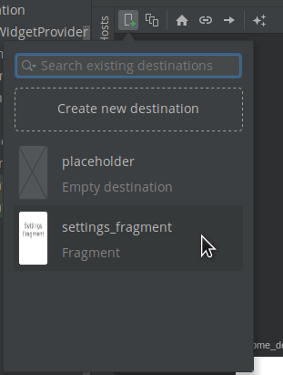
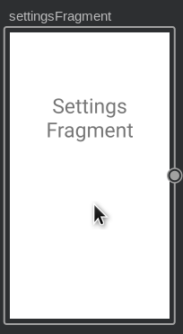
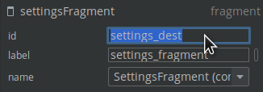
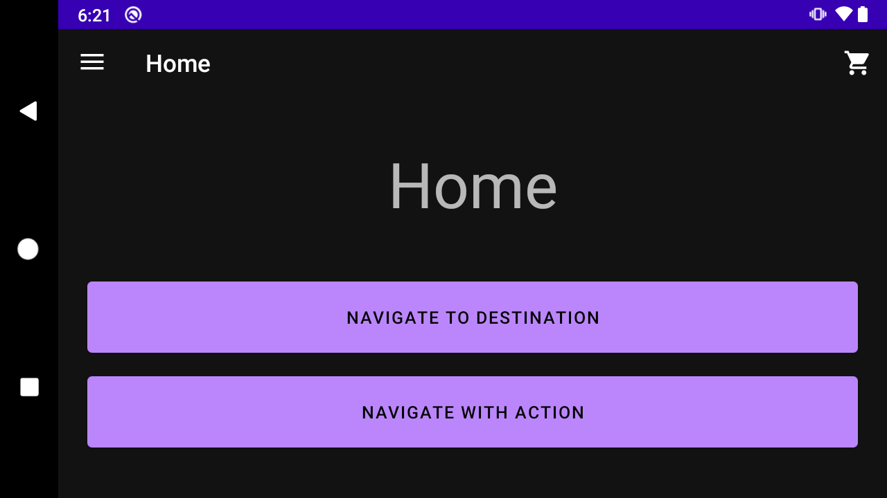
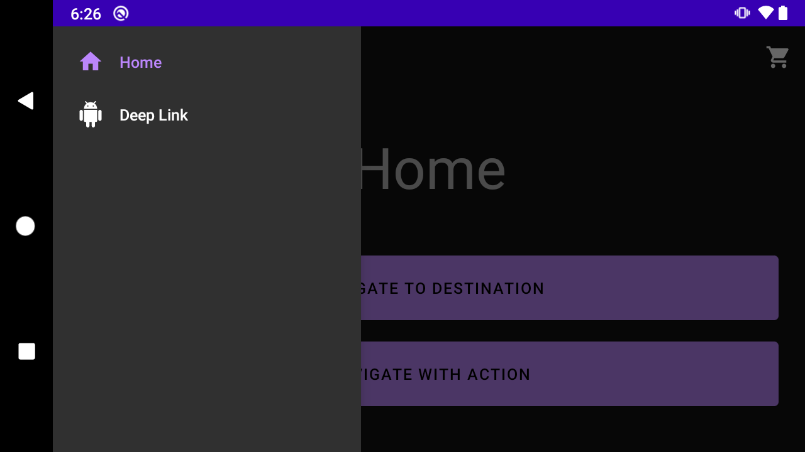
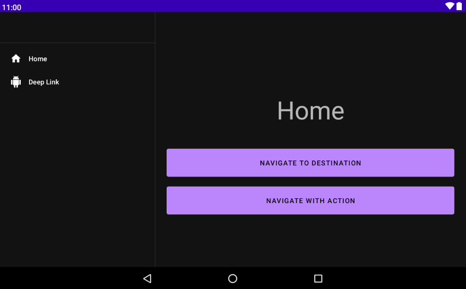

# Ejemplo 03: Agregando navegación

## Objetivo

* Agregar nuevos destinos y acciones para navegar entre pantallas de una app.

## Desarrollo

Como vimos en el ejemplo 01, nuestro proyecto base ya tiene algunos destinos y acciones. Ahora se agregará y probará un nuevo destino. Para ello realizamos los siguientes pasos:

1. Abre **mobile_navigation.xml** y haz clic en la pestaña Design.

    

2. Haz clic en el ícono New Destination y selecciona **settings_fragment**. 

    > Nota: en esta sesión Android studio nos mostrará las secciones que aún no han sido agregadas al gráfico de navegación, como se aprecia en la imagen.

    

3. Haz clic en **settings_fragment**. El resultado es un nuevo destino, que presenta una vista previa del diseño del fragmento en la vista de diseño.

    

4. Selecciona el nuevo destino y modifica, en la sección de **Attributes**, por **settings_dest** su id.

    

5. Si navegamos a **res -> layout -> navigation_activity** nos encontramos con tres archivos con diferentes densidades de pantalla.
Hasta este punto, ¿ya probaste acostar tu teléfono?, ¿qué comportamiento encontraste?

    Como seguro habrás notado, el proyecto dispone de tres versiones del Home. Dos de ellas las puedes probar en tu teléfono y la otra solo podrás con una tablet o en el simulador, seleccionando una resolución similar a la de una tablet. 

    Ahora visualizaremos las tres versiones.

    
    
    
    

6. Para que el componente Navigation haga su magia, nuestra vista principal **navigation_activity.xml** necesita invocar a **NavHostFragment**. Este **nav** tiene que estar dentro de un contenedor, y para esto los tres **navigations** tienen el componente **FragmentContainerView**. El anterior conecta con el botón atrás del sistema. 
Así, el código resulta de la siguiente manera.

    </br>

    navigation_activity.xml -> h470dp

    ```xml
    <androidx.fragment.app.FragmentContainerView
      android:id="@+id/my_nav_host_fragment"
      android:name="androidx.navigation.fragment.NavHostFragment"
      android:layout_width="match_parent"
      android:layout_height="0dp"
      android:layout_weight="1"
      app:defaultNavHost="true"
      app:navGraph="@navigation/mobile_navigation" />

    <!-- Esta vista implementa el menú de fondo -->
    <com.google.android.material.bottomnavigation.BottomNavigationView
      android:id="@+id/bottom_nav_view"
      android:layout_width="match_parent"
      android:layout_height="wrap_content"
      app:menu="@menu/bottom_nav_menu" />
    ```

    </br>

    navigation_activity.xml -> w960dp

    ```xml
    <!-- Esta vista tiene el menú siempre visible -->
    <com.google.android.material.navigation.NavigationView
      android:id="@+id/nav_view"
      android:layout_width="wrap_content"
      android:layout_height="match_parent"
      android:layout_alignParentStart="true"
      app:elevation="0dp"
      app:headerLayout="@layout/nav_view_header"
      app:menu="@menu/nav_drawer_menu" />

    <androidx.fragment.app.FragmentContainerView
      android:id="@+id/my_nav_host_fragment"
      android:name="androidx.navigation.fragment.NavHostFragment"
      android:layout_width="match_parent"
      android:layout_height="match_parent"
      android:layout_below="@id/toolbar"
      android:layout_toEndOf="@id/nav_view"
      app:defaultNavHost="true"
      app:navGraph="@navigation/mobile_navigation" />
    ```

    </br>

    navigation_activity.xml

    ```xml
    <androidx.fragment.app.FragmentContainerView
      android:id="@+id/my_nav_host_fragment"
      android:name="androidx.navigation.fragment.NavHostFragment"
      android:layout_width="match_parent"
      android:layout_height="match_parent"
      app:defaultNavHost="true"
      app:navGraph="@navigation/mobile_navigation" />

    <!-- Esta vista implementa el menú lateral, mejor conocido como DrawerMenu -->
    <com.google.android.material.navigation.NavigationView
      android:id="@+id/nav_view"
      android:layout_width="wrap_content"
      android:layout_height="match_parent"
      android:layout_gravity="start"
      app:menu="@menu/nav_drawer_menu" />
    ```
7. Cuando un usuario realiza una acción, como hacer clic en un botón, debe activarse un comando de navegación. La clase NavController es la que activa el intercambio de fragmentos en el NavHostFragment. 
Abre el **HomeFragment** y agrega el siguiente bloque código dentro del **onViewCreated**.

    ```kotlin
    val button = view.findViewById<Button>(R.id.navigate_destination_button)
    button?.setOnClickListener {
        findNavController().navigate(R.id.flow_step_one_dest, null)
    }
    ```

8. Ejecuta la app y haz clic en el botón Navigate to Destination. El clic debería enviarte al Step One.

</br>

¡Felicidades! Has concluído con tu primera navegación con el componente Navigation.

</br>

[Siguiente ](../Reto-01/README.md)(Reto 1)