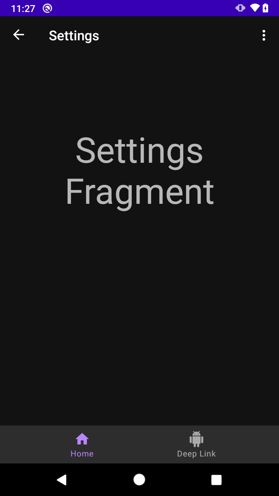

# Ejemplo 04: SafeArgs y navegación con menús y paneles


## Objetivo

* Adaptar el código de un proyecto Android para el envío de argumentos de manera segura mediante SafeArgs.
* Implementar una navegación en un proyecto Android a partir de menús y paneles.

## Desarrollo

En este ejemplo enviaremos argumentos de manera segura, con la forma de navegar por acciones, y se aplicarán métodos de navegación reconocidos por los usuarios de Android. Para hacerlo es necesario realizar los siguientes pasos:

1. Nos dirigimos al mobile_navigation.xml. Ahí corroboramos que se envía el argumento dentro del **flow_step_one_dest**.

    ```xml
    <argument
        android:name="flowStepNumber"
        app:argType="integer"
        android:defaultValue="1"/>
    ```

2. Ahora se debe abrir el **FlowStepFragment** y reemplazar la línea “val flowStepNumber = arguments?.getInt("flowStepNumber")” por el siguiente código.

    ```kotlin
    val safeArgs: FlowStepFragmentArgs by navArgs()
    val flowStepNumber = safeArgs.flowStepNumber
    ```

3. Después se abre **HomeFragment** y se cambia el evento del **navigate_action_button** con el siguiente código que utiliza los **safeArgs**.

    ```kotlin
    val flowStepNumberArg = 1
    val action = HomeFragmentDirections.nextAction(flowStepNumberArg)
    findNavController().navigate(action)
    ```

4. Posteriormente ejecutamos el proyecto y hacemos clic en **Navigate with action**. Se distinguirá que tiene el mismo funcionamiento, pero ahora se hace con **safeArgs**.

5. Se proseguirá con el menú y los paneles. Para ello creamos el recurso de menú **overflow_menu** y le agregamos el siguiente código.

    ```xml
    <?xml version="1.0" encoding="utf-8"?>
    <menu xmlns:android="http://schemas.android.com/apk/res/android">
        <item
            android:id="@+id/settings_dest"
            android:icon="@drawable/ic_settings"
            android:menuCategory="secondary"
            android:title="@string/settings" />
    </menu>
    ```

6. Luego se abre **MainActivity** y se agregan las siguiente líneas de código. 

    El **onCreateOptionsMenu** agrega la interfaz y el **onOptionsItemSelected** se mantendrá esperando que el usuario haga clic en la opción. Con esto **NavigationUI** controla las opciones de este menú.

    ```kotlin
    override fun onCreateOptionsMenu(menu: Menu): Boolean {
        val retValue = super.onCreateOptionsMenu(menu)
        val navigationView = findViewById<NavigationView>(R.id.nav_view)
        if (navigationView == null) {
            menuInflater.inflate(R.menu.overflow_menu, menu)
            return true
        }
        return retValue
    }

    override fun onOptionsItemSelected(item: MenuItem): Boolean {
        return item.onNavDestinationSelected(findNavController(R.id.my_nav_host_fragment))
                || super.onOptionsItemSelected(item)
    }
    ```

7. Se debe compilar la app y ahora tendrá los tres puntos del menú. Al hacer clic sobre ellos, estos abren un menú con el texto Settings, y cuando se hace clic en Settings se dirige a la pantalla siguiente.

      

8. Para completar el reto resta agregar el panel. Para empezar abrimos el **MainActivity** y agregamos las siguientes líneas, las cuales activan la navegación inferior y el panel lateral.

    ```kotlin
    private fun setupBottomNavMenu(navController: NavController) {
      val bottomNav = findViewById<BottomNavigationView>(R.id.bottom_nav_view)
      bottomNav?.setupWithNavController(navController)
    }

    private fun setupNavigationMenu(navController: NavController) {
        val sideNavView = findViewById<NavigationView>(R.id.nav_view)
        sideNavView?.setupWithNavController(navController)
    }

    private fun setupActionBar(navController: NavController, appBarConfig : AppBarConfiguration) {
        setupActionBarWithNavController(navController, appBarConfig)
    }

    override fun onSupportNavigateUp(): Boolean {
        return findNavController(R.id.my_nav_host_fragment).navigateUp(appBarConfiguration)
    }
    ```

9. Luego es necesario configurar la **ActionBar**, para que muestre el icono de menú, mediante la adición del siguiente código dentro del **onCreate** del **MainActivity**.

    ```kotlin
    val drawerLayout : DrawerLayout? = findViewById(R.id.drawer_layout)
    appBarConfiguration = AppBarConfiguration(
            setOf(R.id.home_dest, R.id.deeplink_dest),
            drawerLayout)

    setupActionBar(navController, appBarConfiguration)

    setupNavigationMenu(navController)

    setupBottomNavMenu(navController)
    ```

    > Nota: los destinos listados en el AppBarConfiguration no agregan la flecha **Atrás** al ser seleccionados, ya que son de orden superior. Por ejemplo: al entrar a Settings veremos la fecha de Back.

</br>

**¡Felicidades!** Ahora tu app envía argumentos con SafeArgs y tiene navegación desde un menú, un panel inferior y uno lateral.
El siguiente reto te espera con el logro de implementar una nueva opción de menú. ¡Adelante!


</br>

[Siguiente ](../Reto-03/README.md)(Reto 3)
