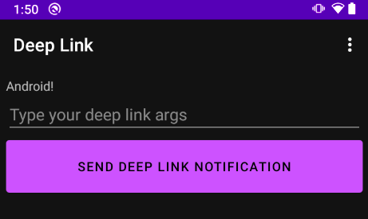

# Postwork 4 - Deep links

## Objetivo

- Implementar Deep Links a un proyecto Android.
- Agregar Navigation al proyecto Android personal **(este será el presentado al final del módulo)**.

## Desarrollo

### Deep Linking: “Enlace profundo”
Se emplean para generar un vínculo (hiperenlace) que lleve a un contenido específico sin tener que pasar por la entrada principal. Los enlaces de ese tipo se denominan enlaces profundos (deep links).

Su objetivo es ofrecer una mejor experiencia de usuario mediante la reducción de los pasos a realizar para acceder a un contenido o servicio. Por ejemplo, es mucho más cómodo para el usuario acceder directamente a la pantalla de una promoción tras hacer clic sobre una publicidad, que tener que navegar hasta encontrarla.

</br>

### Indicaciones generales:
1. El proyecto base de la sesión contiene la siguiente interfaz (Figura 2) la cual carece de funcionalidad. Para este punto se requiere que al presionar el botón **Send deep link notification** se detone una notificación que incluya el texto como argumento. Al hacer clic en la notificación debe abrirse la app navegando en esta pantalla y mostrando el mensaje donde la figura 2 muestra “Android!”. Este proceso debe realizarse mediante el uso de **deep links**.

    </br>

    

    Figura 2: interfaz del proyecto base a donde llevará el deep link de la notificación.

    Considera las siguientes recomendaciones para el reto.
    - El mensaje debe enviarse como argumentos con un Bundle.
    - El Bundle se agrega a la función createDeepLink, ubicada dentro de findNavController, mediante la creación de un pendingIntent.
    - El deepLink se envía como contentIntent del build de la notificación.

</br>

2. En el postwork pasado definiste el proyecto con el que trabajarás el resto de las sesiones. 
Si aún no has creado el proyecto es momento de hacerlo.

</br>

3. Una vez creado el proyecto, implementa en él Navigation y SafeArgs. Además agrega por lo menos dos pantallas que utilicen el mobile_navigation aprendido en esta sesión. 

    Te recomendamos implementar BottomNavigationView.

</br>
</br>

<details>
    <summary>Solución 1</summary>

DeepLinkFragment -> dentro del evento del botón
  ```Kotlin
  val editArgs = view.findViewById<EditText>(R.id.args_edit_text)
  val args = Bundle()
  args.putString("myarg", editArgs.text.toString())

  val deeplink = findNavController().createDeepLink()
          .setDestination(R.id.deeplink_dest)
          .setArguments(args)
          .createPendingIntent()

  val notificationManager =
          context?.getSystemService(Context.NOTIFICATION_SERVICE) as NotificationManager
  if (Build.VERSION.SDK_INT >= Build.VERSION_CODES.O) {
      notificationManager.createNotificationChannel(NotificationChannel(
              "deeplink", "Deep Links", NotificationManager.IMPORTANCE_HIGH))
  }

  val builder = NotificationCompat.Builder(
          context!!, "deeplink")
          .setContentTitle("Navigation")
          .setContentText("Deep link to Android")
          .setSmallIcon(R.drawable.ic_launcher_foreground)
          .setContentIntent(deeplink)
          .setAutoCancel(true)
  notificationManager.notify(0, builder.build())
  ```

</details>

</br>

[Regresar ](../)(Sesion 4)

[Siguiente ](../../Sesion-05/README.md)(Sesión 05)