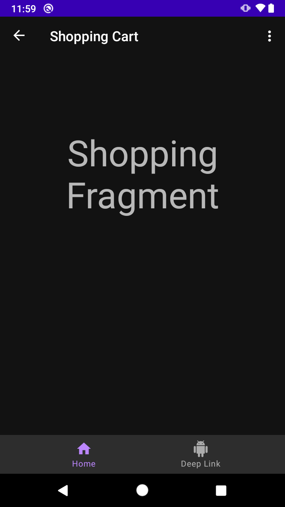

# Reto 03: Nueva opción en Home

## Objetivo

* Implementar una nueva opción de menú accesible solamente desde el **HomeFragment**.

## Desarrollo

Llegó el momento de agregar una nueva opción al Home y hacer uso de todo lo aprendido en los ejemplos y retos de la sesión.
Para resolver este reto debes agregar una opción nueva que dirija a la pantalla de shopping. Esta opción sólo debe mostrarse en la pantalla de Home.

> Nota: el icono ya se encuentra en el proyecto con el nombre de **ic_shopping_cart_white**

</br>

Propuesta visual:




</br>
</br>

<details>
    <summary>Solución</summary>

  Crear main_menu.xml
  
  ```xml
  <?xml version="1.0" encoding="utf-8"?>
  <menu xmlns:android="http://schemas.android.com/apk/res/android"
        xmlns:app="http://schemas.android.com/apk/res-auto">

      <item
          android:id="@+id/shopping_dest"
          android:icon="@drawable/ic_shopping_cart_white"
          android:title="@string/shopping_cart"
          app:showAsAction="ifRoom" />
  </menu>
  ```

  Crear ShoppingFragment

  ```Kotlin
  class ShoppingFragment : Fragment() {
    override fun onCreateView(
        inflater: LayoutInflater,
        container: ViewGroup?,
        savedInstanceState: Bundle?
    ): View? {
        // Inflate the layout for this fragment
        return inflater.inflate(R.layout.shopping_fragment, container, false)
    }
  }
  ```

  Crear layout shoping_fragment.xml

  ```Kotlin
  <androidx.constraintlayout.widget.ConstraintLayout
    xmlns:android="http://schemas.android.com/apk/res/android"
    xmlns:app="http://schemas.android.com/apk/res-auto"
    xmlns:tools="http://schemas.android.com/tools"
    android:layout_width="match_parent"
    android:layout_height="match_parent"
    tools:context=".ShoppingFragment">

    <TextView
        android:id="@+id/text"
        android:layout_width="match_parent"
        android:layout_height="wrap_content"
        android:text="@string/shopping_fragment_text"
        android:textAlignment="center"
        android:textSize="52sp"
        app:layout_constraintBottom_toBottomOf="parent"
        app:layout_constraintEnd_toEndOf="parent"
        app:layout_constraintHorizontal_bias="0.0"
        app:layout_constraintStart_toStartOf="parent"
        app:layout_constraintTop_toTopOf="parent"
        app:layout_constraintVertical_bias="0.25" />

  </androidx.constraintlayout.widget.ConstraintLayout>
  ```

  Agregar a mobile_navigation.xml

  ```xml
  <fragment
    android:id="@+id/shopping_dest"
    android:name="com.bedu.navigation.ShoppingFragment"
    android:label="@string/shopping_cart"
    tools:layout="@layout/shopping_fragment" />
  ```

  Agregar a HomeFragment
  
  ```kotlin
  override fun onCreateOptionsMenu(menu: Menu, inflater: MenuInflater) {
    inflater.inflate(R.menu.main_menu, menu)
  }
  ```

</details>

</br>
</br>

[Siguiente ](../Postwork/README.md)(Postwork)
