# Ejemplo 01: Facebook Developers

## Objetivo

* Implementar SDK de Facebook en proyecto base Android para combinar la función de compartir contenido a una app.
- Crear y configurar proyecto desde el portal de Facebook Developers.

## Desarrollo

En el prework de esta sesión debiste crear un proyecto desde cero que tuviera 3 botones en su pantalla principal: “Facebook, Spotify, y Conekta”. Cada botón abre una pantalla con una interfaz mínima. Sólo si no te fue posible completar este proyecto puedes utilizar el [Proyecto base](./base),

El proyecto base muestra la siguiente interfaz:

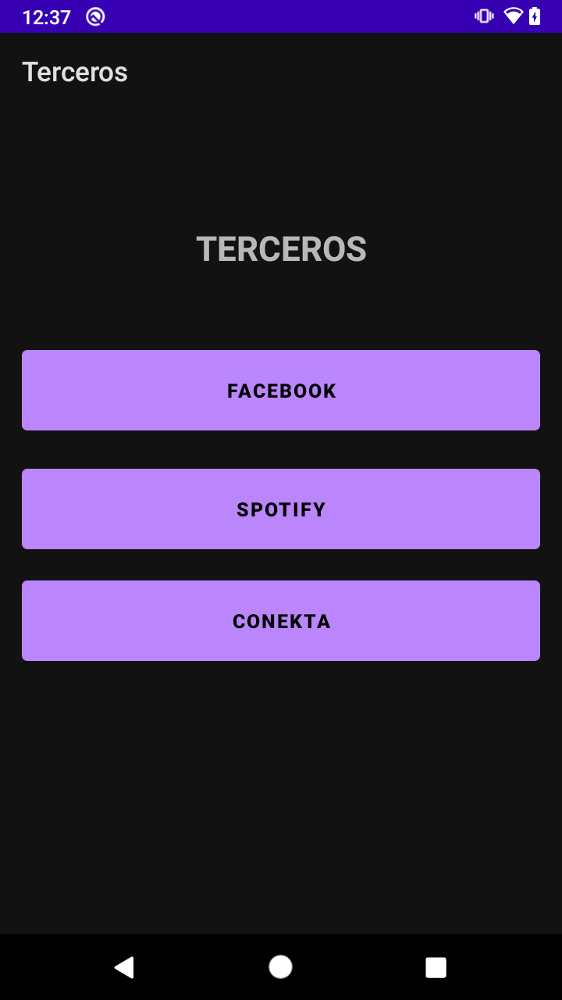

Con la intención de agregar el SDK de Facebook a nuestra app, sea la del proyecto base o un proyecto individual previamente seleccionado y trabajado en el prework, realizaremos los siguientes pasos.

</br>

1. Nos dirigimos al **Gradle** del módulo y agregamos las siguientes líneas de código.

    ```gradle
    // Facebook Android SDK (everything)
    implementation 'com.facebook.android:facebook-android-sdk:8.1.0'

    // Facebook Share only
    implementation 'com.facebook.android:facebook-share:8.1.0'
    ```

    Cada empresa que provee un SDK para implementar sus servicios en nuestras app genera una sección donde se incluye la configuración y documentación de la misma.

2. Ahora, para crear y configurar nuestro proyecto desde el administrador de Facebook es necesario abrir el administrador de [Facebook Developers](https://developers.facebook.com/docs/) e iniciar sesión. 

    **"Podemos utilizar nuestra cuenta de Facebook"**.
 
    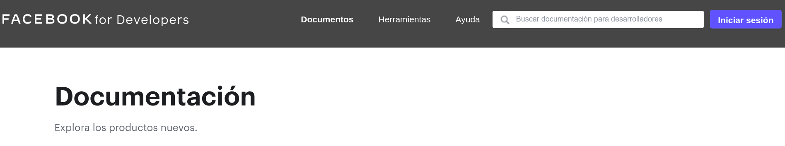

    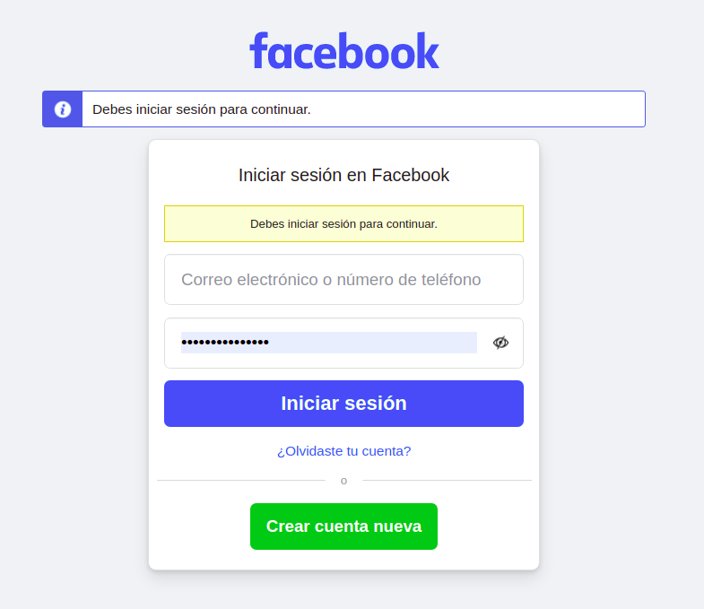

3. Una vez iniciada la sesión hacemos clic en **Mis Apps**, y después clic en **Crear app**.

    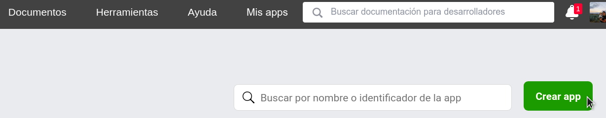

4. En el modal seleccionamos **Ninguno** y se hace clic en **Continuar**.

    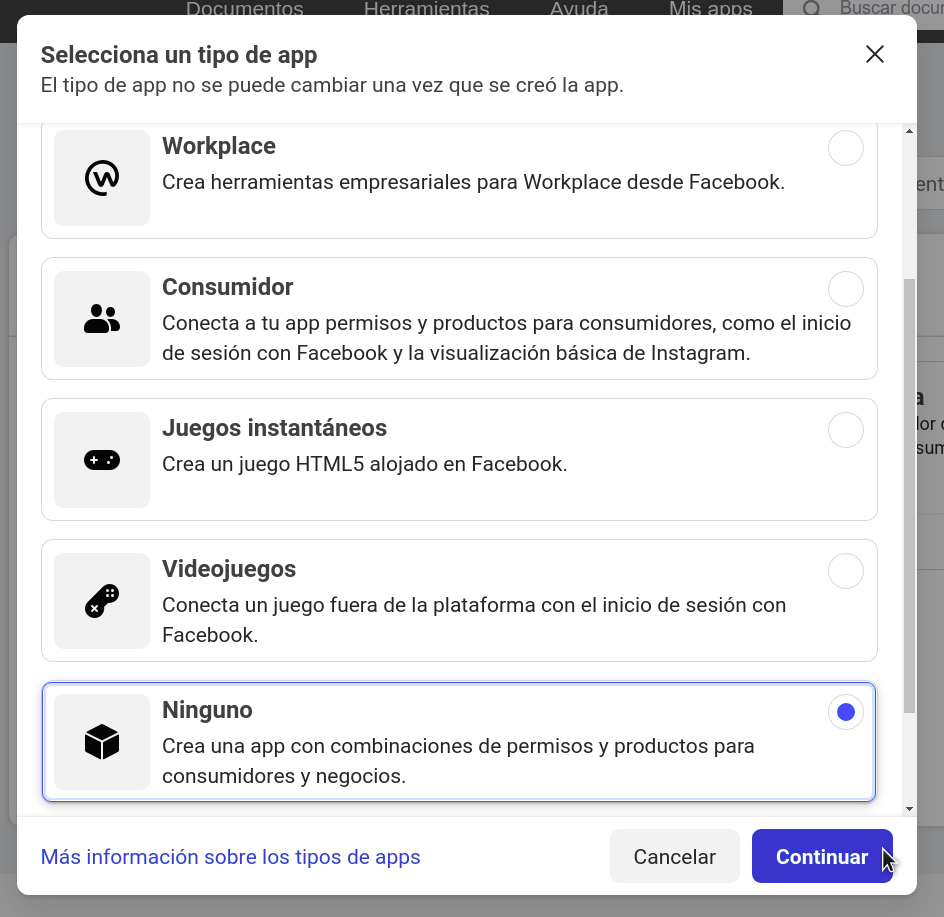

5. Luego escribimos el nombre del proyecto y el correo de contacto, y hacemos clic en **Crear app**. En este momento puede solicitar nuestra contraseña de Facebook.

    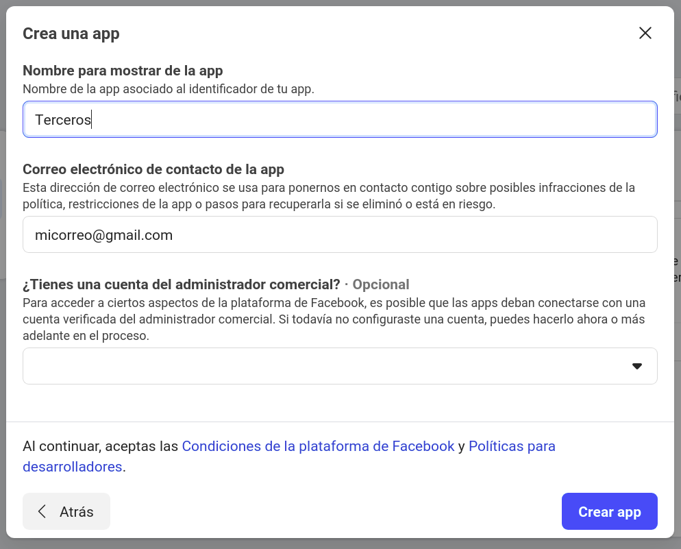

    Una vez creado el proyecto nos mandará a la pantalla principal, donde se muestra el identificador de la app.

    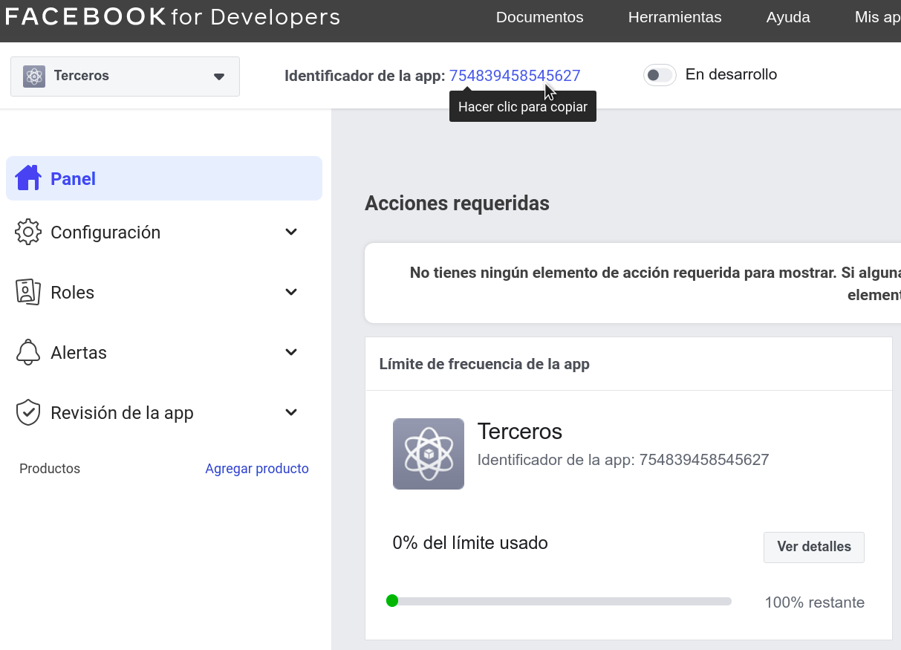

6. Abrimos el siguiente [link](https://developers.facebook.com/docs/facebook-login/android) de Facebook para desarrolladores, para completar la configuración, y nos dirigimos al paso 1 del sitio, donde seleccionaremos el proyecto recién creado

    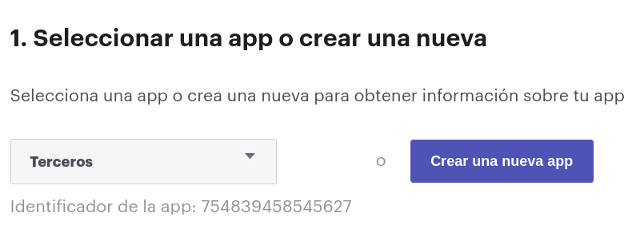

7. Nos saltamos al paso 4 “Al inicio del ejemplo realizamos los pasos 2 y 3”. Abrimos los **strings**  de nuestro proyecto y agregamos el punto 2. Estos son únicos de nuestro proyecto.

    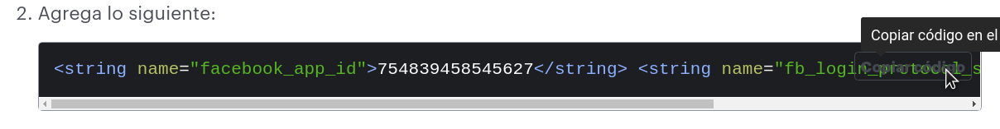

8. Después se agrega el permiso de Internet, los metadatos y el provider de Facebook a nuestro  **AndroidManifest**, como se aprecia en la imagen.

    ```xml
    <uses-permission android:name="android.permission.INTERNET"/>

    …

    <meta-data
      android:name="com.facebook.sdk.ApplicationId"
      android:value="@string/facebook_app_id" />

    …

    <provider
      android:name="com.facebook.FacebookContentProvider"
      android:authorities="com.facebook.app.FacebookContentProvider{cambiarPorId}"
      android:exported="true"
      tools:ignore="ExportedContentProvider" />
    ```

    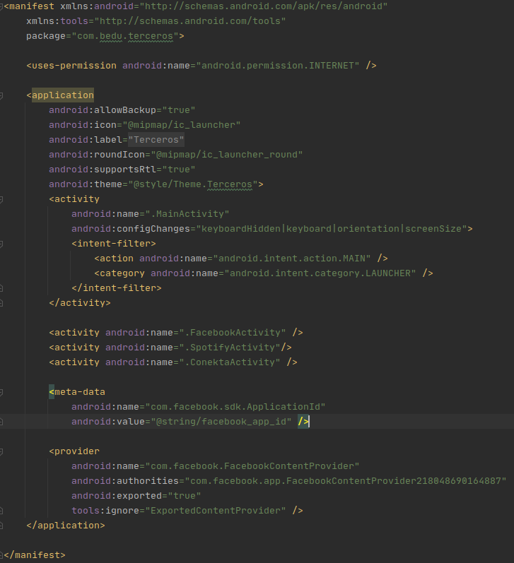

9. Debe asociarse el nombre de tu paquete y la clase predeterminada con tu app

    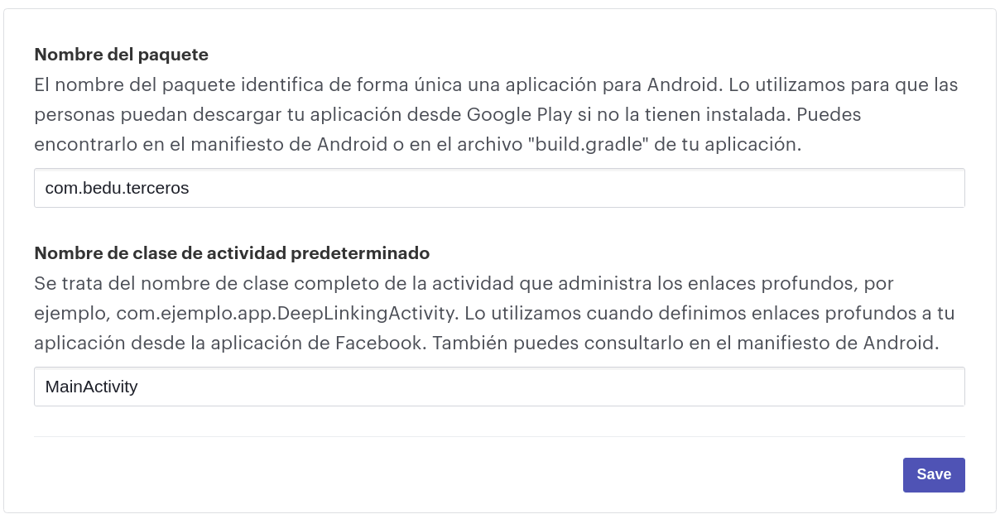

10. Posteriormente, en Android Studio hacemos clic en la siguiente ruta: **File > Project Structure > Modules > app > Signing Configs** y una vez dentro es necesario buscar el archivo de la llave.

    "Podemos usar la llave generada en el Ejercicio 03 de la sesión 01", agregar los datos de usuario y hacer clic en **OK**. Este proceso se representa en la siguiente imagen.

    

11. Luego, en la pestaña de *Default Config*, en la opción de *Signing Config*, seleccionamos ***$signingConfigs.debug***. Después debe hacerse clic en OK, como se visualiza en la imagen.

     

    Esto agrega la siguiente línea en el Gradle:

    ```kotlin
    signingConfigs {
      debug {
        storeFile file('/home/andres/Documentos/Android/DebugKey/debug.keystore')
        storePassword 'android'
        keyAlias 'android'
      }
    }
    ```

12. Así, para generar la huella ejecutamos la siguiente línea en la terminal.

    ```hash
    /opt/android-studio/jre/bin/keytool -exportcert -alias android -storepass android -keypass android -keystore /home/andres/Documentos/Android/DebugKey/debug.keystore  | openssl sha1 -binary | openssl base64
    ```

    > Nota: la primera parte es la ruta donde está instalado **keytool**, luego la ruta donde está la llave, y después los datos de ésta.
    La salida esperada es la siguiente: ywtccZ4ubNv2icrQKK9tCMYQN64=

    > Pro-tip: guarda el hash generado.

13. Se agrega y guarda el hash en el portal de Facebook.

    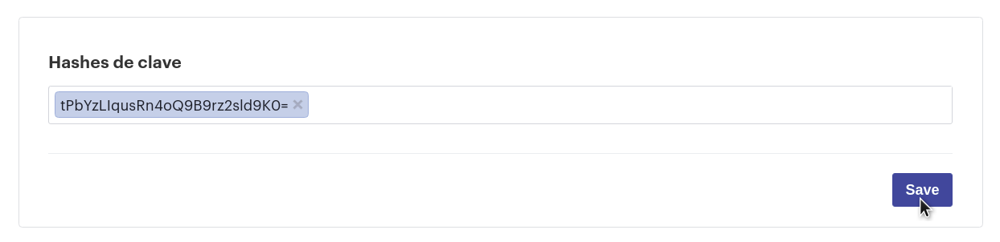

14. Ahora, en Android Studio abrimos la Actividad que tiene la interfaz de Facebook y agregamos el siguiente código en el evento del botón Link.

    ```kotlin
    val content = ShareLinkContent.Builder()
    .setContentUrl(Uri.parse("https://developers.facebook.com"))
    .build()

    ShareDialog.show(this, content)
    ```

15. Se ejecuta el proyecto y se hace clic en el botón Link.

    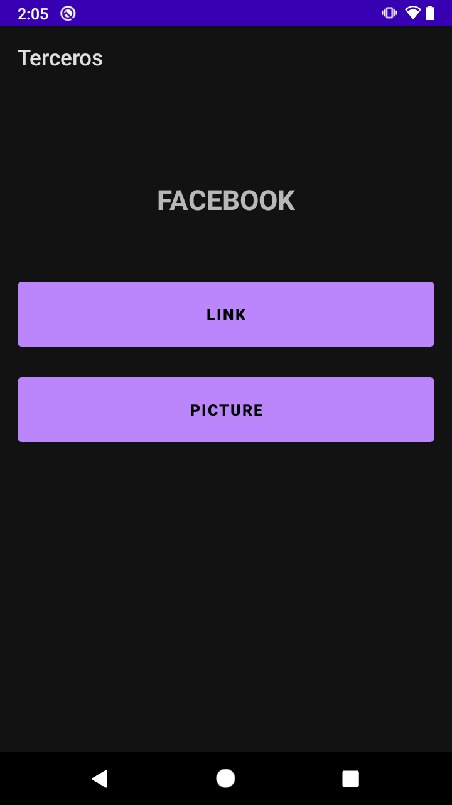 

    Si tenemos la app de Facebook instalada nos mostrará la siguiente interfaz, donde se muestra el link que agregamos en el código anterior, de lo contrario nos abrirá una página web donde nos pedirá iniciar sesión.

    

    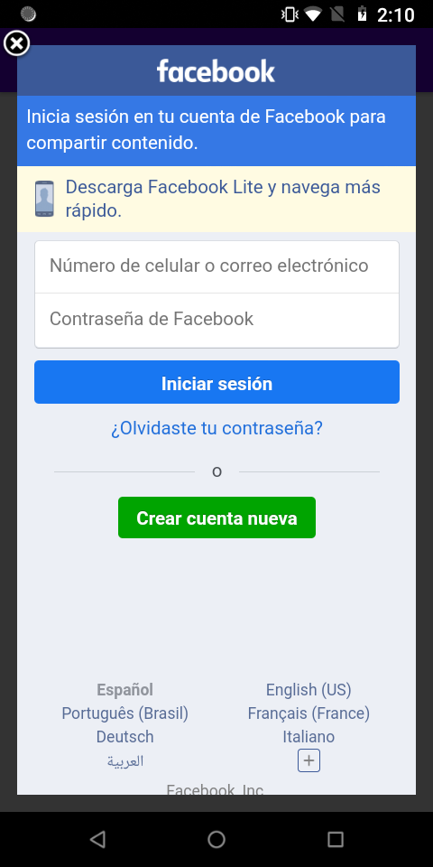

    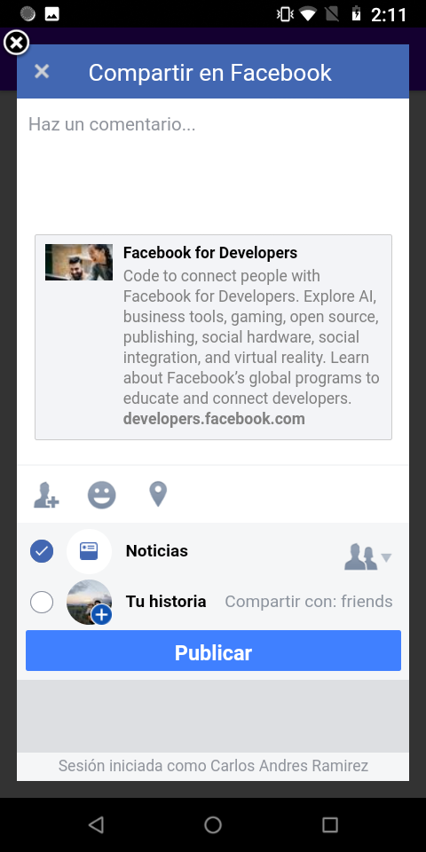

</br>

**¡Felicidades!** Tu app ahora puede compartir contenido en Facebook.

</br>

[Siguiente ](../Reto-01/README.md)(Reto 1)