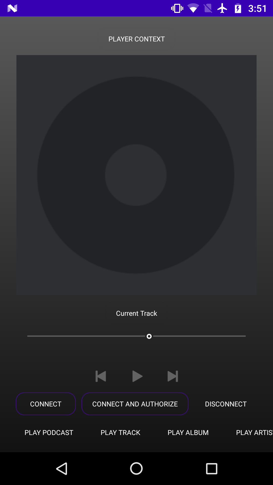
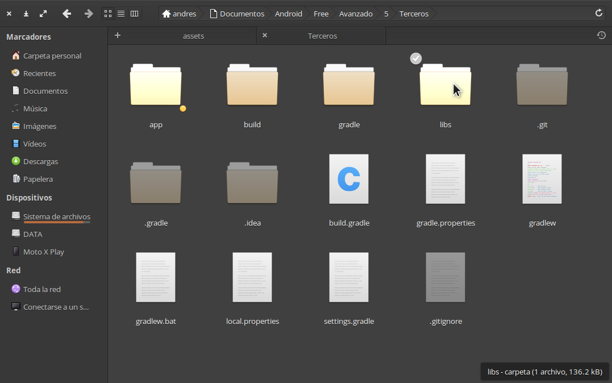
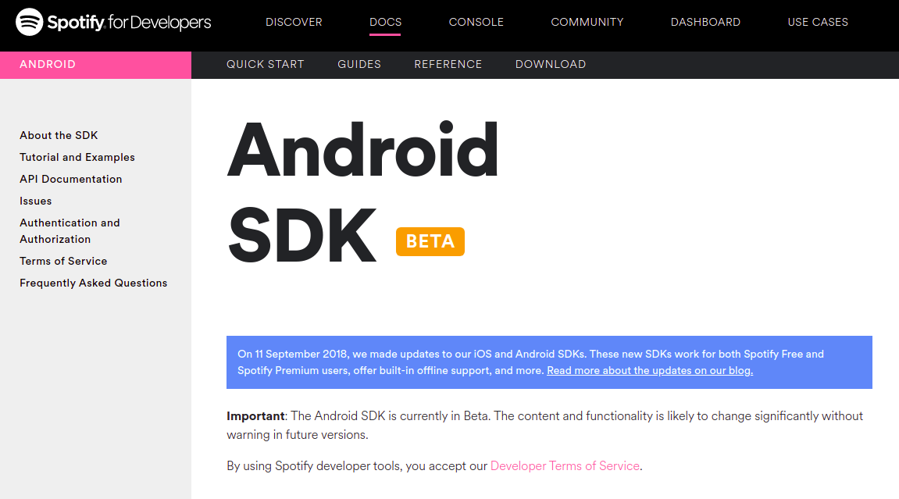
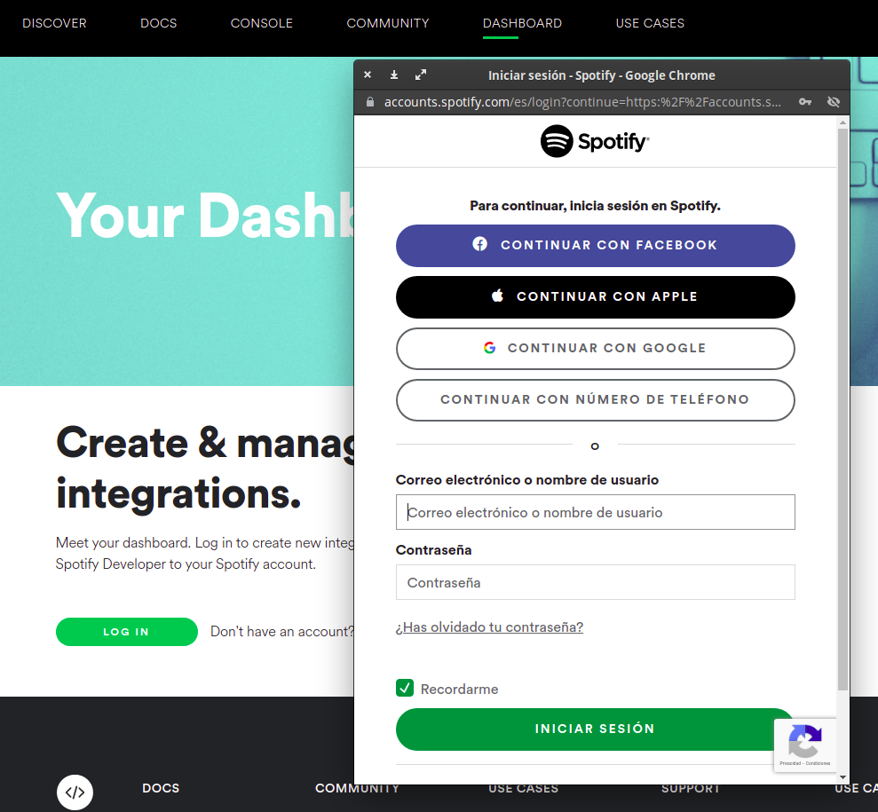
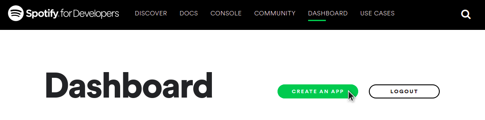
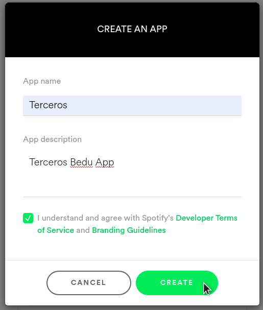
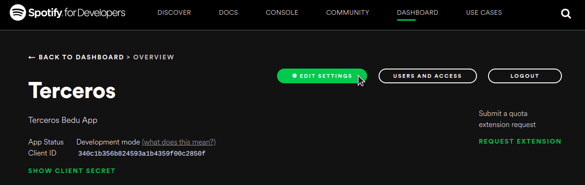
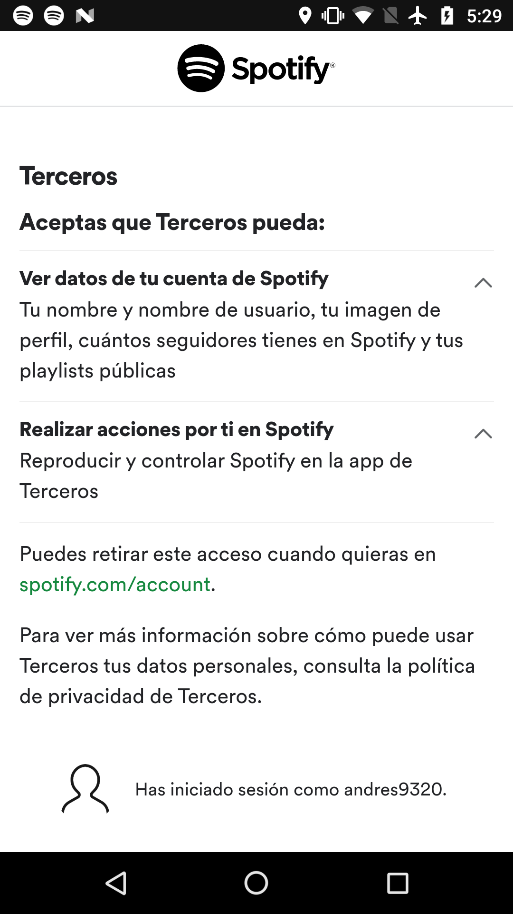
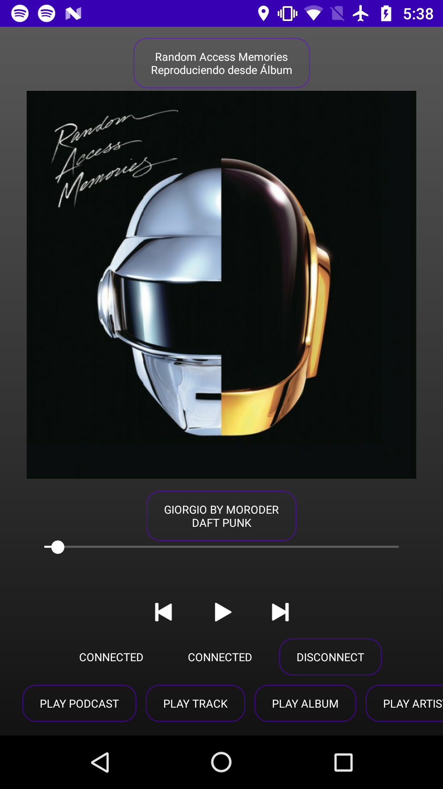

# Ejemplo 03: Spotify Developers

## Objetivo

* Implementar SDK de Spotify en proyecto base Android para combinar la función de controlar reproducción de contenido a una app.
* Crear y configurar proyecto desde el portal de Spotify Developers.

## Desarrollo

Como vimos en el ejemplo 01, nuestro proyecto ya tiene la sección de Spotify, la cual utilizaremos en este ejemplo.

La pantalla Spotify debe tener como mínimo la siguiente interfaz:



Una vez que se tiene la pantalla realizamos los siguientes pasos para crear y configurar nuestro proyecto desde el administrador de Spotify:

1. Cada empresa y/o desarrollador proveerá el SDK de una manera diferente. En el caso de Spotify brindan el **aar**. Este se puede descargar de la documentación oficial o del siguiente vínculo.  [Link SDK Spotify](./spotify-app-remote-release-0.7.2.aar)

2. Una vez descargado el SDK, creamos una carpeta con el nombre **libs** en la raíz de nuestro proyecto, y dentro agregamos el archivo **aar**.
 
    

3. Ahora vamos al **Gradle** del módulo y agregamos las siguientes líneas para agregar el SDK de Spotify y las dependencias que necesita nuestra app para interactuar con Spotify:

    ```gradle
    // Spotify
    implementation files('../libs/spotify-app-remote-release-0.7.2.aar')
    implementation 'com.squareup.okhttp3:okhttp:4.9.0'
    implementation "com.google.code.gson:gson:2.8.6"
    implementation "androidx.lifecycle:lifecycle-runtime-ktx:2.3.1"
    ```

4. Abrimos el administrador de [Spotify Developers](https://developer.spotify.com/documentation/android/) e iniciamos sesión, “Podemos utilizar nuestra cuenta de Spotify”.

    

5. Luego iniciamos sesión haciendo clic en **Dashboard**, y después clic en el botón de **Login**.

    

6. Creamos un nuevo proyecto haciendo clic en **Create an app** e indicando el nombre.

    

    

7. Cuando ya está creado el proyecto abrimos **Settings**. Recuerda copiar el **ClientId**, pues lo necesitaremos más adelante.

    

8. Dentro del modal de Settings agregamos lo siguiente:

    - **Redirect URIs:** https://developer.spotify.com/dashboard
    - **Android Packages**
      - Nombre del paquete, Ej: com.bedu.terceros
      - SHA1: Ej: CB:0B:5C:71:9E:2E:6C:DB:F6:89:CA:D0:28:AF:6D:08:C6:10:37:AF
        - Recuerda generar la llave con, "[Esto lo realizamos en el paso 7 del Ejemplo 03 de la sesión 01](https://github.com/beduExpert/Android-Avanzado-2021/tree/main/Sesion-01/Ejemplo-03)":
            - /opt/android-studio/jre/bin/keytool -list -v -keystore /home/andres/Documentos/Android/DebugKey/debug.keystore -alias android -storepass android -keypass android

    Una vez que agregados los datos anteriores se hace clic en Save. 

9. Se añade el siguiente código en la actividad de Spotify.

    ```kotlin
    object AuthParams {
      const val CLIENT_ID = "Aquí pega tu ClientId"
      const val REDIRECT_URI = "https://developer.spotify.com/dashboard"
    }

    companion object {
        const val TAG = "SpotifyActivity"
    }
    ```

10. Creamos las siguientes variables:

    ```kotlin
    private var playerStateSubscription: Subscription<PlayerState>? = null
    private var playerContextSubscription: Subscription<PlayerContext>? = null
    private var spotifyAppRemote: SpotifyAppRemote? = null

    private lateinit var views: List<View>
    private lateinit var trackProgressBar: TrackProgressBar
    private lateinit var binding: ActivitySpotifyBinding

    private val errorCallback = { throwable: Throwable -> logError(throwable) }
    ```

11. Debe crearse una clase con el nombre de TrackProgressBar, la cual nos ayudará a controlar la barra de reproducción. 
    Le agregamos el siguiente código:

    ```kotlin
    import android.os.Handler
    import android.widget.SeekBar

    class TrackProgressBar(private val seekBar: SeekBar, private val seekStopListener: (Long) -> Unit) {
      private val handler: Handler

      private val seekBarChangeListener = object : SeekBar.OnSeekBarChangeListener {
          override fun onProgressChanged(seekBar: SeekBar, progress: Int, fromUser: Boolean) {}

          override fun onStartTrackingTouch(seekBar: SeekBar) {}

          override fun onStopTrackingTouch(seekBar: SeekBar) {
              seekStopListener.invoke(seekBar.progress.toLong())
          }
      }

      init {
          seekBar.setOnSeekBarChangeListener(seekBarChangeListener)
          handler = Handler()
      }

      private val seekUpdateRunnable = object : Runnable {
          override fun run() {
              val progress = seekBar.progress
              seekBar.progress = progress + LOOP_DURATION
              handler.postDelayed(this, LOOP_DURATION.toLong())
          }
      }

      fun setDuration(duration: Long) {
          seekBar.max = duration.toInt()
      }

      fun update(progress: Long) {
          seekBar.progress = progress.toInt()
      }

      fun pause() {
          handler.removeCallbacks(seekUpdateRunnable)
      }

      fun unpause() {
          handler.removeCallbacks(seekUpdateRunnable)
          handler.postDelayed(seekUpdateRunnable, LOOP_DURATION.toLong())
      }

      companion object {
          private const val LOOP_DURATION = 500
      }
    }
    ```

12. Existen múltiples maneras de activar y desactivar los botones. En esta ocasión lo haremos con una lista, donde los almacenaremos. Además, añadimos la configuración para controlar la barra, previamente creada. Con ello el siguiente código va dentro del onCreate:

    ```kotlin
    binding.seekTo.apply {
      isEnabled = false
      progressDrawable.setColorFilter(Color.WHITE, PorterDuff.Mode.SRC_ATOP)
      indeterminateDrawable.setColorFilter(Color.WHITE, PorterDuff.Mode.SRC_ATOP)
    }

    trackProgressBar =
        TrackProgressBar(binding.seekTo) { seekToPosition: Long -> seekTo(seekToPosition) }

    views = listOf(
      binding.disconnectButton,
      binding.subscribeToPlayerContextButton,
      binding.subscribeToPlayerStateButton,
      binding.playPauseButton,
      binding.skipPrevButton,
      binding.skipNextButton,
      binding.playPodcastButton,
      binding.playTrackButton,
      binding.playAlbumButton,
      binding.playArtistButton,
      binding.playPlaylistButton,
      binding.seekTo
    )

    SpotifyAppRemote.setDebugMode(false)

    onDisconnected()
    onConnectAndAuthorizedClicked(binding.connectAuthorizeButton)
    ```

    El código previo tiene la siguiente línea -> **SpotifyAppRemote.setDebugMode(false)**. En este caso Spotify nos permite indicarle si estamos corriendo la app en modo debug. 
    
    Si activamos el booleano, Spotify nos estará mostrando los logs, lo cual incluye las llamadas a la API.

13. La siguiente función se encarga de notificar cuando hay cambios de tiempo en la barra de reproducción. "El siguiente código debe ir debajo del onCreate()":

    ```kotlin
    private fun seekTo(seekToPosition: Long) {
        assertAppRemoteConnected()
            .playerApi
            .seekTo(seekToPosition)
            .setErrorCallback(errorCallback)
    }
    ```

14. Ahora agregamos las funciones encargadas de realizar las conexiones para solicitar el control. “El siguiente código debe ir debajo de seekTo()”:

    ```kotlin
    override fun onStop() {
      super.onStop()
      SpotifyAppRemote.disconnect(spotifyAppRemote)
      onDisconnected()
    }

    private fun onConnected() {
      for (input in views) {
          input.isEnabled = true
      }
      binding.connectButton.apply {
          isEnabled = false
          text = getString(R.string.connected)
      }
      binding.connectAuthorizeButton.apply {
          isEnabled = false
          text = getString(R.string.connected)
      }

      onSubscribedToPlayerStateButtonClicked(binding.subscribeToPlayerStateButton)
      onSubscribedToPlayerContextButtonClicked(binding.subscribeToPlayerContextButton)
    }

    private fun onConnecting() {
      binding.connectButton.apply {
          isEnabled = false
          text = getString(R.string.connecting)
      }
      binding.connectAuthorizeButton.apply {
          isEnabled = false
          text = getString(R.string.connecting)
      }
    }

    private fun onDisconnected() {
      for (view in views) {
          view.isEnabled = false
      }
      binding.connectButton.apply {
          isEnabled = true
          text = getString(R.string.connect)
      }
      binding.connectAuthorizeButton.apply {
          isEnabled = true
          text = getString(R.string.authorize)
      }
      binding.image.setImageResource(R.drawable.widget_placeholder)
      binding.subscribeToPlayerContextButton.apply {
          visibility = View.VISIBLE
          setText(R.string.title_player_context)
      }
      binding.subscribeToPlayerStateButton.apply {
          visibility = View.VISIBLE
          setText(R.string.title_current_track)
      }

      binding.currentContextLabel.visibility = View.INVISIBLE
      binding.currentTrackLabel.visibility = View.INVISIBLE
    }

    fun onConnectClicked(notUsed: View) {
      onConnecting()
      connect(false)
    }

    fun onConnectAndAuthorizedClicked(notUsed: View) {
      onConnecting()
      connect(true)
    }

    private fun connect(showAuthView: Boolean) {

      SpotifyAppRemote.disconnect(spotifyAppRemote)
      lifecycleScope.launch {
          try {
              spotifyAppRemote = connectToAppRemote(showAuthView)
              onConnected()
          } catch (error: Throwable) {
              onDisconnected()
              logError(error)
          }
      }
    }

    private suspend fun connectToAppRemote(showAuthView: Boolean): SpotifyAppRemote? =
    suspendCoroutine { cont: Continuation<SpotifyAppRemote> ->
      SpotifyAppRemote.connect(
        application,
        ConnectionParams.Builder(CLIENT_ID)
          .setRedirectUri(REDIRECT_URI)
          .showAuthView(showAuthView)
          .build(),
        object : Connector.ConnectionListener {
          override fun onConnected(spotifyAppRemote: SpotifyAppRemote) {
              cont.resume(spotifyAppRemote)
          }

          override fun onFailure(error: Throwable) {
              cont.resumeWithException(error)
          }
        })
    }

    fun onDisconnectClicked(notUsed: View) {
      SpotifyAppRemote.disconnect(spotifyAppRemote)
      onDisconnected()
    }
    ```

    En términos generales, el código previo se encargará de realizar la conexión con el API de Spotify, además de activar y desactivar los botones.

    La función connectToAppRemote se encarga de enviar el clientId y la url a los servicios de Spotify, y validar si tiene permisos. Esto se realiza con una Coroutine.

15. Agregamos las siguientes líneas, que tienen la función de mostrar lo que se está reproduciendo (“Canción, Artista, Playlist, Álbum, Podcast…”).

    ```kotlin
    fun onSubscribedToPlayerContextButtonClicked(notUsed: View) {
      playerContextSubscription = cancelAndResetSubscription(playerContextSubscription)

      binding.currentContextLabel.visibility = View.VISIBLE
      binding.subscribeToPlayerContextButton.visibility = View.INVISIBLE
      playerContextSubscription = assertAppRemoteConnected()
          .playerApi
          .subscribeToPlayerContext()
          .setEventCallback(playerContextEventCallback)
          .setErrorCallback { throwable ->
              binding.currentContextLabel.visibility = View.INVISIBLE
              binding.subscribeToPlayerContextButton.visibility = View.VISIBLE
              logError(throwable)
          } as Subscription<PlayerContext>
    }

    fun onSubscribedToPlayerStateButtonClicked(notUsed: View) {
      playerStateSubscription = cancelAndResetSubscription(playerStateSubscription)

      binding.currentTrackLabel.visibility = View.VISIBLE
      binding.subscribeToPlayerStateButton.visibility = View.INVISIBLE

      playerStateSubscription = assertAppRemoteConnected()
          .playerApi
          .subscribeToPlayerState()
          .setEventCallback(playerStateEventCallback)
          .setLifecycleCallback(
              object : Subscription.LifecycleCallback {
                  override fun onStart() {
                      logMessage("Event: start")
                  }

                  override fun onStop() {
                      logMessage("Event: end")
                  }
              })
          .setErrorCallback {
              binding.currentTrackLabel.visibility = View.INVISIBLE
              binding.subscribeToPlayerStateButton.visibility = View.VISIBLE
          } as Subscription<PlayerState>
    }

    private fun <T : Any?> cancelAndResetSubscription(subscription: Subscription<T>?): Subscription<T>? {
      return subscription?.let {
          if (!it.isCanceled) {
              it.cancel()
          }
          null
      }
    }

    private fun assertAppRemoteConnected(): SpotifyAppRemote {
      spotifyAppRemote?.let {
          if (it.isConnected) {
              return it
          }
      }
      Log.e(TAG, getString(R.string.err_spotify_disconnected))
      throw SpotifyDisconnectedException()
    }

    private fun logError(throwable: Throwable) {
      Toast.makeText(this, R.string.err_generic_toast, Toast.LENGTH_SHORT).show()
      Log.e(TAG, "", throwable)
    }

    private fun logMessage(msg: String, duration: Int = Toast.LENGTH_SHORT) {
    //        Toast.makeText(this, msg, duration).show()
      Log.d(TAG, msg)
    }
    ```

    Se agregaron dos funciones extra, encargadas de mostrar tanto errores como mensajes importantes: logError() y logMessage().

16. Ahora es necesario agregar las funciones que estarán esperando eventos con el siguiente código, por ejemplo actualizar la portada, mostrar el botón de play/pause, si cambio el contenido en reproducción:

    ```kotlin
    private val playerContextEventCallback =
    Subscription.EventCallback<PlayerContext> { playerContext ->
      binding.currentContextLabel.apply {
          text = String.format(
              Locale.getDefault(),
              "%s\n%s",
              playerContext.title,
              playerContext.subtitle
          )
          tag = playerContext
      }
    }

    private val playerStateEventCallback = Subscription.EventCallback<PlayerState> { playerState ->

      updateTrackStateButton(playerState)

      updatePlayPauseButton(playerState)

      updateTrackCoverArt(playerState)

      updateSeekbar(playerState)
    }

    private fun updatePlayPauseButton(playerState: PlayerState) {
      // Invalidate play / pause
      if (playerState.isPaused) {
          binding.playPauseButton.setImageResource(R.drawable.btn_play)
      } else {
          binding.playPauseButton.setImageResource(R.drawable.btn_pause)
      }
    }

    private fun updateTrackStateButton(playerState: PlayerState) {
      binding.currentTrackLabel.apply {
          text = String.format(
              Locale.US,
              "%s\n%s",
              playerState.track.name,
              playerState.track.artist.name
          )
          tag = playerState
      }
    }

    private fun updateSeekbar(playerState: PlayerState) {
      // Update progressbar
      trackProgressBar.apply {
          if (playerState.playbackSpeed > 0) {
              unpause()
          } else {
              pause()
          }
          // Invalidate seekbar length and position
          binding.seekTo.max = playerState.track.duration.toInt()
          binding.seekTo.isEnabled = true
          setDuration(playerState.track.duration)
          update(playerState.playbackPosition)
      }
    }

    private fun updateTrackCoverArt(playerState: PlayerState) {
      // Get image from track
      assertAppRemoteConnected()
          .imagesApi
          .getImage(playerState.track.imageUri, Image.Dimension.LARGE)
          .setResultCallback { bitmap ->
              binding.image.setImageBitmap(bitmap)
          }
    }
    ```

17. Luego agregamos los métodos para reproducir/pausar, anterior y siguiente.

    ```kotlin
    fun onSkipPreviousButtonClicked(notUsed: View) {
      assertAppRemoteConnected()
          .playerApi
          .skipPrevious()
          .setResultCallback { logMessage(getString(R.string.command_feedback, "skip previous")) }
          .setErrorCallback(errorCallback)
    }

    fun onPlayPauseButtonClicked(notUsed: View) {
      assertAppRemoteConnected().let {
          it.playerApi
              .playerState
              .setResultCallback { playerState ->
                  if (playerState.isPaused) {
                      it.playerApi
                          .resume()
                          .setResultCallback {
                              logMessage(
                                  getString(
                                      R.string.command_feedback,
                                      "play"
                                  )
                              )
                          }
                          .setErrorCallback(errorCallback)
                  } else {
                      it.playerApi
                          .pause()
                          .setResultCallback {
                              logMessage(
                                  getString(
                                      R.string.command_feedback,
                                      "pause"
                                  )
                              )
                          }
                          .setErrorCallback(errorCallback)
                  }
              }
      }
    }

    fun onSkipNextButtonClicked(notUsed: View) {
      assertAppRemoteConnected()
          .playerApi
          .skipNext()
          .setResultCallback { logMessage(getString(R.string.command_feedback, "skip next")) }
          .setErrorCallback(errorCallback)
    }
    ```

18. Si estás utilizando el proyecto base no es necesario conectar los botones con las funciones, ya que estas ya se encuentran conectadas. Si no lo están debes conectarlas.

19. Debe abrirse el **AndroidManifest** y agregarse **android:exported="true"** a la actividad de **Spotify**.

20. Finalmente ejecutamos el proyecto y abrimos la pantalla de Spotify. 

    > Nota: recuerda tener instalada la **App de Spotify e iniciada la sesión con la misma cuenta que creaste el proyecto**.

    Al entrar a la pantalla se solicitará el permiso de Spotify. “Puedes revocar este permiso entrando a tu [cuenta de Spotify](https://www.spotify.com/mx/account/overview/), seleccionando Apps, seguido del botón **Eliminar acceso**”.

    

    

    

</br>

Si utilizaste Spotify previamente, verás la última canción reproducida. Prueba haciendo clic en **Play** y deberías escuchar la canción. 

Ahora usa los siguientes controles: “Pausa, Anterior, Siguiente y barra de reproducción”.

**¡Súper!** Has concluido tu primera integración con el **SDK de Spotify**.

</br>

[Siguiente ](../Reto-02/README.md)(Reto 2)