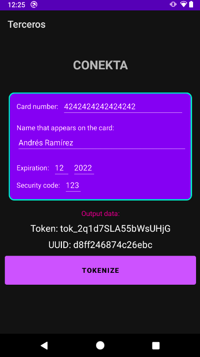
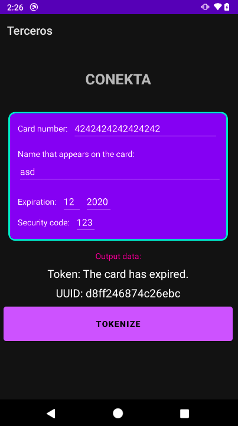

# Postwork 5 - Conekta

## Objetivo

- Implementar SDK de Conekta.
- Tokenizar tarjetas para pagos.

## Desarrollo

En la era digital que vivimos cada vez existen más formas para pagar los productos y servicios que adquirimos.

En países desarrollados y en desarrollo los métodos de pago que casi todos conocemos son el efectivo, las tarjetas de débito y de crédito, sin embargo crecen cada vez más otros métodos de pago, muchos de ellos virtuales. 

Uno de estos métodos es pagar a través del móvil determinados productos y servicios en el eCommerce, o directamente en puntos de venta físicos acercando el smartphone al terminal (a través de la tecnología NFC), o bien, usándolos para hacer transferencias de dinero entre personas.

Para este PostWork se implementará el SDK de Conekta. 

[Conekta](https://conekta.com/) es una empresa mexicana experta en pagos en línea. Más de 6000 comercios cobran en línea con Conekta y millones de mexicanos pagan por productos, servicios y experiencias.

Como se mencionó en el PreWork de esta sesión, cada empresa y/o desarrollador provee su forma de interactuar con sus prestaciones y/o servicios. 

En el caso de Conekta necesitamos **tokenizar** y vincular las tarjetas de los usuarios. La empresa no recomienda almacenar la información de las tarjetas, así que para ello la app tendrá que enviar estos datos de tarjeta a través del SDK de Conekta, y esta operación retornará el **token** y **UUID**. 
Estos deben almacenarse (de preferencia en nuestra DB), y cada vez que el usuario necesite realizar una compra, la app enviará el token y el UUID para que Conekta realice el cargo a la tarjeta del usuario. De esta forma se agrega un nivel extra de seguridad.

</br>

### Indicaciones generales:
1. **Parte 1**. Utiliza el proyecto que realizaste en la actividad 01 del Prework, o el proyecto base del Work de esta sesión.

    - Considera las siguientes recomendaciones para el reto.

      - Agrega el SDK de Conekta desde el Gradle.

      ```Kotlin
      // Conekta
      implementation('io.conekta:conektasdk:2.0') {
          exclude group: 'com.android.support'
      }
      ```

      - Algunas dependencias pueden incluir código que ya provee otro SDK, y para evitar un error se necesita descartar esa sección. En este caso se debe excluir android support, así que se agrega la siguiente línea dentro: **exclude group: 'com.android.support**'

      - Agregamos la siguiente línea en **AndroidManifest** dentro de **Application**:

      ```Kotlin
      <uses-library android:name ="org.apache.http.legacy" android:required ="false"/>
      ```

Abrimos la actividad de Conekta y realizamos los siguientes pasos:

1. Agrega las siguientes variables, incluida la publicKey.

    ```Kotlin
    private val PUBLIC_KEY = "key_eYvWV7gSDkNYXsmr"
    private val API_VERSION = "0.3.0"

    private var hasValidCardData: Boolean? = false
    private var cardName: String? = null
    private var cardNumber: String? = null
    private var cardCvc: String? = null
    private var cardMonth: String? = null
    private var cardYear: String? = null
    private var tokenIdTag: String? = null
    private var errorTag: String? = null
    private var uuidDeviceTag: String? = null
    ```

2. Dentro del onCreate agregamos el siguiente código:

    ```Kotlin
    tokenIdTag = resources.getString(R.string.theTokenIdLabel) // The token id:
    errorTag = resources.getString(R.string.errorLabel) // Error:
    uuidDeviceTag = resources.getString(R.string.uuidDeviceLabel) // Uuid device:

    binding.btnTokenize.setOnClickListener { onPressTokenizeButton() }
    ```

3. Las siguientes funciones se encargan de habilitar los campos, así que deben añadirse.

    ```Kotlin
    override fun onStart() {
        super.onStart()
        enableInputs(true)
        enableProgressBar(false)
    }

    private fun enableInputs(isEnable: Boolean) {
        binding.btnTokenize.isEnabled = isEnable
        binding.numberText.isEnabled = isEnable
        binding.nameText.isEnabled = isEnable
        binding.monthText.isEnabled = isEnable
        binding.yearText.isEnabled = isEnable
        binding.cvcText.isEnabled = isEnable
    }

    private fun enableProgressBar(show: Boolean) {
        binding.progressBar.visibility = if (show) View.VISIBLE else View.GONE
        binding.shadowView.visibility = if (show) View.VISIBLE else View.GONE
    }
    ```

4. Luego se asignan los datos ingresados por el usuario a las variables y se revisa si el dispositivo tiene conexión a Internet.

    ```Kotlin
    private fun getCardData() {
        hasValidCardData = true
        cardName = binding.nameText.text.toString()
        cardNumber = binding.numberText.text.toString()
        cardCvc = binding.cvcText.text.toString()
        cardMonth = binding.monthText.text.toString()
        cardYear = binding.yearText.text.toString()
        if (cardName!!.isEmpty() || cardNumber!!.isEmpty() || cardCvc!!.isEmpty()
            || cardMonth!!.isEmpty() || cardYear!!.isEmpty()
        ) {
            hasValidCardData = false
        }
    }

    private fun hasInternetConnection(): Boolean {
        val cm = getSystemService(CONNECTIVITY_SERVICE) as ConnectivityManager
        val netInfo = cm.activeNetworkInfo
        return netInfo != null && netInfo.isConnected
    }
    ```

5. Después agregamos la función encargada de tokenizar las tarjetas.

    ```Kotlin
    private fun onPressTokenizeButton() {
        enableInputs(false)
        enableProgressBar(true)
        if (hasInternetConnection()) {
            Conekta.setPublicKey(PUBLIC_KEY)
            Conekta.setApiVersion(API_VERSION)
            Conekta.collectDevice(this)
            getCardData()
            if (hasValidCardData!!) {
                val card = Card(cardName, cardNumber, cardCvc, cardMonth, cardYear)
                val token = Token(this)

                //Listen when token is returned
                token.onCreateTokenListener { data -> showTokenResult(data) }

                //Request for create token
                token.create(card)
            } else {
                Toast.makeText(
                    this@ConektaActivity,
                    resources.getString(R.string.cardDataIncomplete),
                    Toast.LENGTH_LONG
                ).show()
                enableInputs(true)
                enableProgressBar(false)
            }
        } else {
            Toast.makeText(
                this@ConektaActivity,
                resources.getString(R.string.needInternetConnection),
                Toast.LENGTH_LONG
            ).show()
            binding.outputView.text = resources.getString(R.string.needInternetConnection)
            enableInputs(true)
            enableProgressBar(false)
        }
    }
    ```

6. Por último agregamos una función que notifique los mensajes del SDK.

    ```Kotlin
    private fun showTokenResult(data: JSONObject) {
        try {
            Log.e("TAG", "showTokenResult: $data")
            val tokenId: String = if (data.has("id")) {
                data.getString("id")
            } else {
                data.getString("message")
            }
            val tokenMessage = "$tokenIdTag $tokenId"
            binding.outputView.text = tokenMessage
            Log.d(tokenIdTag, tokenId)
        } catch (error: Exception) {
            val errorMessage = "$errorTag $error"
            binding.outputView.text = errorMessage
        }
        enableInputs(true)
        enableProgressBar(false)

        val uuidMessage: String = uuidDeviceTag + " " + Conekta.deviceFingerPrint(this)
        binding.uuidDevice.text = uuidMessage
    }
    ```

7. Ahora ejecutamos el proyecto e ingresamos los datos en la pantalla. Conekta nos muestra datos de tarjetas con los que podemos hacer pruebas. Se debe agregar alguna:

    NÚMERO | TOKEN ID | TIPO DE TARJETA
    --- | --- | ---
    4242424242424242 | tok_test_visa_4242 | Visa
    4012888888881881 | tok_test_visa_1881 | Visa
    5555555555554444 | tok_test_mastercard_4444 | MasterCard
    5105105105105100 | tok_test_mastercard_5100 | MasterCard
    378282246310005 | tok_test_amex_0005 | American Express
    371449635398431 | tok_test_amex_8431 | American Express

    En el nombre, fecha de expiración y CVC, puedes agregar el dato que tu quieras.

8. Agregamos alguna de las tarjetas mostradas previamente.

    Una vez agregada la tarjeta, se podrá visualizar alguno de los siguientes escenarios “En la etiqueta Token”: 

      - Se tokenizó correctamente 
      - Datos inompletos.
      - Tarjeta vencida.
      - Tarjeta válida.
      - Necesitas conexión a Internet.





</br>
</br>

- **Parte 2**. Añade al menos uno de los SDK incluidos en esta sesión a tu proyecto, según brinde un criterio de valor en relación con su funcionalidad: Facebook, Spotify o Conekta.

</br>
</br>

[Regresar ](../)(Sesion 5)

[Siguiente ](../../Sesion-06/README.md)(Sesión 06)