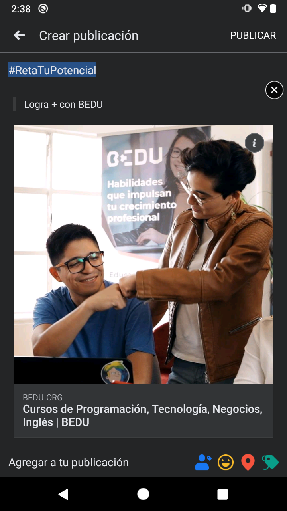
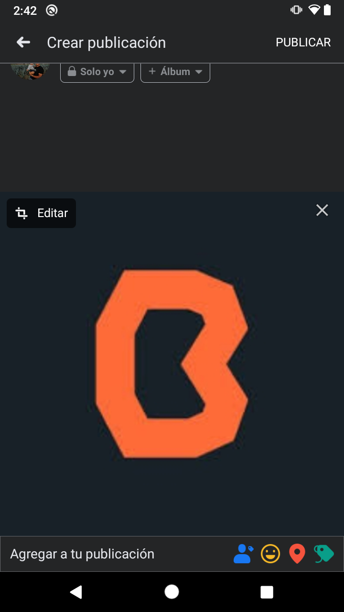

# Reto 01: Compartiendo imágenes, cita y tags

## Objetivo

* Adaptar el código para agregar cita y tags al compartir vínculos a través del SDK de facebook en la app.
* Compartir imágenes con tags.

## Desarrollo

En el ejemplo 01 aprendimos a compartir vínculos con el SDK de Facebook. Para completar este reto necesitas sumar los siguientes puntos al proyecto trabajado previamente:

</br>

1. Agregar cita y tags al evento del botón Link.
  
    - Para agregar la url utilizamos **.setContentUrl**. Explora qué otras opciones tiene **ShareLinkContent**, pues utilizarás dos de ellas para completar este reto.

2. Compartir una imagen alojada en nuestro proyecto al evento del botón Picture. 

    - Utiliza la imagen que sea de tu agrado.
    - Para compartir imágenes utilizamos SharePhoto.

</br>

[Haz clic aquí para abrir la documentación oficial](https://developers.facebook.com/docs/sharing/android)

</br>

<details>
    <summary>Solución 1</summary>

  Evento botón Link
  ```kotlin
  val content = ShareLinkContent.Builder()
    .setContentUrl(Uri.parse("https://bedu.org/"))
    .setQuote("Logra + con BEDU")
    .setShareHashtag(
        ShareHashtag.Builder()
            .setHashtag("#RetaTuPotencial")
            .build()
    )
    .build()

  ShareDialog.show(this, content)
  ```

   

</details>

</br>

<details>
    <summary>Solución 2</summary>
  
  Evento botón Picture
  ```kotlin
  val image = BitmapFactory.decodeResource(resources, R.drawable.bedu)
  val photo = SharePhoto.Builder()
      .setBitmap(image)
      .build()
  val photoContent = SharePhotoContent.Builder()
      .addPhoto(photo)
      .build()

  ShareDialog.show(this, photoContent)
  ```

  

</details>

</br>
</br>

[Siguiente ](../Ejemplo-02/README.md)(Ejemplo 2)
