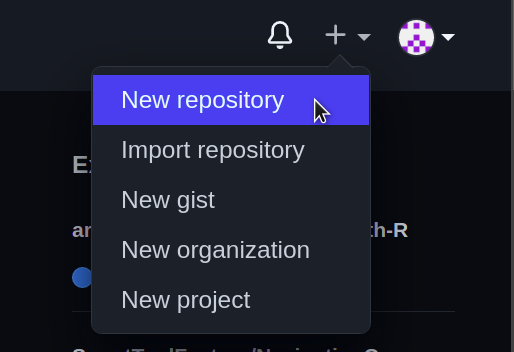
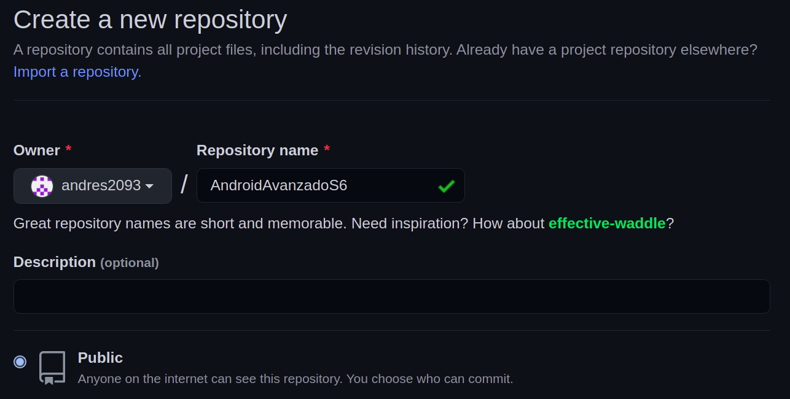
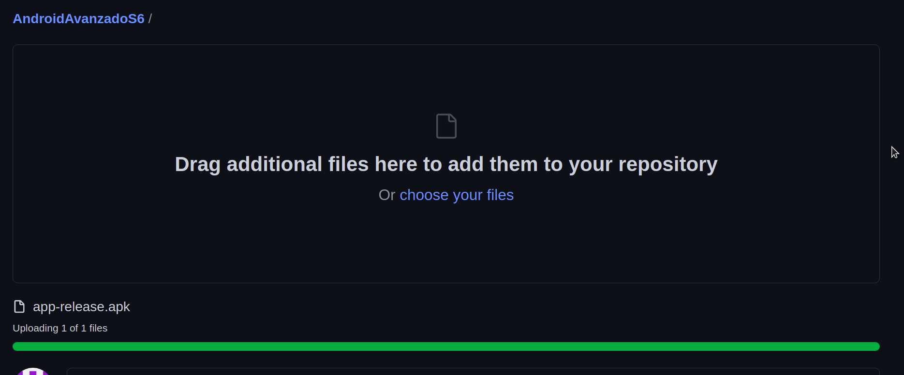

# Ejemplo 01: Subiendo APK a servidor externo

## Objetivo

* Publicar una APK en servidor externo.

## Desarrollo

En el reto 01 generaste el APK firmado. En este ejemplo se publicará este APK en un servidor remoto. En este caso utilizaremos GitHub como servidor. 

Sigue los pasos a continuación para lograrlo:

1. Dirígete a la página de **GitHub**, accesa a tu cuenta, y si creaste el Repositorio durante el Prework ve al **paso 4**, de lo contrario ve al **paso 2**.
2. Crea un nuevo repositorio en el ícono “+” junto a las opciones de usuario, del lado superior derecho.

    

3. Agrega el nombre del repositorio y márcalo como Público.

      

4. Una vez creado el repositorio haz clic en Uploading an existing file.

      

5. Selecciona o arrastra el APK firmado y haz clic en confirmar.

     

     

 

**¡Felicidades!** El APK está listo para ser descargado desde nuestra app.

 

[Siguiente ](../Ejemplo-02/README.md)(Ejemplo 2)