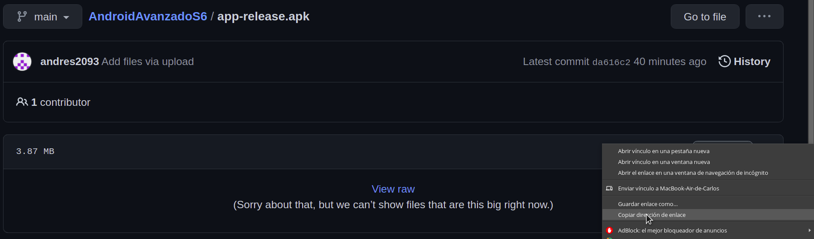
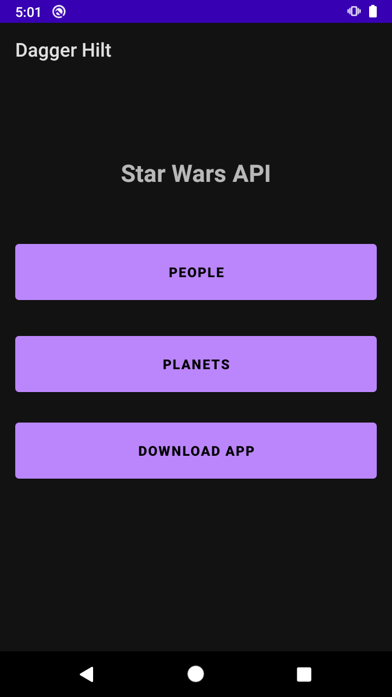
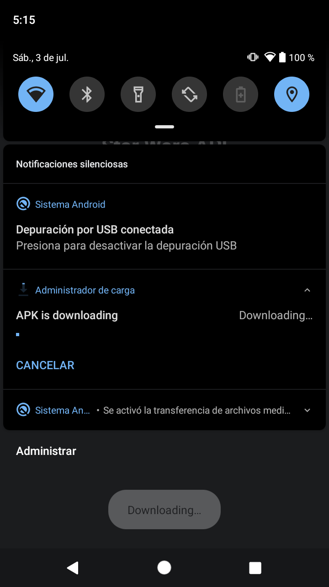
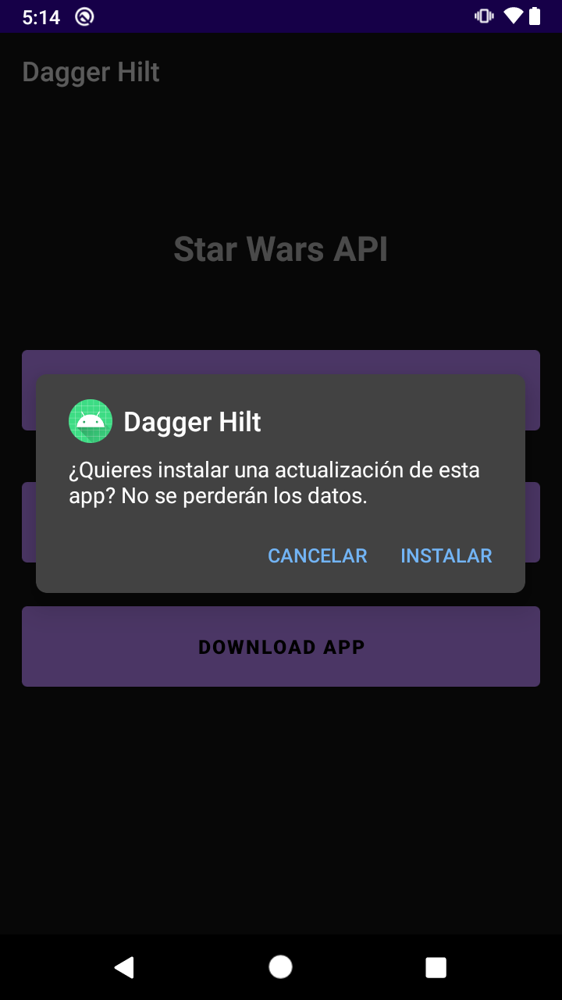

# Ejemplo 02: Descargando e instalando APK programáticamente (Manual)

## Objetivo

* Descargar APK programáticamente desde un servidor externo.
* Abrir el instalador de apps con el APK descargado previamente.

## Desarrollo

En este ejemplo descargaremos e instalaremos el APK publicado en el ejemplo anterior. Para ello realizamos los siguientes pasos en el proyecto utilizado en el reto 1:

1. Nos dirigimos al **activity_main.xml** y agregamos las siguientes líneas dentro del **ConstraintLayout** para crear un botón que descargue el APK:

    ```xml
    <Button
      android:id="@+id/btnDownload"
      android:layout_width="0dp"
      android:layout_height="70dp"
      android:layout_marginTop="10dp"
      android:text="Download app"
      android:textStyle="bold"
      app:layout_constraintBottom_toBottomOf="parent"
      app:layout_constraintStart_toStartOf="parent"
      app:layout_constraintEnd_toEndOf="parent"
      app:layout_constraintTop_toBottomOf="@+id/btnPlanets"
      app:layout_constraintVertical_bias="0.06" />
    ```

2. Ahora vamos al **MainActivity** y agregamos el evento del botón, mediante el siguiente código:

    ```kotlin
    binding.btnDownload.setOnClickListener {

    }
    ```

3. Dentro del **package utils** creamos la clase **Utils** y agregamos el siguiente código para controlar los permisos de almacenamiento:

    ```kotlin
    fun AppCompatActivity.checkSelfPermissionCompat(permission: String) =
        ActivityCompat.checkSelfPermission(this, permission)

    fun AppCompatActivity.shouldShowRequestPermissionRationaleCompat(permission: String) =
        ActivityCompat.shouldShowRequestPermissionRationale(this, permission)

    fun AppCompatActivity.requestPermissionsCompat(
        permissionsArray: Array<String>,
        requestCode: Int
    ) {
        ActivityCompat.requestPermissions(this, permissionsArray, requestCode)
    }
    ```

4. Después vamos al **AndroidManifest** y agregamos los siguientes permisos:

    ```xml
    <uses-permission android:name="android.permission.ACCESS_NETWORK_STATE" />
    <uses-permission android:name="android.permission.INTERNET" />
    <uses-permission android:name="android.permission.WRITE_EXTERNAL_STORAGE" />
    <uses-permission android:name="android.permission.REQUEST_INSTALL_PACKAGES" />
    ```

    Además añadimos lo siguiente dentro del tag application:

    ```xml
    <provider
    android:name="androidx.core.content.FileProvider"
    android:authorities="${applicationId}.provider"
    android:exported="false"
    android:grantUriPermissions="true">
    <meta-data
        android:name="android.support.FILE_PROVIDER_PATHS"
        android:resource="@xml/provider_paths" />
    </provider>
    ```

5. Proseguimos a crear el archivo **provider_paths.xml**, dentro de **res**, con el siguiente código:

    ```xml
    <?xml version="1.0" encoding="utf-8"?>
    <paths>
        <external-path
            name="external"
            path="." />
        <external-files-path
            name="external_files"
            path="." />
        <files-path
            name="files"
            path="." />
    </paths>
    ```

6. Agregamos los Strings.

    ```xml
    <string name="downloading">Downloading…</string>
    <string name="title_file_download">APK is downloading</string>
    <string name="storage_access_required">Storage access is required to downloading the file.</string>
    <string name="storage_permission_denied">Storage permission request was denied.</string>
    <string name="ok">OK</string>

    <string name="new_version">New version</string>
    <string name="new_version_msg">We recommend installing the update</string>

    <string name="btn_update">Update</string>
    <string name="btn_cancel">Cancel</string>
    ```

7. Una vez realizado lo anterior es necesario crear una clase llamada **DownloadController** dentro del package **utils**, y se le agrega el siguiente código:

    ```kotlin
    class DownloadController(private val context: Context, private val url: String) {

        companion object {
            private const val FILE_NAME = "appUpdate.apk"
            private const val FILE_BASE_PATH = "file://"
            private const val MIME_TYPE = "application/vnd.android.package-archive"
            private const val PROVIDER_PATH = ".provider"
            private const val APP_INSTALL_PATH = "\"application/vnd.android.package-archive\""
        }

        fun enqueueDownload() {

            var destination =
                context.getExternalFilesDir(Environment.DIRECTORY_DOWNLOADS).toString() + "/"
            destination += FILE_NAME

            val uri = Uri.parse("$FILE_BASE_PATH$destination")

            val file = File(destination)
            if (file.exists()) file.delete()

            val downloadManager = context.getSystemService(Context.DOWNLOAD_SERVICE) as DownloadManager
            val downloadUri = Uri.parse(url)
            val request = DownloadManager.Request(downloadUri)
            request.setMimeType(MIME_TYPE)
            request.setTitle(context.getString(R.string.title_file_download))
            request.setDescription(context.getString(R.string.downloading))
            request.setDestinationUri(uri)

            showInstallOption(destination, uri)
            
            downloadManager.enqueue(request)
            Toast.makeText(context, R.string.downloading, Toast.LENGTH_LONG).show()

        }

        private fun showInstallOption(
            destination: String,
            uri: Uri
        ) {

            val onComplete = object : BroadcastReceiver() {
                override fun onReceive(
                    context: Context,
                    intent: Intent
                ) {
                    if (Build.VERSION.SDK_INT >= Build.VERSION_CODES.N) {
                        val contentUri = FileProvider.getUriForFile(
                            context,
                            BuildConfig.APPLICATION_ID + PROVIDER_PATH,
                            File(destination)
                        )
                        val install = Intent(Intent.ACTION_VIEW)
                        install.addFlags(Intent.FLAG_GRANT_READ_URI_PERMISSION)
                        install.addFlags(Intent.FLAG_ACTIVITY_CLEAR_TOP)
                        install.putExtra(Intent.EXTRA_NOT_UNKNOWN_SOURCE, true)
                        install.data = contentUri
                        context.startActivity(install)
                        context.unregisterReceiver(this)
                    } else {
                        val install = Intent(Intent.ACTION_VIEW)
                        install.flags = Intent.FLAG_ACTIVITY_CLEAR_TOP
                        install.setDataAndType(
                            uri,
                            APP_INSTALL_PATH
                        )
                        context.startActivity(install)
                        context.unregisterReceiver(this)
                    }
                }
            }
            context.registerReceiver(onComplete, IntentFilter(DownloadManager.ACTION_DOWNLOAD_COMPLETE))
        }
    }
    ```

    El código anterior contiene dos funciones:
      - **enqueueDownload:** encargada de descargar un archivo desde una URL, así como notificar cuando la descarga ha concluido.
      - **showInstallOption:** invoca un intent que lanzará el instalador de apps con la ruta especificada.

    </br>

8. Posteriormente regresamos al **MainActivity** y llamamos a las funciones que agregamos a la clase **utils**.

    ```kotlin
    override fun onRequestPermissionsResult(
        requestCode: Int,
        permissions: Array<out String>,
        grantResults: IntArray
    ) {
        super.onRequestPermissionsResult(requestCode, permissions, grantResults)
        if (requestCode == PERMISSION_REQUEST_STORAGE) {
            if (grantResults.size == 1 && grantResults[0] == PackageManager.PERMISSION_GRANTED) {
                downloadController.enqueueDownload()
            } else {
                Toast.makeText(this, R.string.storage_permission_denied, Toast.LENGTH_LONG).show()
            }
        }
    }

    private fun checkStoragePermission() {
        if (checkSelfPermissionCompat(WRITE_EXTERNAL_STORAGE) == PackageManager.PERMISSION_GRANTED
        ) {
            downloadController.enqueueDownload()
        } else {
            requestStoragePermission()
        }
    }

    private fun requestStoragePermission() {
        if (shouldShowRequestPermissionRationaleCompat(WRITE_EXTERNAL_STORAGE)) {
            Toast.makeText(this, R.string.storage_permission_denied, Toast.LENGTH_LONG).show()
            requestPermissionsCompat(
                arrayOf(WRITE_EXTERNAL_STORAGE),
                PERMISSION_REQUEST_STORAGE
            )
        } else {
            requestPermissionsCompat(
                arrayOf(WRITE_EXTERNAL_STORAGE),
                PERMISSION_REQUEST_STORAGE
            )
        }
    }
    ```

9. Agregamos el siguiente código al inicio del MainActivity, que incluye el permiso de almacenamiento y la ruta de nuestro APK alojado en GitHub.

    > Nota: la ruta la copiamos haciendo click derecho en el botón de Download y copiar dirección de enlace, desde GitHub:

    

    ```kotlin
    companion object {
        const val PERMISSION_REQUEST_STORAGE = 0
        const val urlApp = "https://github.com/andres2093/AndroidAvanzadoS6/raw/main/app-release.apk"
    }

    private lateinit var downloadController: DownloadController
    ```

10. Después invocamos la función en el evento del botón “btnDownload” e inicializamos la clase **downloadController** dentro del **onCreate**:

    ```kotlin
    downloadController = DownloadController(this, urlApp)

    ...

    checkStoragePermission()
    ```

11. Ejecutamos la app y hacemos click en el botón **Download**, y observaremos que inicia la descarga.

    

    

</br>

**¡Hecho!** Una vez completada la descarga se mostrará la interfaz con las opciones de instalar o cancelar la actualización.

 

</br>

</br>

[Siguiente ](../Reto-02/README.md)(Reto 2)