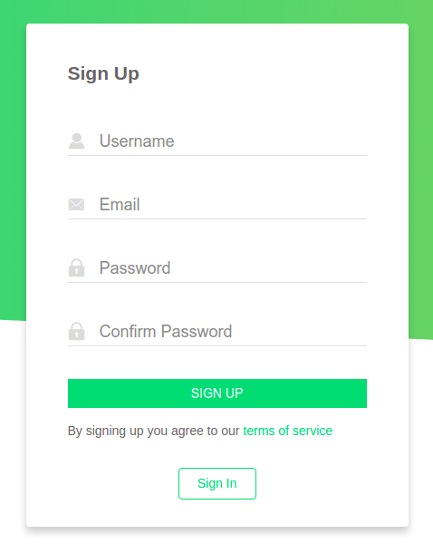
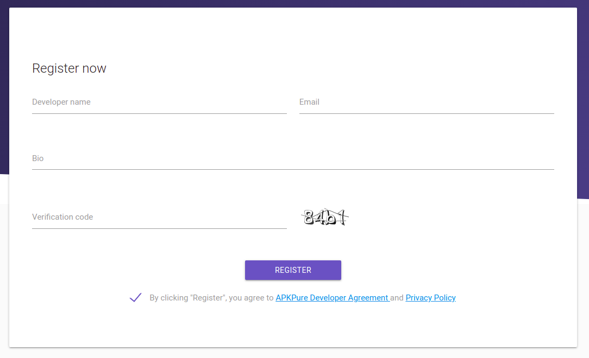
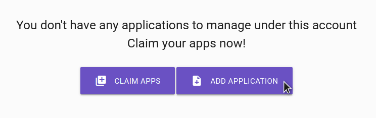
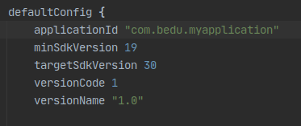
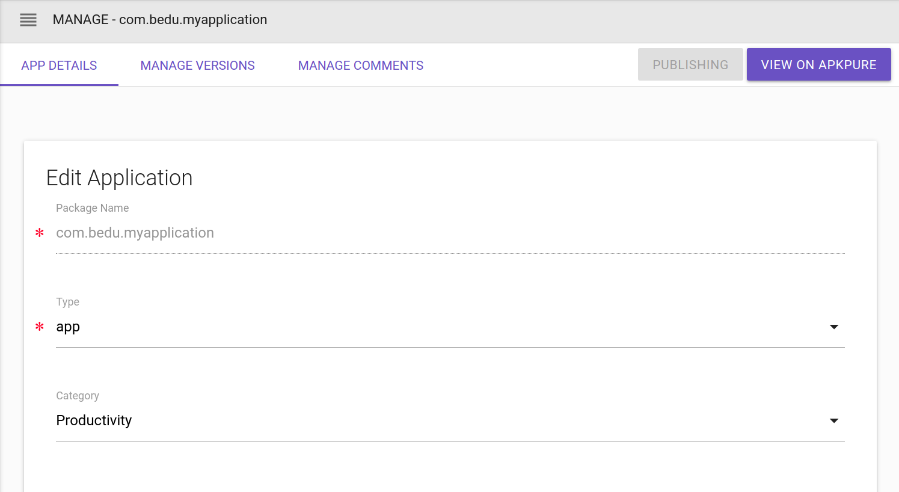
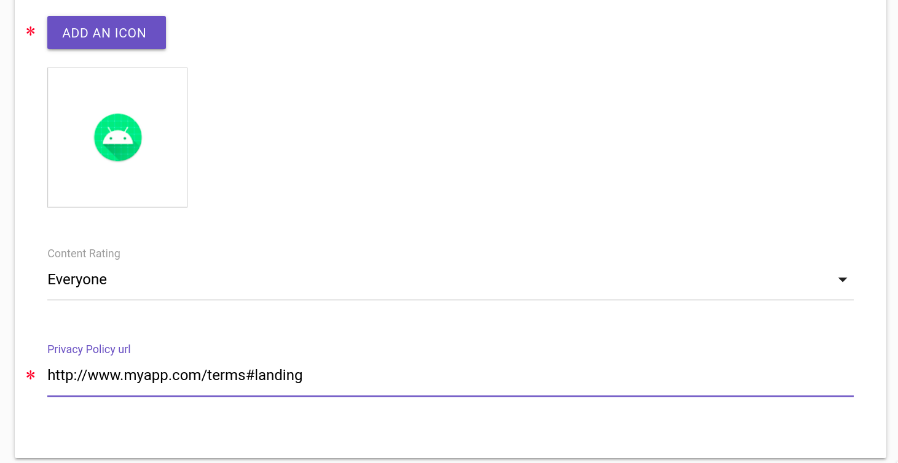
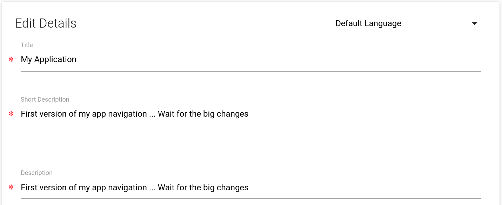
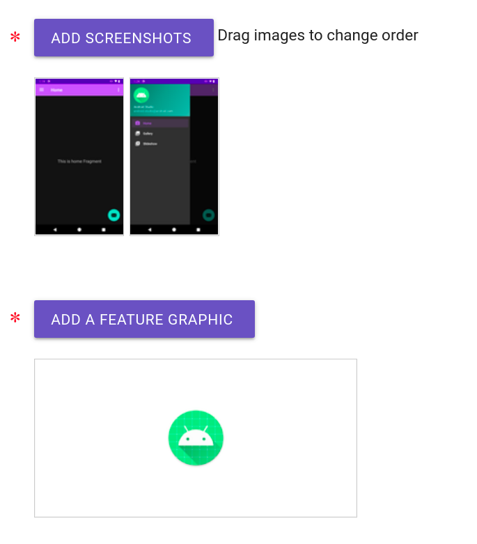
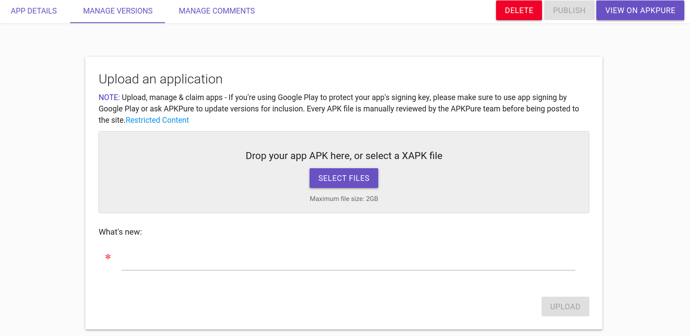
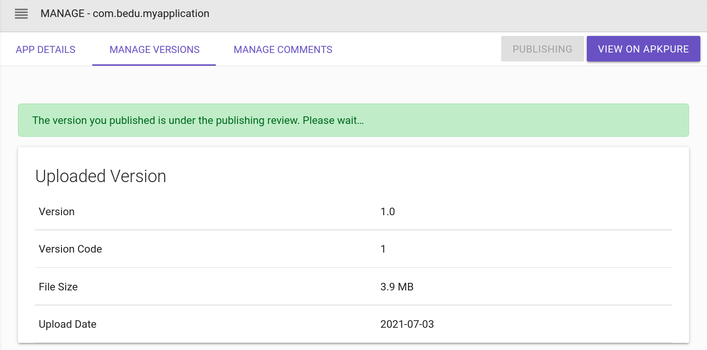

# Ejemplo 03: Publicando en ApkPure

## Objetivo

* Publicar APK firmado en la consola de desarrollador de ApkPure.

## Desarrollo

Ahora ya sabemos cómo gestionar nuestra app desde un servidor externo. Es momento de aprender cómo publicar en una tienda alternativa, específicamente ApkPure. Para hacerlo es necesario hacer lo siguiente:

1. Abrimos la siguiente [página](https://developer.apkpure.com/) del sitio de APKPure y hacemos clic en **Sign In**.

    

2. Creamos una cuenta.

    

3. Una vez creada la cuenta, el sitio nos regresará a la pantalla previa. Ahí hacemos click en Register now y agregamos los datos que solicita.

    

    

4. Ya dentro de la consola hacemos click en Add application, agregamos el nombre de la app y del paquete. Lo puedes encontrar en el Gradle del módulo, y si estás utilizando el proyecto base cambia el paquete por otro, ya que este es único por cada app.”

    

    

5. Después agregamos los datos de nuestra app.

    

    

    

    

6. Guardamos los datos y nos dirigimos a la siguiente pestaña.

    

7. Una vez cargado el APK, hacemos click en Upload.
8. Por último hacemos click en el botón Publish.

    

9. Ahora veremos la siguiente interfaz.

    

**¡Súper!** Has concluido la publicación de tu app en la consola de ApkPure y en un par de días deberías poder visualizar la app disponible para su descarga. 

> “El tiempo varía de acuerdo al volumen de apps recibidas”

 

[Siguiente ](../Reto-03/README.md)(Reto 3)