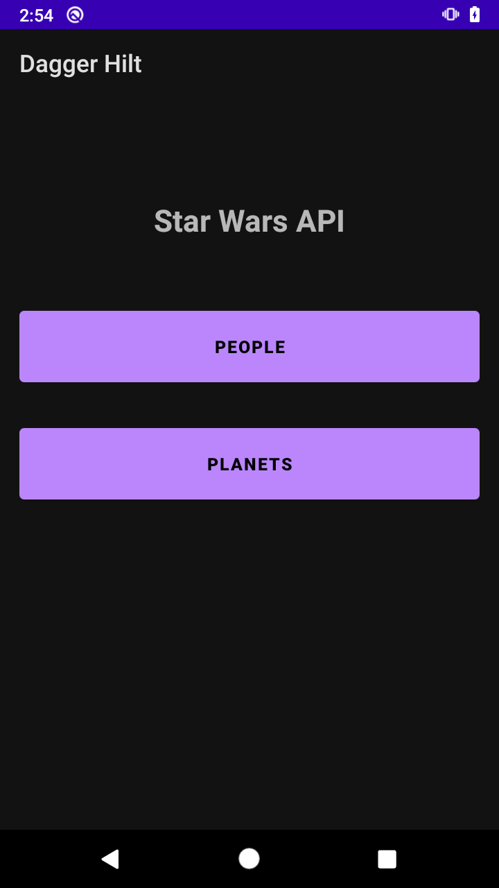
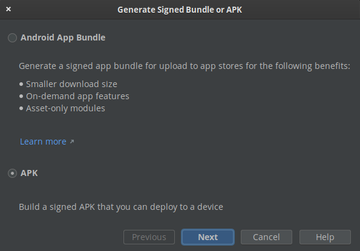
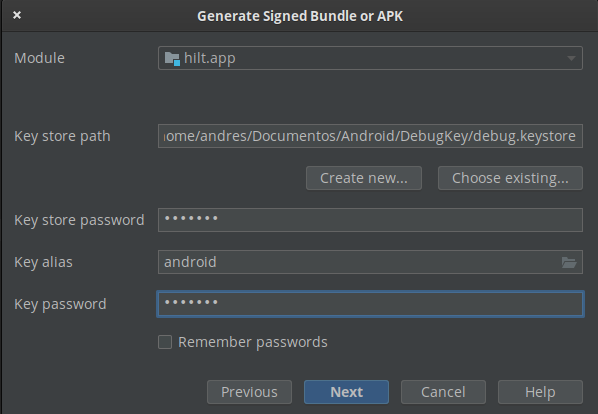
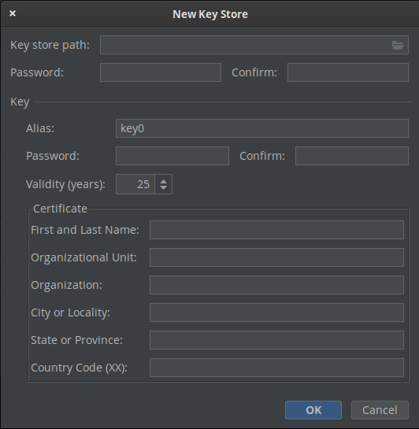
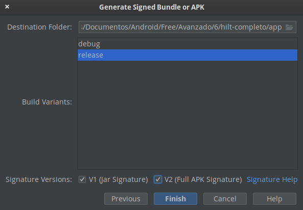
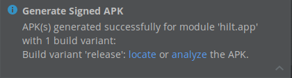

# Reto 01: Generando llave y firmando la app

## Objetivo

* Generar la llave de un proyecto Android para utilizarla en la creación de APK / APP Bundle.
* Crear Apk firmado con llave creada previamente.

## Desarrollo

En el Prework de esta sesión debiste seleccionar el proyecto con el que trabajarás. Sólo si no te fue posible seleccionar el proyecto puedes utilizar el [Proyecto base](./base).

El proyecto base muestra la siguiente interfaz:

 

 
 

Un **keystore** es un repositorio asegurado con una contraseña, donde se guardan una serie de llaves y certificados. Cada llave tiene asignado un alias para identificarse y una contraseña para protegerse. Para firmar nuestra aplicación de release, debemos generar un keystore con una signing key, que es una llave privada que genera un certificado (una llave pública), y este está en el META_INF de nuestro APK; esto asegura a Google que nuestra aplicación es auténtica. Una vez que una app es subida, la llave no puede ser cambiada, por lo que perderla implica no poder volver a actualizar la app. La llave de debug es genérica e insegura, por lo que no es válida como una llave de release.

 

> IMPORTANTE, el keystore debe ser guardado de forma segura y no debe subirse como archivo en un CVS (Control Version System) como Git.

Para completar este reto necesitas sumar los siguientes puntos al proyecto seleccionado previamente:

1. Genera la llave con la que firmarás tus Apk’s enviados a producción.
	a. Encontrarás la opción en **Build > Generate Signed Bundle / Apk**
2. Crea el Apk con la firma generada previamente.

 

    
Solución

1. Ir a **Build > Generate Signed Bundle / Apk.**
2. Selecciona APK.

      

3. Haz clic en Create new.

      

4. Ingresa los datos. Es importante guardar estos datos.

      

5. Una vez creada la llave, búscala con el botón Choose existing… Y agrega los datos de la misma, como se aprecia.

      

6. Selecciona release y activa los checkbox V1 (Jar Signature) y V2 (Full APK Signature) para tener mayor seguridad.

      

7. Listo. La Apk está lista.

      

 
 

[Siguiente ](../Ejemplo-01/README.md)(Ejemplo 1)
