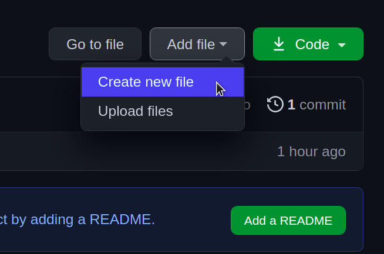
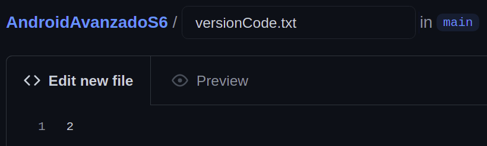
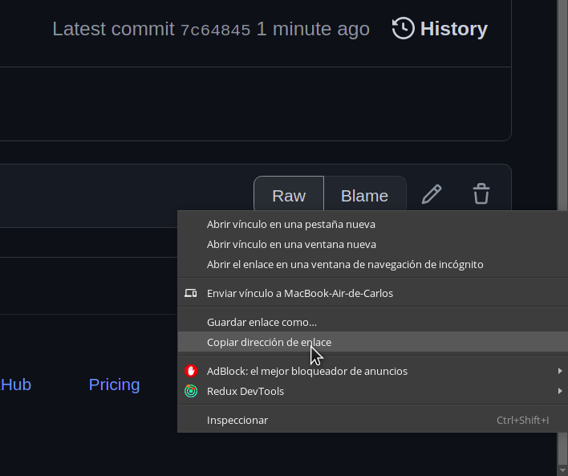
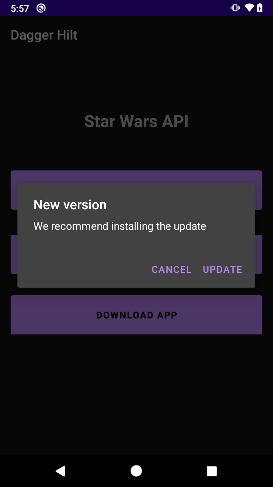

# Reto 02: Descargando actualizaciones automáticamente

## Objetivo

* Adaptar el código de un app Android para que descargue actualizaciones automáticamente.

## Desarrollo

En el ejemplo 02 descargamos el APK mediante un botón. Para cumplir con este reto debes descargar el APK sólo cuando exista una actualización. 

A continuación te mostramos algunos puntos importantes. Es necesario que adaptes el código y agregues un nuevo archivo en el repositorio.

  - Para saber si existe un actualización nuestra app necesita conectarse a algún **servicio externo** para consultar la **última versión** y compararla con la que está **instalada**. De este modo sabe si necesita descargar la nueva versión. Esto se puede realizar de varias maneras, y la más común es mediante un servicio web que nos provee el **backend**. 

En esta ocasión lo haremos mediante un archivo **txt** alojado en nuestro repositorio.

  - Para ello creamos un archivo “versionCode.txt” y le agregamos el número 2.

    

     

    

  - Agrega la ruta del versionCode.txt alojado en GitHub.

    > Nota: la ruta la copiamos haciendo click derecho en el botón de Raw y con copiar dirección de enlace desde GitHub:

    

- Te presentamos la función que puede leer un archivo desde una URL:

  ```kotlin
  private fun readUrlFile(url: String): String? {
      var data: String? = null
      var iStream: InputStream? = null
      var urlConnection: HttpURLConnection? = null
      try {
          urlConnection = URL(url).openConnection() as HttpURLConnection?
          urlConnection?.connect()
          iStream = urlConnection?.inputStream
          val br = BufferedReader(InputStreamReader(iStream))
          val sb = StringBuilder()
          var line: String?
          while (br.readLine().also { line = it } != null) {
              sb.append(line)
          }
          data = sb.toString()
          br.close()
      } catch (e: Exception) {
          Log.w("", "Exception while downloading url: $e")
      } finally {
          iStream?.close()
          urlConnection?.disconnect()
      }
      return data
  }
  ```

  - Recuerda ejecutar esta función dentro de un proceso en segundo plano. Por ejemplo puedes utilizar un **Thread**:

    ```kotlin
    Thread {
        // Aquí consultas la función -> readUrlFile(“...”)
    }.start()
    ```

- Con el siguiente código puedes obtener la versión “Version code” que tiene tu app asignada en el Gradle del módulo. Así podrás compararlo con el del archivo de GitHub.

  ```kotlin
  val localVersionCode: Int = if (Build.VERSION.SDK_INT >= Build.VERSION_CODES.P) {
      packageManager.getPackageInfo(packageName, 0).longVersionCode.toInt()
  } else {
      packageManager.getPackageInfo(packageName, 0).versionCode
  }
  ```

Ya tienes la información necesaria para completar este reto. A continuación te mostramos una propuesta de cómo podría verse. Adapta el código para que tu app sólo descargue actualizaciones cuando están disponibles.

 

</br>
</br>

<details>
    <summary>Solución</summary>

-> Dentro de la clase **Utils**

```kotlin
fun buildAlertDialog(context: Context, resTitle: Int, resMessage: Int): AlertDialog {
    val alertDialog = AlertDialog.Builder(context).create()
    alertDialog.setTitle(context.getString(resTitle))
    alertDialog.setMessage(context.getString(resMessage))
    alertDialog.setCancelable(false)
    return alertDialog
}
```

-> Dentro del **companion object** en el MainActivity

  ```kotlin
  const val urlCode =
  "https://github.com/andres2093/AndroidAvanzadoS6/raw/main/versionCode.txt"
  ```

-> Dentro del **MainActivity**

  ```kotlin
  private fun checkUpdate(){
      Thread {
          val remoteVersionCode = readUrlFile(urlCode)
          if (remoteVersionCode !== null) {
              val localVersionCode: Int = if (Build.VERSION.SDK_INT >= Build.VERSION_CODES.P) {
                  packageManager.getPackageInfo(packageName, 0).longVersionCode.toInt()
              } else {
                  packageManager.getPackageInfo(packageName, 0).versionCode
              }

              Log.e("TAG", "onCreate: $remoteVersionCode, $localVersionCode")
              runOnUiThread {
                  if (remoteVersionCode.toInt() > localVersionCode) {
                      val alertDialog: AlertDialog = buildAlertDialog(
                          this,
                          R.string.new_version,
                          R.string.new_version_msg
                      )
                      alertDialog.setButton(
                          DialogInterface.BUTTON_POSITIVE, getString(R.string.btn_update)
                      ) { dialog: DialogInterface, _: Int ->
                          dialog.dismiss()
                          checkStoragePermission()
                      }
                      alertDialog.setButton(
                          DialogInterface.BUTTON_NEGATIVE, getString(R.string.btn_cancel)
                      ) { dialog: DialogInterface, _: Int ->
                          dialog.dismiss()
                      }
                      alertDialog.show()
                  }
              }
          } else {
              Log.e("TAG", "onCreate: error checking version")
          }
      }.start()
  }

  private fun readUrlFile(url: String): String? {
      var data: String? = null
      var iStream: InputStream? = null
      var urlConnection: HttpURLConnection? = null
      try {
          urlConnection = URL(url).openConnection() as HttpURLConnection?
          urlConnection?.connect()
          iStream = urlConnection?.inputStream
          val br = BufferedReader(InputStreamReader(iStream))
          val sb = StringBuilder()
          var line: String?
          while (br.readLine().also { line = it } != null) {
              sb.append(line)
          }
          data = sb.toString()
          br.close()
      } catch (e: Exception) {
          Log.w("", "Exception while downloading url: $e")
      } finally {
          iStream?.close()
          urlConnection?.disconnect()
      }
      return data
  }
  ```

-> Llamamos la función checkUpdate dentro del onCreate

  ```kotlin
  checkUpdate()
  ```

  **¡Perfecto!** Ahora tu app descarga actualizaciones sólo cuando estas se encuentran disponibles.

</details>

</br>
</br>

[Siguiente ](../Ejemplo-03/README.md)(Ejemplo 3)
