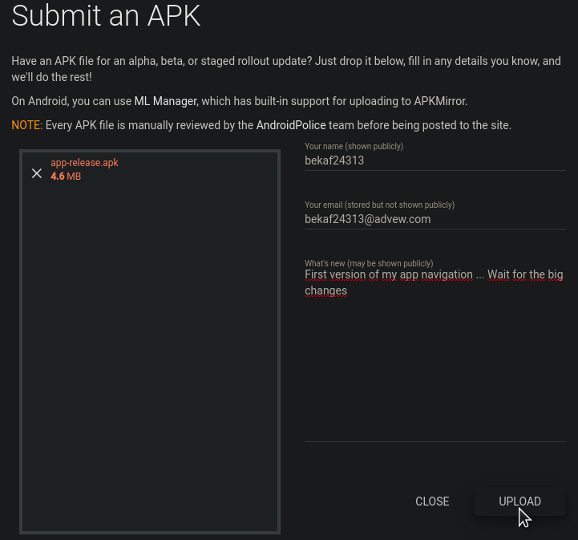
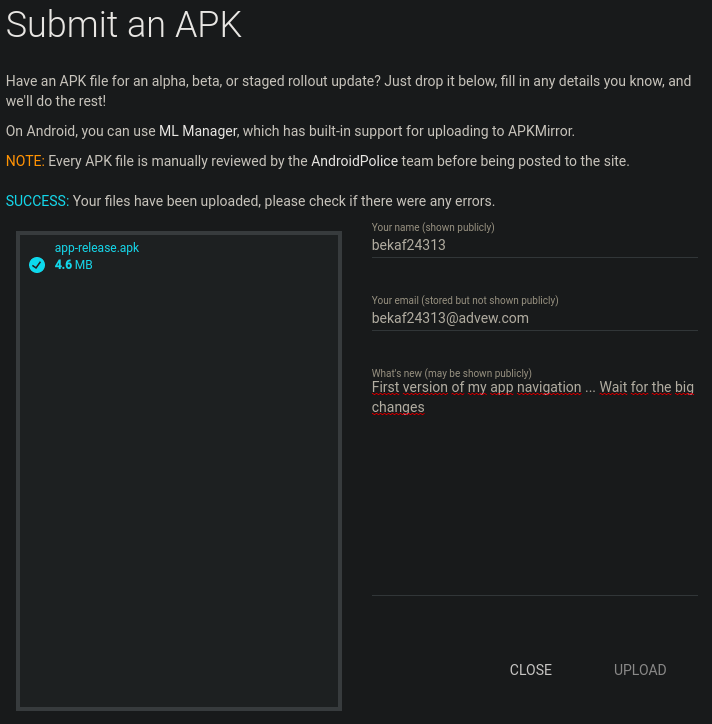

# Reto 03: Publicando en ApkMirror

## Objetivo

* Publicar APK firmado en ApkMirror.

## Desarrollo

En el ejemplo 03 revisamos el proceso para publicar apps en ApkPure. Así como vimos en los SDK, cada desarrollador define procesos diferentes para implementar sus librerías. 

 

Para completar este reto, es necesario que publiques tu app en ApkMirror.

[Haz clic aquí para abrir la página de ApkMirror](https://www.apkmirror.com/)

 

    
Solución

1. Entra al sitio de ApkMirror.
2. Haz clic en el icono de Upload.

    

3. Ingresa los datos que solicita el formulario, seguido del apk que deseas publicar.

    

4. Una vez agregada la información se hace click en Upload.
5. Al terminar el proceso se obtendrá el mensaje de confirmación.

    

6. Y ¡Listo!, esperamos unos días a que nuestra app sea revisada y aprobada.

 
 

[Siguiente ](../Postwork/README.md)(Postwork)
