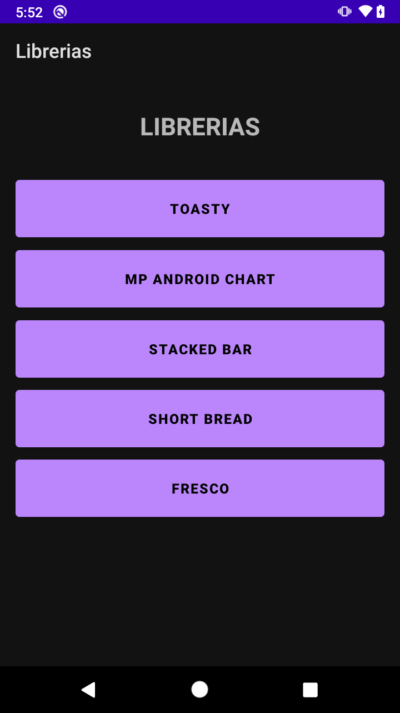
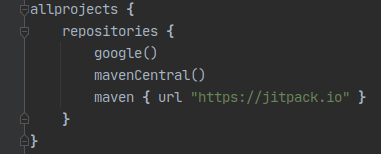
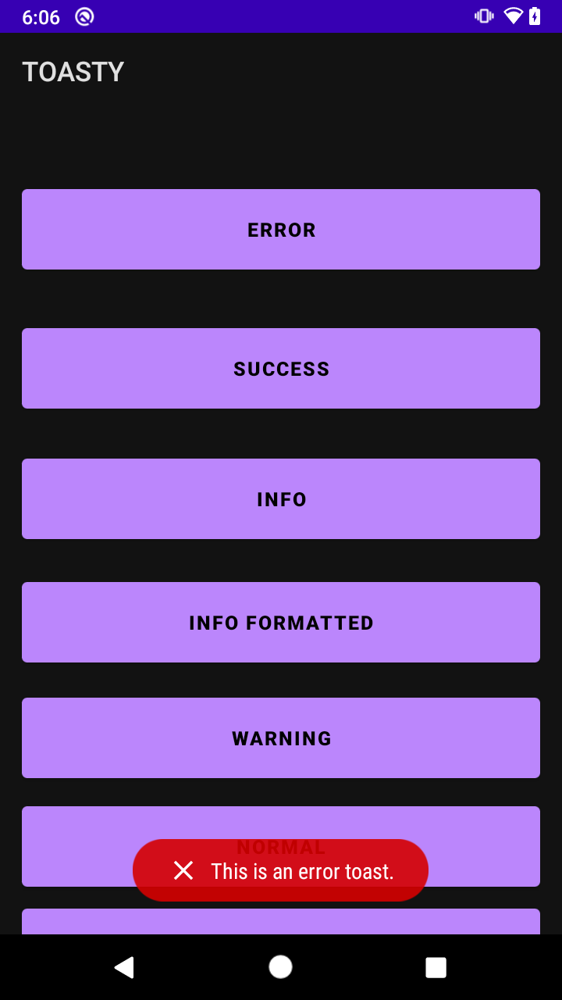
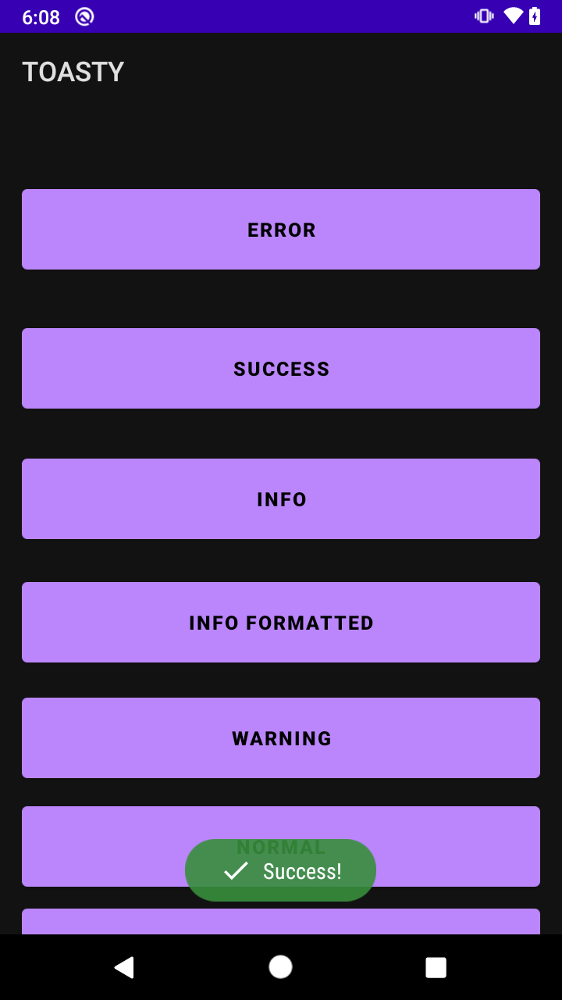

# Ejemplo 01: Implementando Toasty

## Objetivo

* Implementar Toasty en un proyecto base Android para mostrar avisos "Toast" con mejoras visuales.

## Desarrollo

En el prework de esta sesión debiste crear desde cero un proyecto que contará con cinco botones en su pantalla principal: “Toasty, Mp Android Chart, Stacked bar, Short Bread y Fresco”; y cada botón debería abrir una pantalla con una interfaz mínima. 

Sólo si no te fue posible completar este proyecto puedes utilizar el [Proyecto base](./base),
El proyecto base muestra la siguiente interfaz:



Con la intención de agregar la dependencia de Toasty a nuestra app, realizaremos los siguientes pasos.

1. Cada desarrollador tiene la opción de publicar las librerías en diferentes repositorios. Las que veremos en esta sesión se encuentran en **maven jitpack**, por lo que necesitamos indicarle al **Gradle** del proyecto donde buscará las librerías. Para ello agregamos las siguientes líneas de código en el Gradle del proyecto.

    ```gradle
    maven { url "https://jitpack.io" }
    ```

     

2. Ahora nos dirigimos al Gradle del módulo y agregamos las siguientes líneas de código.

    ```gradle
    //    Toasty
    implementation 'com.github.GrenderG:Toasty:1.5.0'
    ```

3. Sincronizamos el proyecto.

      

4. Abrimos el **ToastyActivity** y agregamos el siguiente código en el evento del botón Error.

    ```kotlin
    Toasty.error(this, "This is an error toast.", Toast.LENGTH_SHORT, true).show()
    ```

5. Después sumamos el siguiente código en el evento del botón Success.

    ```kotlin
    Toasty.success(this, "Success!", Toast.LENGTH_SHORT, true).show()
    ```

6. Ejecutamos el proyecto, hacemos clic en **Toasty**, seguido del botón Error, y vemos que nos muestra un Aviso “Toast” con una interfaz más colorida que los clásicos mensajes de Android.

      

7. Ahora hacemos clic en el botón **success** y observamos que el mensaje se muestra con otros colores, lo cual, en conjunto, nos permite mostrarle al usuario mensajes con este diseño según el tipo de aviso.

      

</br>

**¡Felicidades!** Tu app ahora puede mostrar mensajes con mejoras visuales según el tipo de aviso que se requiera mostrar.

</br>

[Siguiente ](../Reto-01/README.md)(Reto 1)