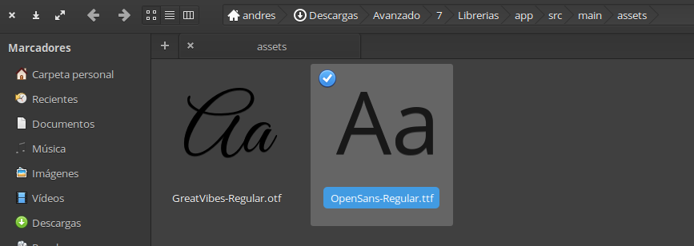
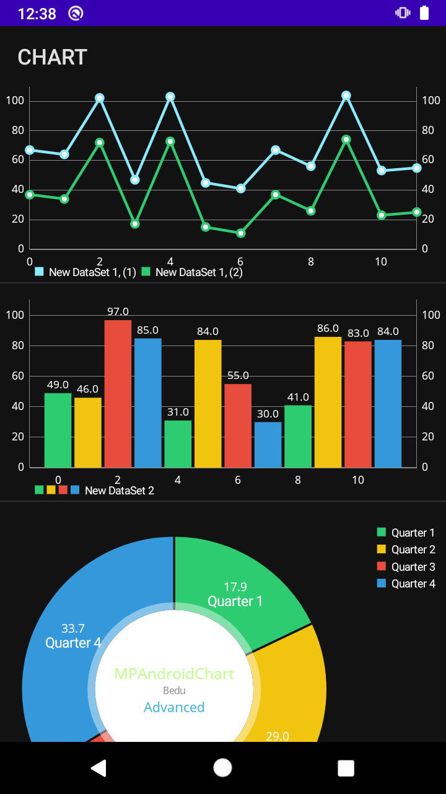

# Ejemplo 02: Agregando gráficas by MpAndroidChart

## Objetivo

* Implementar una de las mejores librerías, MpAndroidChart, para visualizar gráficas de barras, líneas, y pie con un rendimiento alto.

## Desarrollo

En este ejemplo descargaremos e instalaremos la librería MpAndroidChart.

Para hacerlo realizamos los siguientes pasos en el proyecto utilizado previamente:

1. Nos dirigimos al **Gradle** del módulo y agregamos las siguientes líneas de código.

    ```gradle
    //    MPAndroidChart
    implementation 'com.github.PhilJay:MPAndroidChart:v3.1.0'
    ```

2. Sincronizamos el proyecto.

     

3. Creamos el **package items**, donde agregaremos los ítems que pintarán las gráficas.

4. La primera clase es abstracta y tiene por nombre **ChartItem**, y tiene la tarea de agregar los métodos que implementarán los items, así como el tipo que tendrán. Para ello agregamos el siguiente código.

    ```kotlin
    abstract class ChartItem internal constructor(var mChartData: ChartData<*>) {
        abstract val itemType: Int

        abstract fun getView(position: Int, convertView: View?, c: Context?): View?

        companion object {
            const val TYPE_BARCHART = 0
            const val TYPE_LINE_CHART = 1
            const val TYPE_PIE_CHART = 2
        }
    }
    ```

5. La segunda clase tiene por nombre **BarChartItem**, y se añade con el siguiente código. 

    > Nota: fue agregada una condicional dentro del constructor para obtener el color, según el tema del dispositivo “**Dark / Day**”.

    ```kotlin
    abstract class BarChartItem(cd: ChartData<*>?, c: Context) : ChartItem(cd!!) {

        private val mTf: Typeface = Typeface.createFromAsset(c.assets, "OpenSans-Regular.ttf")
        private val resTextColor: Int = if (Build.VERSION.SDK_INT >= Build.VERSION_CODES.M) c.resources
            .getColor(R.color.text_color, c.theme) else c.resources.getColor(R.color.text_color)

        @SuppressLint("InflateParams")
        override fun getView(position: Int, convertView: View?, c: Context?): View? {
            var convertView: View? = convertView
            val holder: ViewHolder

            if (convertView == null) {
                holder = ViewHolder()
                convertView = LayoutInflater.from(c).inflate(R.layout.list_item_barchart, null)
                holder.chart = convertView.findViewById(R.id.chart)
                convertView.tag = holder
            } else {
                holder = convertView.tag as ViewHolder
            }

            holder.chart!!.description.isEnabled = false
            holder.chart!!.setDrawGridBackground(false)
            holder.chart!!.setDrawBarShadow(false)

            val xAxis = holder.chart!!.xAxis
            xAxis.position = XAxisPosition.BOTTOM
            xAxis.typeface = mTf
            xAxis.textColor = resTextColor
            xAxis.setDrawGridLines(false)
            xAxis.setDrawAxisLine(true)

            val leftAxis = holder.chart!!.axisLeft
            leftAxis.typeface = mTf
            leftAxis.setLabelCount(5, false)
            leftAxis.textColor = resTextColor
            leftAxis.spaceTop = 20f
            leftAxis.axisMinimum = 0f

            val rightAxis = holder.chart!!.axisRight
            rightAxis.typeface = mTf
            rightAxis.textColor = resTextColor
            rightAxis.setLabelCount(5, false)
            rightAxis.spaceTop = 20f
            rightAxis.axisMinimum = 0f
            mChartData.setValueTypeface(mTf)

            val l = holder.chart!!.legend
            l.textColor = resTextColor
            holder.chart!!.data = mChartData as BarData
            holder.chart!!.setFitBars(true)
            holder.chart!!.animateY(700)

            return convertView
        }

        private class ViewHolder {
            var chart: BarChart? = null
        }
    }
    ```

6. La tercera clase tiene el nombre de **LineChartItem**, y esta se encarga de mostrar los datos de la gráfica de líneas. Agregamos el siguiente código para establecerla.

    ```kotlin
    abstract class LineChartItem(cd: ChartData<*>?, c: Context) : ChartItem(cd!!) {

        private val mTf: Typeface = Typeface.createFromAsset(c.assets, "OpenSans-Regular.ttf")
        private val resTextColor: Int = if (Build.VERSION.SDK_INT >= Build.VERSION_CODES.M) c.resources
            .getColor(R.color.text_color, c.theme) else c.resources.getColor(R.color.text_color)

        @SuppressLint("InflateParams")
        override fun getView(position: Int, convertView: View?, c: Context?): View? {
            var convertView: View? = convertView
            val holder: ViewHolder

            if (convertView == null) {
                holder = ViewHolder()
                convertView = LayoutInflater.from(c).inflate(
                    R.layout.list_item_linechart, null
                )
                holder.chart = convertView.findViewById(R.id.chart)
                convertView.tag = holder
            } else {
                holder = convertView.tag as ViewHolder
            }

            holder.chart!!.description.isEnabled = false
            holder.chart!!.setDrawGridBackground(false)

            val xAxis = holder.chart!!.xAxis
            xAxis.position = XAxisPosition.BOTTOM
            xAxis.typeface = mTf
            xAxis.textColor = resTextColor
            xAxis.setDrawGridLines(false)
            xAxis.setDrawAxisLine(true)

            val leftAxis = holder.chart!!.axisLeft
            leftAxis.typeface = mTf
            leftAxis.textColor = resTextColor
            leftAxis.setLabelCount(5, false)
            leftAxis.axisMinimum = 0f

            val rightAxis = holder.chart!!.axisRight
            rightAxis.typeface = mTf
            rightAxis.textColor = resTextColor
            rightAxis.setLabelCount(5, false)
            rightAxis.setDrawGridLines(false)
            rightAxis.axisMinimum = 0f

            val l = holder.chart!!.legend
            l.textColor = resTextColor
            holder.chart!!.data = mChartData as LineData
            holder.chart!!.animateX(750)

            return convertView
        }

        private class ViewHolder {
            var chart: LineChart? = null
        }
    }
    ```

7. Por último, la cuarta clase se añade con el nombre de **PieChartItem**, para mostrar los valores del pie, y se suma lo siguiente.

    ```kotlin
    abstract class PieChartItem(cd: ChartData<*>?, c: Context) : ChartItem(cd!!) {

        private val mTf: Typeface = Typeface.createFromAsset(c.assets, "OpenSans-Regular.ttf")
        private val mCenterText: SpannableString
        private val resTextColor: Int

        @SuppressLint("InflateParams")
        override fun getView(position: Int, convertView: View?, c: Context?): View? {
            var convertView: View? = convertView
            val holder: ViewHolder
            
            if (convertView == null) {
                holder = ViewHolder()
                convertView = LayoutInflater.from(c).inflate(
                    R.layout.list_item_piechart, null
                )
                holder.chart = convertView.findViewById(R.id.chart)
                convertView.tag = holder
            } else {
                holder = convertView.tag as ViewHolder
            }
            
            holder.chart!!.description.isEnabled = false
            holder.chart!!.holeRadius = 52f
            holder.chart!!.transparentCircleRadius = 57f
            holder.chart!!.centerText = mCenterText
            holder.chart!!.setHoleColor(resTextColor)
            holder.chart!!.setCenterTextTypeface(mTf)
            holder.chart!!.setCenterTextSize(9f)
            holder.chart!!.setUsePercentValues(true)
            holder.chart!!.setExtraOffsets(5f, 10f, 50f, 10f)
            
            mChartData.setValueFormatter(PercentFormatter())
            mChartData.setValueTypeface(mTf)
            mChartData.setValueTextSize(11f)
            mChartData.setValueTextColor(resTextColor)
            
            holder.chart!!.data = mChartData as PieData
            
            val l = holder.chart!!.legend
            l.verticalAlignment = Legend.LegendVerticalAlignment.TOP
            l.horizontalAlignment = Legend.LegendHorizontalAlignment.RIGHT
            l.orientation = Legend.LegendOrientation.VERTICAL
            l.textColor = resTextColor
            l.setDrawInside(false)
            l.yEntrySpace = 0f
            l.yOffset = 0f
            holder.chart!!.animateY(900)
            
            return convertView
        }

        private fun generateCenterText(): SpannableString {
            val s = SpannableString("MPAndroidChart\nBedu\nAdvanced")
            s.setSpan(RelativeSizeSpan(1.6f), 0, 14, 0)
            s.setSpan(ForegroundColorSpan(ColorTemplate.VORDIPLOM_COLORS[0]), 0, 14, 0)
            s.setSpan(RelativeSizeSpan(1.0f), 14, 20, 0)
            s.setSpan(ForegroundColorSpan(Color.GRAY), 14, 20, 0)
            s.setSpan(RelativeSizeSpan(1.4f), 20, s.length, 0)
            s.setSpan(ForegroundColorSpan(ColorTemplate.getHoloBlue()), 20, s.length, 0)
            return s
        }

        private class ViewHolder {
            var chart: PieChart? = null
        }

        init {
            mCenterText = generateCenterText()
            resTextColor = if (Build.VERSION.SDK_INT >= Build.VERSION_CODES.M) c.resources
                .getColor(R.color.text_color, c.theme) else c.resources.getColor(R.color.text_color)
        }
    }
    ```

8. Descarga la fuente de la [siguiente dirección](./OpenSans-Regular.ttf) y agrégala en la carpeta de **assets**.

     

9. Una vez creado el código de los **ítems**, agregamos la interfaz de los mismos mediante el siguiente código.

    9.1  xml list_item_barchart


    ```xml
    <?xml version="1.0" encoding="utf-8"?>
    <LinearLayout xmlns:android="http://schemas.android.com/apk/res/android"
        android:layout_width="match_parent"
        android:layout_height="wrap_content"
        android:orientation="vertical" >

        <com.github.mikephil.charting.charts.BarChart
            android:id="@+id/chart"
            android:layout_width="match_parent"
            android:layout_height="200dp" />

    </LinearLayout>
    ```

    9.2 xml list_item_linechart

    ```xml
    <?xml version="1.0" encoding="utf-8"?>
    <LinearLayout xmlns:android="http://schemas.android.com/apk/res/android"
        android:layout_width="match_parent"
        android:layout_height="wrap_content"
        android:orientation="vertical" >

        <com.github.mikephil.charting.charts.LineChart
            android:id="@+id/chart"
            android:layout_width="match_parent"
            android:layout_height="200dp" />

    </LinearLayout>
    ```

    9.3 xml list_item_piechart

    ```xml
    <?xml version="1.0" encoding="utf-8"?>
    <LinearLayout xmlns:android="http://schemas.android.com/apk/res/android"
        android:layout_width="match_parent"
        android:layout_height="wrap_content"
        android:orientation="vertical" >

        <com.github.mikephil.charting.charts.PieChart
            android:id="@+id/chart"
            android:layout_width="match_parent"
            android:layout_height="345dp" />

    </LinearLayout>
    ```

10. Ahora nos dirigimos al **ChartActivity** y agregamos el siguiente código dentro del **onCreate**, el cual va a crear las 30 gráficas que veremos dentro de nuestra pantalla, además de seleccionar el color del texto a partir del tema, por lo que no debes olvidar agregar la variable resTextColor.

    ```kotlin
    private int resTextColor;

    ...
    resTextColor = Build.VERSION.SDK_INT >= Build.VERSION_CODES.M ?
                getResources().getColor(R.color.text_color, getTheme())
                : getResources().getColor(R.color.text_color);

    ListView listView = findViewById(R.id.listView);
    ArrayList<ChartItem> list = new ArrayList<>();

    for (int i = 0; i < 30; i++) {
        if (i % 3 == 0) {
            list.add(new LineChartItem(generateDataLine(i + 1), getApplicationContext()) {
                @Override
                public int getItemType() {
                    return ChartItem.TYPE_LINE_CHART;
                }
            });
        } else if (i % 3 == 1) {
            list.add(new BarChartItem(generateDataBar(i + 1), getApplicationContext()) {
                @Override
                public int getItemType() {
                    return ChartItem.TYPE_BARCHART;
                }
            });
        } else {
            list.add(new PieChartItem(generateDataPie(), getApplicationContext()) {
                @Override
                public int getItemType() {
                    return ChartItem.TYPE_PIE_CHART;
                }
            });
        }
    }

    ChartDataAdapter cda = new ChartDataAdapter(getApplicationContext(), list);
    listView.setAdapter(cda);
    ```

11. Ya que nuestra pantalla tendrá una lista, necesitamos crear un **adaptador**. Es posible agregar el siguiente código debajo del **onCreate** para ello.

    ```kotlin
    private static class ChartDataAdapter extends ArrayAdapter<ChartItem> {

        ChartDataAdapter(Context context, List<ChartItem> objects) {
            super(context, 0, objects);
        }

        @Override
        public View getView(int position, View convertView, ViewGroup parent) {
            return getItem(position).getView(position, convertView, getContext());
        }

        @Override
        public int getItemViewType(int position) {
            ChartItem ci = getItem(position);
            return ci != null ? ci.getItemType() : 0;
        }

        @Override
        public int getViewTypeCount() {
            return 3;
        }
    }
    ```

12. Como lo has notado, el código que agregamos en el **onCreate** muestra errores, ya que aún no hemos creado las funciones que generarán los datos para nuestras gráficas. 
A continuación se muestra el código de las tres gráficas.

    12.1 Función generateDataLine

    ```kotlin
    private LineData generateDataLine(int cnt) {

        ArrayList<Entry> values1 = new ArrayList<>();

        for (int i = 0; i < 12; i++) {
            values1.add(new Entry(i, (int) (Math.random() * 65) + 40));
        }

        LineDataSet d1 = new LineDataSet(values1, "New DataSet " + cnt + ", (1)");
        d1.setLineWidth(2.5f);
        d1.setCircleRadius(4.5f);
        d1.setHighLightColor(resTextColor);
        d1.setValueTextColor(resTextColor);
        d1.setDrawValues(false);

        ArrayList<Entry> values2 = new ArrayList<>();

        for (int i = 0; i < 12; i++) {
            values2.add(new Entry(i, values1.get(i).getY() - 30));
        }

        LineDataSet d2 = new LineDataSet(values2, "New DataSet " + cnt + ", (2)");
        d2.setLineWidth(2.5f);
        d2.setCircleRadius(4.5f);
        d2.setHighLightColor(resTextColor);
        d2.setColor(ColorTemplate.MATERIAL_COLORS[0]);
        d2.setCircleColor(ColorTemplate.MATERIAL_COLORS[0]);
        d1.setValueTextColor(resTextColor);
        d2.setDrawValues(false);

        ArrayList<ILineDataSet> sets = new ArrayList<>();
        sets.add(d1);
        sets.add(d2);

        return new LineData(sets);
    }
    ```

    12.2 Función generateDataBar

    ```kotlin
    private BarData generateDataBar(int cnt) {
        ArrayList<BarEntry> entries = new ArrayList<>();

        for (int i = 0; i < 12; i++) {
            entries.add(new BarEntry(i, (int) (Math.random() * 70) + 30));
        }

        BarDataSet d = new BarDataSet(entries, "New DataSet " + cnt);
        d.setColors(ColorTemplate.MATERIAL_COLORS);
        d.setHighLightAlpha(255);
        d.setValueTextColor(resTextColor);

        BarData cd = new BarData(d);
        cd.setBarWidth(0.9f);
        cd.setValueTextColor(resTextColor);
        return cd;
    }
    ```

    12.3 Función generateDataPie

    ```kotlin
    private PieData generateDataPie() {
        ArrayList<PieEntry> entries = new ArrayList<>();

        for (int i = 0; i < 4; i++) {
            entries.add(new PieEntry((float) ((Math.random() * 70) + 30), "Quarter " + (i + 1)));
        }

        PieDataSet d = new PieDataSet(entries, "");
        d.setSliceSpace(2f);
        d.setValueTextColor(resTextColor);
        d.setColors(ColorTemplate.MATERIAL_COLORS);

        return new PieData(d);
    }
    ```

13. Ejecutamos el proyecto y hacemos clic en el botón **Mp Android Chart**. 
Ahora se visualizarán las gráficas de la siguiente forma.

    

</br>

**¡Hecho!** Ahora nuestra app puede mostrar gráficas con muy buen rendimiento a pesar de la cantidad de elementos en la lista.

</br>

[Siguiente ](../Ejemplo-03/README.md)(Ejemplo 3)