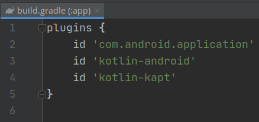
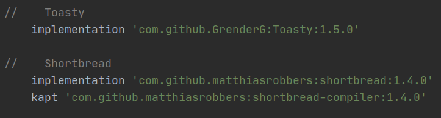
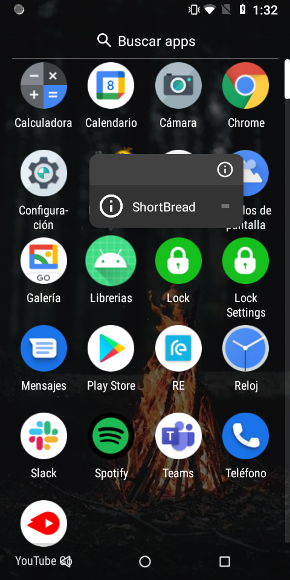
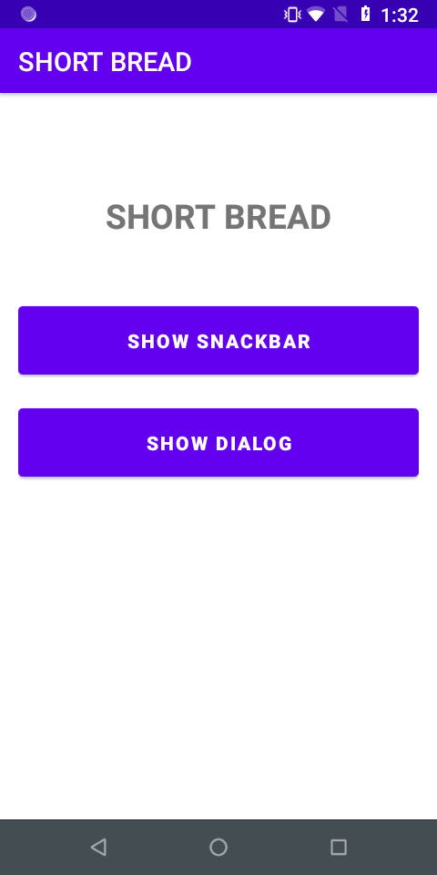

# Ejemplo 03: Mostrando atajos desde el launcher

## Objetivo

* Crear accesos directos desde el launcher y/o pantalla principal, mediante la implementación de la librería shortbread, que envíen al usuario a tareas comunes en la app.

## Desarrollo

Como desarrollador, puedes definir accesos directos para realizar acciones específicas en tu app. Se pueden mostrar esos accesos directos en un selector y/o launcher, además de agregarse como widgets, y estos ayudan a los usuarios a iniciar rápidamente tareas comunes, o recomendadas, dentro de la app.

Llegó el momento de agregar estos atajos con ayuda de la librería **shortbread**. Es posible agregarlos sin ayuda de la librería, pero esto implica más pasos, así que delegaremos esas tareas a **shortbread**.

Realizamos lo siguiente para agregar estos atajos:

1. Ahora nos dirigimos al **Gradle** del módulo y agregamos las siguientes líneas de código.

    ```gradle
    id 'kotlin-kapt'

    ...

    //    Shortbread
        implementation 'com.github.matthiasrobbers:shortbread:1.4.0'
        kapt 'com.github.matthiasrobbers:shortbread-compiler:1.4.0'
    ```

     

     

2. Sincronizamos el proyecto.

      

3. Abrimos el **ShortbreadActivity** y agregamos la siguiente línea arriba de la declaración de la clase, donde el icon es el recurso que mostraremos, y el **shortLabel** es el texto que se mostrará en el launcher.

    ```kotlin
    @Shortcut(id = "shortBread", icon = R.drawable.ic_info_outline_white_24dp, shortLabel = "ShortBread")
    ```

4. Ejecutamos el proyecto, nos dirigimos al menú del sistema operativo y mantenemos presionado el icono de nuestra app, el cual nos mostrará la opción que acabamos de agregar. Si haces clic te enviará a la pantalla donde agregamos el atajo. De esta manera el usuario puede ser enlazado a cualquier pantalla sin pasar por el menú o pantalla principal.

     

     

</br>

**¡Súper!** Has concluido con la implementación para agregar atajos al launcher. 

</br>

> Nota: recuerda que los atajos fueron introducidos en **Android Nougat 7.1 (API 25)**, y puede que algunas versiones no cuenten con la implementación de atajos, por lo que en esas versiones no sería posible visualizarlas.

</br>

[Siguiente ](../Reto-03/README.md)(Reto 3)