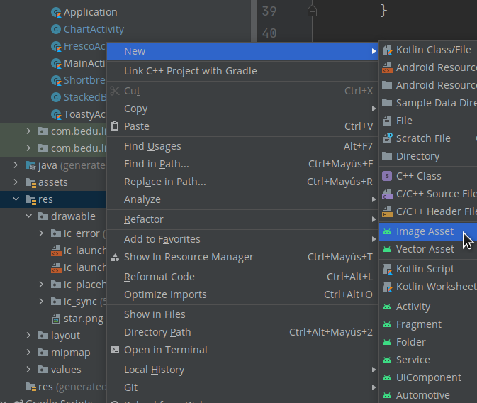
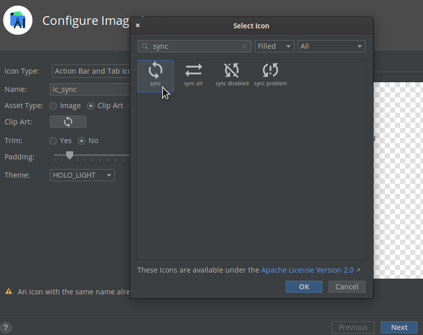
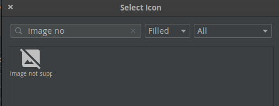
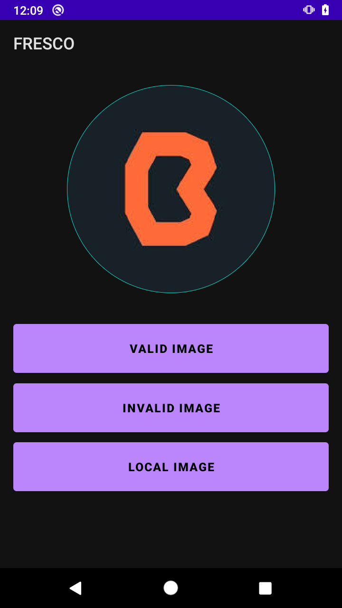
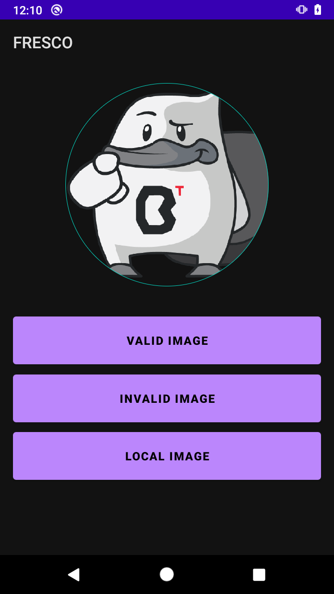
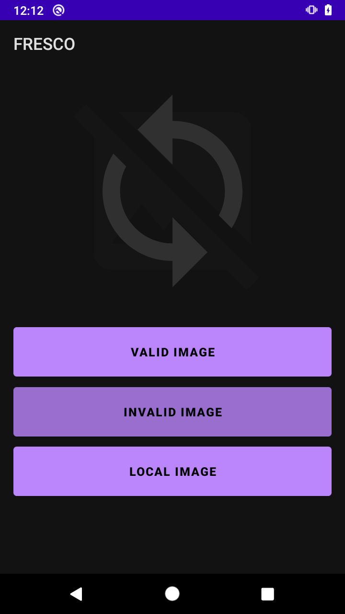
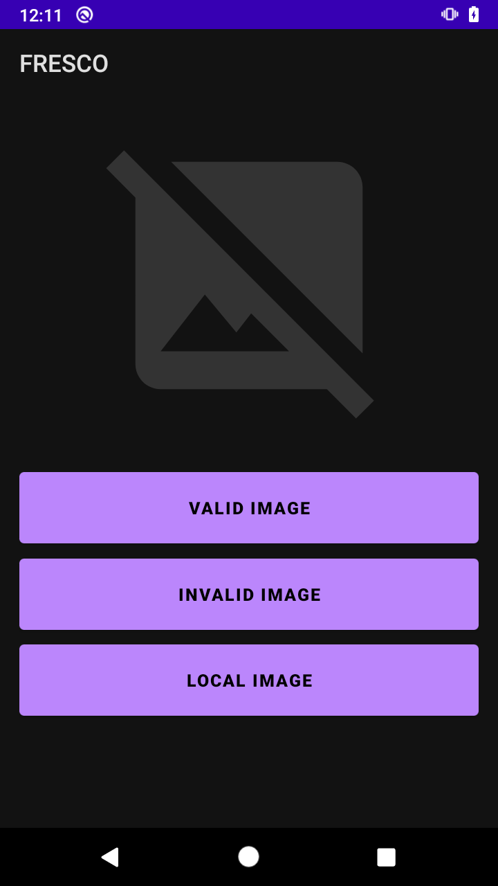

# Postwork 7 - Implementando Fresco

## Objetivo

- Optimizar la visualización de imágenes, implementando Fresco by Facebook.

## Desarrollo

Durante el work de esta sesión implementamos algunas librerías top con determinados propósitos. Para este postwork necesitas agregar la librería de Fresco creada por Facebook.

Fresco es una excelente librería para mostrar imágenes en aplicaciones de Android, pues las gestiona con eficiencia y consumen menos recursos.

Puedes encontrar más información en la documentación oficial.

[Haz clic aquí para abrir la documentación oficial de fresco](https://frescolib.org/docs/index.html)

A continuación se presentan los requerimientos para este Postwork.

</br>

### Indicaciones generales:

- Primera parte:
  
  - Cada vez que el usuario entre a la pantalla del botón **Fresco**, o haga clic en el botón **valid image**, se deberá cargar una imagen desde una URL válida.

  - El botón **invalid image** debe intentar cargar una URL que no contenga una imagen, provocando un error. 

  - Al presionar el botón **local image**, se cargará un recurso local. “Puedes leerlo desde los **drawable**”.

  - Fresco tiene la posibilidad de mostrar una imagen mientras carga el contenido, además de mostrar un recurso en caso de que se provoque un error, entre otras personalizaciones. Por lo menos deberías agregar dos de las muchas opciones disponibles. 
  Recuerda apoyarte con la documentación oficial.

- Segunda parte:

    - Implementa por lo menos una librería en tu proyecto.

</br>
</br>

<details>
    <summary>Solución</summary>

1. Nos dirigimos al Gradle del módulo y agregamos las siguientes líneas de código.

    ```gradle
    //    Fresco
        implementation 'com.facebook.fresco:fresco:2.5.0'
    ```

2. Sincronizamos el proyecto.

3. Creamos la clase **Application**, con el siguiente código.

    ```kotlin
    class Application : Application() {
        override fun onCreate() {
            super.onCreate()
            Fresco.initialize(this)
        }
    }
    ```

4. Agregamos el permiso de internet, y llamamos la clase Application dentro de la etiqueta application.

    ```xml
    <uses-permission android:name="android.permission.INTERNET" />

    ...

    android:name=".Application"
    ```

5. Reemplazamos el **view** de **activity_fresco** por el de **Fresco**.

    ```xml
    <com.facebook.drawee.view.SimpleDraweeView
        android:id="@+id/sDView"
        android:layout_width="250dp"
        android:layout_height="250dp"
        app:layout_constraintBottom_toBottomOf="parent"
        app:layout_constraintEnd_toEndOf="parent"
        app:layout_constraintStart_toStartOf="parent"
        app:layout_constraintTop_toTopOf="parent"
        app:layout_constraintVertical_bias="0.02" />
    ```

6. Dentro del **FrescoActivity** sobreescribimos el **onResume** con el siguiente código, para cargar la imagen cada vez que entremos a esta pantalla.

    ```kotlin
    override fun onResume() {
        super.onResume()
        binding.sDView.setImageURI(
            "https://raw.githubusercontent.com/beduExpert/Android-Avanzado-2021/main/Sesion-05/Ejemplo-01/base/app/src/main/res/drawable/bedu.png"
        )
    }
    ```

7. Cargamos los recursos que servirán como **progressBarImage** y **failureImage**, “Las importamos desde los assets de Android Studio”. Además agregamos la imagen a la carpeta **drawable**, la cual utilizaremos para la carga local.

    

     

     

8. Una vez cargados los recursos, añadimos lo siguiente dentro del **onCreate**, lo cual corresponde a la configuración y asignación de los placeholders.

    ```kotlin
    val resourcesHierarchy = binding.sDView.hierarchy

    val drawableError: Drawable
    val drawableSync: Drawable

    if (Build.VERSION.SDK_INT >= Build.VERSION_CODES.LOLLIPOP) {
        drawableError = resources.getDrawable(R.drawable.ic_error, theme)
        drawableSync = resources.getDrawable(R.drawable.ic_sync, theme)
    } else {
        drawableError = resources.getDrawable(R.drawable.ic_error)
        drawableSync = resources.getDrawable(R.drawable.ic_sync)
    }

    val color: Int = if (Build.VERSION.SDK_INT >= Build.VERSION_CODES.M) {
        resources.getColor(R.color.teal_200, theme)
    } else {
        resources.getColor(R.color.teal_200)
    }

    val roundingParams = RoundingParams.fromCornersRadius(5f)
    roundingParams.setBorder(color, 1.0f)
    roundingParams.roundAsCircle = true

    resourcesHierarchy.setFailureImage(drawableError)
    resourcesHierarchy.setProgressBarImage(drawableSync)
    resourcesHierarchy.roundingParams = roundingParams
    resourcesHierarchy.fadeDuration = 2000

    binding.sDView.hierarchy = resourcesHierarchy
    ```

9. Después agregamos los eventos de los botones.

    ```kotlin
    binding.btnLoadValid.setOnClickListener {
        binding.sDView.setImageURI(
            "https://raw.githubusercontent.com/beduExpert/Android-Avanzado-2021/main/Sesion-05/Ejemplo-01/base/app/src/main/res/drawable/bedu.png"
        )
    }
    binding.btnLoadInvalid.setOnClickListener {
        binding.sDView.setImageURI(
            "https://raw.githubusercontent.com/beduExpert/Android-Avanzado-2021/main/Sesion-05/bedu.png"
        )
    }
    binding.btnLoadLocal.setOnClickListener {
        binding.sDView.setImageURI("android.resource://com.bedu.librerias/drawable/bedu")
    }
    ```

10. Ejecutamos el proyecto, abrimos la pantalla **Fresco**, y como estaba previsto nos muestra la imagen de Bedu. Si haces clic en:

    - **Local image:** carga la imagen local, que en este agregamos la Beto.
    - **Invalid image:** intenta cargar la imagen desde una url invalida, lo que provoca que se muestre la imagen que configuramos en el failure.
    - **Valid imagen:** carga la misma imagen cuando entramos a esta pantalla.

</details>

</br>

Propuesta visual:



 

 

 

</br>
</br>

[Regresar ](../)(Sesion 7)

[Siguiente ](../../Sesion-08/README.md)(Sesión 08)