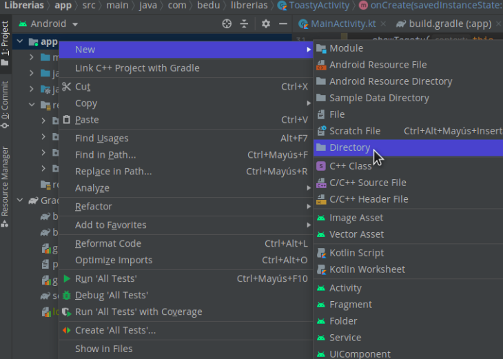
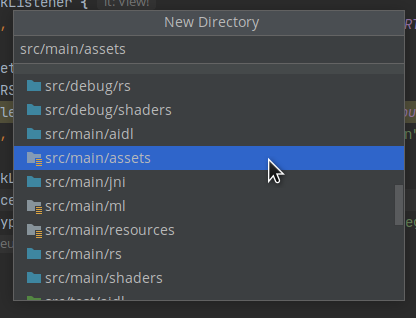
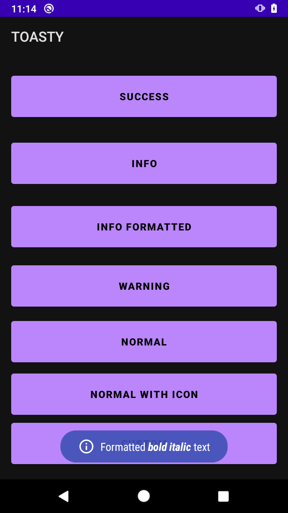
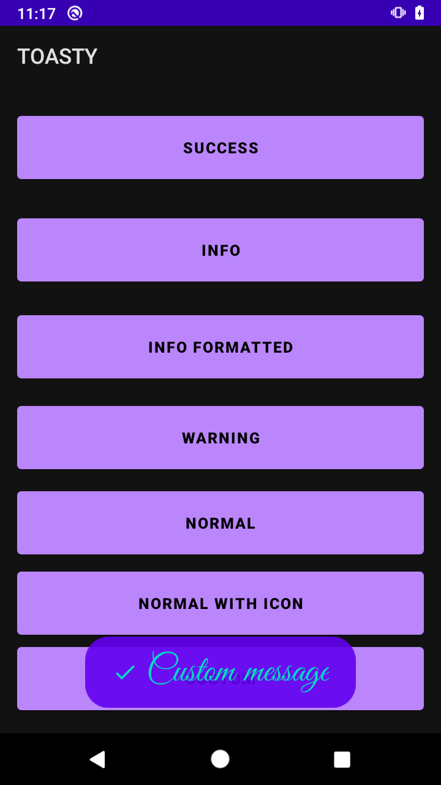

# Reto 01: Personalizando mensajes

## Objetivo

* Personalizar los mensajes Toasty.

## Desarrollo

En el ejemplo 1 se implementó la librería Toasty, la cual nos permite mostrar avisos con diferentes colores, íconos, fuentes, entre otras personalizaciones.

Puedes encontrar opciones de personalización en la documentación oficial.
[Haz clic aquí para abrir la documentación oficial de Toasty](https://github.com/GrenderG/Toasty)

Para completar este reto necesitas sumar los siguientes puntos al proyecto:

1. El proyecto de esta sesión contiene varios botones dentro de la pantalla **Toasty**, cada botón debe mostrar el aviso **“Toast”** correspondiente. Por ejemplo si hacemos clic en Warning debería mostrarse el Toasty de **Warning**, el cual es **amarillo**.

    Te recomendamos generar alguna función que puedas llamar desde cualquier parte del código, y así con una llamada genérica puedas mostrar cualquier tipo de Toasty.

</br>

<details>
    <summary>Solución</summary>

1. Crea el package **utils**.
2. Crea un archivo de kotlin con el nombre de **Utils**, el cual debe estar dentro del package **utils**.
3. Dentro del archivo crea las siguientes variables.

    ```kotlin
    const val ERROR = "error"
    const val SUCCESS = "success"
    const val INFO = "info"
    const val INFO_FORMATTED = "info_formatted"
    const val WARNING = "warning"
    const val NORMAL = "normal"
    const val NORMAL_WITH_ICON = "normalWithIcon"
    const val CUSTOM = "custom"
    ```

4. Agrega la siguiente función debajo de las variables previamente creadas.

    ```kotlin
    fun showToasty(
        context: Context,
        type: String,
        message: String,
        duration: Int,
        withIcon: Boolean,
        drawable: Drawable?,
        charSequence: CharSequence?
    ) {
        when (type) {
            "error" -> Toasty.error(context, message, duration, withIcon).show()
            "success" -> Toasty.success(context, message, duration, withIcon).show()
            "info" -> Toasty.info(context, message, duration, withIcon).show()
            "info_formatted" -> charSequence?.let { Toasty.info(context, it).show() }
            "warning" -> Toasty.warning(context, message, duration, withIcon).show()
            "normal" -> Toasty.normal(context, message, duration).show()
            "normalWithIcon" -> Toasty.normal(context, message, duration, drawable).show()
            "custom" -> if (Build.VERSION.SDK_INT >= Build.VERSION_CODES.M) {
                Toasty.custom(
                    context,
                    message,
                    drawable,
                    context.resources.getColor(R.color.purple_500, context.theme),
                    context.resources.getColor(R.color.teal_200, context.theme),
                    duration,
                    true,
                    true
                ).show()
            } else {
                Toasty.custom(
                    context,
                    message,
                    drawable,
                    context.resources.getColor(R.color.purple_500),
                    context.resources.getColor(R.color.teal_200),
                    duration,
                    true,
                    true
                ).show()
            }
        }
    }
    ```

5. Descarga la fuente de la [siguiente dirección](./GreatVibes-Regular.otf)

6. Después de descargar la fuente crea un directorio dentro de la app, con el nombre de **assets**, en la ruta **src/main**.

      

      

7. Una vez creada pega la fuente en la carpeta.

8. ahora dirígete al **ToastyActivity**. Ahí agrega la siguiente función debajo del **onCreate**, la cual se encarga de generar el texto del **Toasty formatted**.

    ```kotlin
    private fun getFormattedMessage(): CharSequence? {
        val prefix = "Formatted "
        val highlight = "bold italic"
        val suffix = " text"
        val ssb = SpannableStringBuilder(prefix).append(highlight).append(suffix)
        val prefixLen = prefix.length
        ssb.setSpan(
            StyleSpan(BOLD_ITALIC),
            prefixLen, prefixLen + highlight.length, Spannable.SPAN_EXCLUSIVE_EXCLUSIVE
        )
        return ssb
    }
    ```

9. En el mismo **ToastyActivity** reemplaza los eventos de los botones por el siguiente código.

    ```kotlin
    binding.btnError.setOnClickListener {
        showToasty(this, ERROR, "This is an error toast", Toast.LENGTH_SHORT, true, null, null)
    }
    binding.btnSuccess.setOnClickListener {
        showToasty(this, SUCCESS, "Success!", Toast.LENGTH_SHORT, true, null, null)
    }
    binding.btnInfo.setOnClickListener {
        showToasty(this, INFO, "Here is some info for you", Toast.LENGTH_SHORT, true, null, null)
    }
    binding.btnInfoFormatted.setOnClickListener {
        showToasty(this, INFO_FORMATTED, "", Toast.LENGTH_SHORT, true, null, getFormattedMessage())
    }
    binding.btnWarning.setOnClickListener {
        showToasty(this, WARNING, "Beware of the dog", Toast.LENGTH_SHORT, true, null, null)
    }
    binding.btnNormal.setOnClickListener {
        showToasty(this, NORMAL, "Normal toast", Toast.LENGTH_SHORT, false, null, null)
    }
    binding.btnNormalWithIcon.setOnClickListener {
        val icon = if (Build.VERSION.SDK_INT >= Build.VERSION_CODES.LOLLIPOP)
            resources.getDrawable(R.drawable.ic_check_white_24dp, theme) else resources.getDrawable(R.drawable.ic_check_white_24dp)
        showToasty(this, NORMAL_WITH_ICON, "Normal toast with icon", Toast.LENGTH_SHORT, true, icon, null)
    }
    binding.btnCustom.setOnClickListener {
        Toasty.Config.getInstance()
            .setToastTypeface(Typeface.createFromAsset(assets, "GreatVibes-Regular.otf"))
            .allowQueue(false)
            .setTextSize(35)
            .apply()

        val icon = if (Build.VERSION.SDK_INT >= Build.VERSION_CODES.LOLLIPOP)
            resources.getDrawable(R.drawable.ic_check_white_24dp, theme) else resources.getDrawable(R.drawable.ic_check_white_24dp)
        showToasty(this, CUSTOM, "Custom message", Toast.LENGTH_SHORT, true, icon, null)

        Toasty.Config.reset()
    }
    ```

10. Se ejecuta el proyecto. Se hace clic en **Toasty** y ahora se prueban los botones. Verás que cada uno muestra un Toast diferente.

    

      

</details>

</br>
</br>

[Siguiente ](../Ejemplo-02/README.md)(Ejemplo 2)
