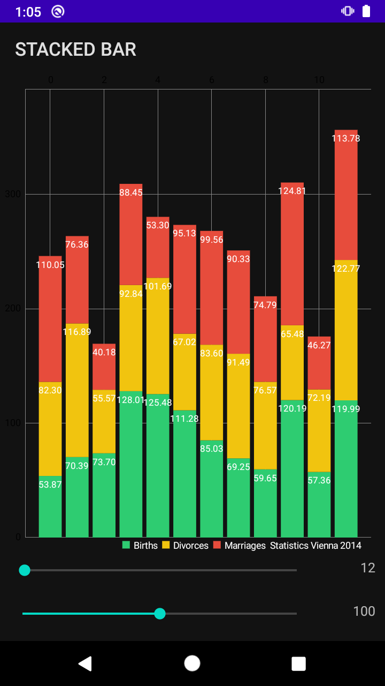

# Reto 02: Mostrando StackedBar

## Objetivo

* Agregar al proyecto base Android un nuevo tipo de gráfica “StackedBar” comúnmente utilizado en dashboard.

## Desarrollo

En el ejemplo 02 se instruyó en cómo implementar tres tipos de gráficas en un listView con la ayuda de **MpAndroidChart**. Para cumplir con este reto debes agregar en el botón **Stacked Bar** del proyecto base la gráfica correspondiente. 

A continuación te mostramos cómo debería verse la pantalla. 

 

Puedes encontrar el ejemplo de StackBar dentro del repositorio oficial.

[Haz clic aquí para abrir la documentación oficial de MPAndroidChart](https://github.com/PhilJay/MPAndroidChart)

</br>

<details>
    <summary>Solución</summary>

-> Dentro del xml **activity_barchart**

  ```xml
  <?xml version="1.0" encoding="utf-8"?>
  <RelativeLayout xmlns:android="http://schemas.android.com/apk/res/android"
      android:layout_width="match_parent"
      android:layout_height="match_parent">

      <com.github.mikephil.charting.charts.BarChart
          android:id="@+id/chart1"
          android:layout_width="match_parent"
          android:layout_height="match_parent"
          android:layout_above="@+id/seekBar1" />

      <SeekBar
          android:id="@+id/seekBar2"
          android:layout_width="match_parent"
          android:layout_height="wrap_content"
          android:layout_alignParentStart="true"
          android:layout_alignParentBottom="true"
          android:layout_margin="8dp"
          android:layout_marginEnd="5dp"
          android:layout_toStartOf="@+id/tvYMax"
          android:max="200"
          android:paddingBottom="12dp" />

      <SeekBar
          android:id="@+id/seekBar1"
          android:layout_width="match_parent"
          android:layout_height="wrap_content"
          android:layout_above="@+id/seekBar2"
          android:layout_margin="8dp"
          android:layout_marginEnd="5dp"
          android:layout_marginBottom="35dp"
          android:layout_toStartOf="@+id/tvXMax"
          android:max="1500"
          android:paddingBottom="12dp" />

      <TextView
          android:id="@+id/tvXMax"
          android:layout_width="60dp"
          android:layout_height="wrap_content"
          android:layout_alignBottom="@+id/seekBar1"
          android:layout_alignParentEnd="true"
          android:layout_marginEnd="10dp"
          android:layout_marginBottom="15dp"
          android:gravity="end"
          android:textAppearance="?android:attr/textAppearanceSmall" />

      <TextView
          android:id="@+id/tvYMax"
          android:layout_width="60dp"
          android:layout_height="wrap_content"
          android:layout_alignBottom="@+id/seekBar2"
          android:layout_alignParentEnd="true"
          android:layout_marginEnd="10dp"
          android:layout_marginBottom="15dp"
          android:gravity="end"
          android:textAppearance="?android:attr/textAppearanceSmall" />

  </RelativeLayout>
  ```

-> Dentro del **StackedBarActivity**

  ```kotlin
  public class StackedBarActivity extends AppCompatActivity implements SeekBar.OnSeekBarChangeListener {

      private BarChart chart;
      private SeekBar seekBarX, seekBarY;
      private TextView tvX, tvY;

      @Override
      protected void onCreate(Bundle savedInstanceState) {
          super.onCreate(savedInstanceState);
          setContentView(R.layout.activity_barchart);

          int resTextColor = Build.VERSION.SDK_INT >= Build.VERSION_CODES.M ?
                  getResources().getColor(R.color.text_color, getTheme())
                  : getResources().getColor(R.color.text_color);

          tvX = findViewById(R.id.tvXMax);
          tvY = findViewById(R.id.tvYMax);

          seekBarX = findViewById(R.id.seekBar1);
          seekBarX.setOnSeekBarChangeListener(this);

          seekBarY = findViewById(R.id.seekBar2);
          seekBarY.setOnSeekBarChangeListener(this);

          chart = findViewById(R.id.chart1);
          chart.getDescription().setEnabled(false);
          chart.setMaxVisibleValueCount(40);
          chart.setPinchZoom(false);
          chart.setDrawGridBackground(false);
          chart.setDrawBarShadow(false);
          chart.setDrawValueAboveBar(false);
          chart.setHighlightFullBarEnabled(false);

          YAxis leftAxis = chart.getAxisLeft();
          leftAxis.setAxisMinimum(0f);

          chart.getAxisRight().setEnabled(false);

          XAxis xLabels = chart.getXAxis();
          xLabels.setPosition(XAxis.XAxisPosition.TOP);

          seekBarX.setProgress(12);
          seekBarY.setProgress(100);

          Legend l = chart.getLegend();
          l.setVerticalAlignment(Legend.LegendVerticalAlignment.BOTTOM);
          l.setHorizontalAlignment(Legend.LegendHorizontalAlignment.RIGHT);
          l.setOrientation(Legend.LegendOrientation.HORIZONTAL);
          l.setDrawInside(false);
          l.setTextColor(resTextColor);
          l.setFormSize(8f);
          l.setFormToTextSpace(4f);
          l.setXEntrySpace(6f);
      }

      @Override
      public void onProgressChanged(SeekBar seekBar, int progress, boolean fromUser) {
          tvX.setText(String.valueOf(seekBarX.getProgress()));
          tvY.setText(String.valueOf(seekBarY.getProgress()));

          ArrayList<BarEntry> values = new ArrayList<>();

          for (int i = 0; i < seekBarX.getProgress(); i++) {
              float mul = (seekBarY.getProgress() + 1);
              float val1 = (float) (Math.random() * mul) + mul / 3;
              float val2 = (float) (Math.random() * mul) + mul / 3;
              float val3 = (float) (Math.random() * mul) + mul / 3;

              values.add(new BarEntry(i, new float[]{val1, val2, val3}));
          }

          BarDataSet set1;

          if (chart.getData() != null && chart.getData().getDataSetCount() > 0) {
              set1 = (BarDataSet) chart.getData().getDataSetByIndex(0);
              set1.setValues(values);
              chart.getData().notifyDataChanged();
              chart.notifyDataSetChanged();
          } else {
              set1 = new BarDataSet(values, "Statistics Vienna 2014");
              set1.setDrawIcons(false);
              set1.setColors(getColors());
              set1.setStackLabels(new String[]{"Births", "Divorces", "Marriages"});

              ArrayList<IBarDataSet> dataSets = new ArrayList<>();
              dataSets.add(set1);

              BarData data = new BarData(dataSets);
              data.setValueTextColor(Color.WHITE);

              chart.setData(data);
          }

          chart.setFitBars(true);
          chart.invalidate();
      }

      @Override
      public void onStartTrackingTouch(SeekBar seekBar) {
      }

      @Override
      public void onStopTrackingTouch(SeekBar seekBar) {
      }

      private int[] getColors() {
          int[] colors = new int[3];
          System.arraycopy(ColorTemplate.MATERIAL_COLORS, 0, colors, 0, 3);
          return colors;
      }
  }
  ```

</details>

</br>
</br>

[Siguiente ](../Ejemplo-03/README.md)(Ejemplo 3)
