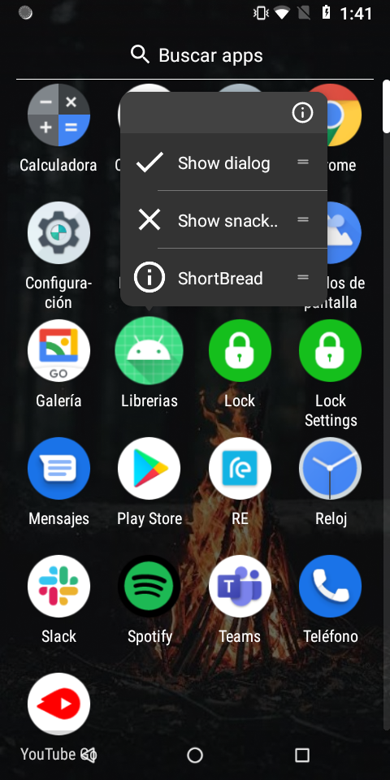

# Reto 03: Agregando más atajos

## Objetivo

* Agregar atajos que ejecuten funciones dentro de la app sin que el usuario presione algún botón.

## Desarrollo

En el ejemplo 03 se agregó un atajo y estudiamos cómo interactuar con él. Para completar este reto tendrás que agregar dos funciones que sean ejecutadas por los botones Show **SnackBar** y **Show Dialog**, del proyecto base, las cuales mostrarán los elementos antes mencionados “**SnackBar y AlertDialog**”.

Puedes encontrar más información en la documentación oficial.

[Haz clic aquí para abrir la documentación oficial de shorbread](https://github.com/MatthiasRobbers/shortbread)

Propuesta visual:



 

</br>
</br>

<details>
    <summary>Solución</summary>

1. Dentro del **ShortbreadActivity** agregamos dos funciones, una mostrará un **SnackBar** y la otra un **AlertDialog**.

    ```kotlin
    @Shortcut(
        id = "show_snack_bar",
        icon = R.drawable.ic_clear_white_24dp,
        shortLabel = "Show snackbar"
    )
    fun showSnackBar() {
        Snackbar.make(binding.content, "show_snack_bar", Snackbar.LENGTH_SHORT).show()

    }

    @Shortcut(id = "show_dialog", icon = R.drawable.ic_check_white_24dp, shortLabel = "Show dialog")
    fun showDialog() {
        AlertDialog.Builder(this)
            .setTitle("show_dialog")
            .setMessage(R.string.app_name)
            .setNegativeButton("close") { dialog, _ -> dialog.dismiss() }
            .setPositiveButton("Ok!") { dialog, _ ->
                dialog.dismiss()
                showToasty(
                    this,
                    SUCCESS,
                    "Ok!",
                    Toast.LENGTH_SHORT,
                    true,
                    null,
                    null
                )
            }.create().show()
    }
    ```

2. El código previo incorpora dos atajos, uno para cada función. Ahora llamemos estas funciones desde los botones correspondientes “**btnSnackBar y btnDialog**”.

    ```kotlin
    binding.btnSnackBar.setOnClickListener { showSnackBar() }
    binding.btnDialog.setOnClickListener { showDialog() }
    ```

3. Ejecutamos el proyecto, nos dirigimos al menú del sistema operativo y mantenemos presionado el ícono de nuestra app, el cual nos mostrará la opción que acabamos de agregar. Si haces clic en los siguientes botones, te enviarán respectivamente de la siguiente manera.

    - **Show snackbar:** te enviará a la pantalla y ejecutará la función que muestra el snackBar.
    - **Show dialog:** te enviará a la pantalla y ejecutará la función que muestra el alertDialog.

    De esta manera el usuario puede ser enlazado a cualquier pantalla sin pasar por el menú, además de ejecutar funciones, sin necesidad de presionar algún botón.

</details>

</br>

[Siguiente ](../Postwork/README.md)(Postwork)
