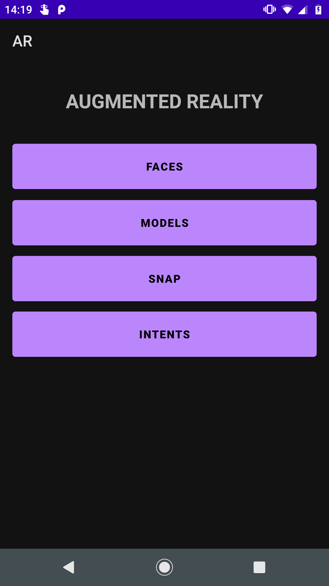
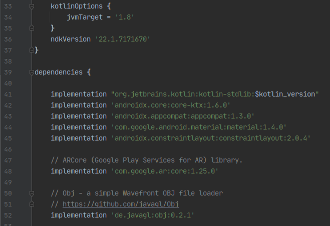
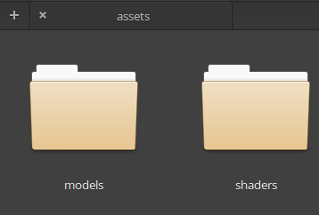
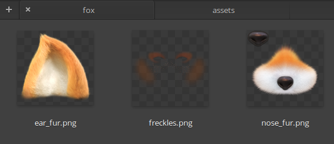

# Ejemplo 01: Implementando ArCore y cambiando rostros desde imágenes

## Objetivo

* Implementar ArCore en un proyecto base Android para cambiar la apariencia digital del rostro detectado por la cámara a partir de imágenes.

## Desarrollo

En el prework de esta sesión debiste crear desde cero un proyecto que contará con cuatro botones en su pantalla principal: “Faces, Models, Snap, e Intents”; de momento solo la pantalla de Intents debe contar con cinco botones, y el nombre de estos por ahora no importa.

Sólo si no te fue posible completar este proyecto puedes utilizar el [Proyecto base](./base),

El proyecto base muestra la siguiente interfaz:



Ahora revisaremos cómo implementar ArCore y cargar nuestro primer modelo 2D.
Para hacerlo realiza los siguientes pasos:

1. Abrimos el **Gradle** del módulo y agregamos las siguientes líneas de código.

    ```gradle
    ndkVersion '22.1.7171670'

    …

    // ARCore (Google Play Services for AR) library.
    implementation 'com.google.ar:core:1.25.0'

    // Obj - a simple Wavefront OBJ file loader
    // https://github.com/javagl/Obj
    implementation 'de.javagl:obj:0.2.1'
    ```

     

2. Sincronizamos el proyecto.

      

3. Creamos el xml **activity_face**, con la siguiente interfaz.

    ```xml
    <RelativeLayout xmlns:android="http://schemas.android.com/apk/res/android"
        xmlns:tools="http://schemas.android.com/tools"
        android:layout_width="match_parent"
        android:layout_height="match_parent"
        tools:context=".FaceActivity">

        <android.opengl.GLSurfaceView
            android:id="@+id/surfaceview"
            android:layout_width="fill_parent"
            android:layout_height="fill_parent"
            android:layout_gravity="top" />

    </RelativeLayout>
    ```

4. Ahora creamos la clase **FaceActivity**. Hasta este momento sólo contendrá el código básico.

    ```kotlin
    class FaceActivity : AppCompatActivity() {

        private lateinit var binding: ActivityFaceBinding

        override fun onCreate(savedInstanceState: Bundle?) {
            super.onCreate(savedInstanceState)

            binding = ActivityFaceBinding.inflate(layoutInflater)
            val view = binding.root
            setContentView(view)

        }
    }
    ```

5. Abrimos el **AndroidManifest** y agregamos los permisos, los metadatos, así como la actividad previamente creada.

    ```xml
    <uses-permission android:name="android.permission.INTERNET"/>

    <uses-permission android:name="android.permission.CAMERA"/>

    <uses-feature android:name="android.hardware.camera.ar" android:required="true"/>

    <uses-feature android:glEsVersion="0x00020000" android:required="true" />

    …

    <activity android:name=".FaceActivity" android:label="FACES"/>

    <meta-data android:name="com.google.ar.core" android:value="required" />
    ```

6. Nos dirigimos al **ActivityMain** y agregamos el botón, con su evento, que abrirá el **FaceActivity**.

    ```kotlin
    binding.btnFaces.setOnClickListener {
            val intent = Intent(this, FaceActivity::class.java)
            startActivity(intent)
    }
    ```

7. Después creamos el package **common** y dentro incluimos dos package: **helpers** y **rendering**.

      

8. Dentro de **helpers** crearemos dos clases. Estas serán **CameraPermissionHelper** y **DisplayRotationHelper**; la primera solicitará los permisos para utilizar la cámara y la segunda percibirá las rotaciones de la pantalla.

    - CameraPermissionHelper:

    ```kotlin
    object CameraPermissionHelper {
        private const val CAMERA_PERMISSION_CODE = 0
        private const val CAMERA_PERMISSION = Manifest.permission.CAMERA

        /** Check to see we have the necessary permissions for this app.  */
        fun hasCameraPermission(activity: Activity?): Boolean {
            return (ContextCompat.checkSelfPermission(activity!!, CAMERA_PERMISSION)
                    == PackageManager.PERMISSION_GRANTED)
        }

        /** Check to see we have the necessary permissions for this app, and ask for them if we don't.  */
        fun requestCameraPermission(activity: Activity?) {
            ActivityCompat.requestPermissions(
                activity!!, arrayOf(CAMERA_PERMISSION), CAMERA_PERMISSION_CODE
            )
        }

        /** Check to see if we need to show the rationale for this permission.  */
        fun shouldShowRequestPermissionRationale(activity: Activity?): Boolean {
            return ActivityCompat.shouldShowRequestPermissionRationale(activity!!, CAMERA_PERMISSION)
        }

        /** Launch Application Setting to grant permission.  */
        fun launchPermissionSettings(activity: Activity) {
            val intent = Intent()
            intent.action = Settings.ACTION_APPLICATION_DETAILS_SETTINGS
            intent.data = Uri.fromParts("package", activity.packageName, null)
            activity.startActivity(intent)
        }
    }
    ```

    - DisplayRotationHelper:

    ```kotlin
    /**
    * Helper to track the display rotations. In particular, the 180 degree rotations are not notified
    * by the onSurfaceChanged() callback, and thus they require listening to the android display
    * events.
    */
    class DisplayRotationHelper(context: Context) : DisplayListener {

        private var viewportChanged = false
        private var viewportWidth = 0
        private var viewportHeight = 0
        private val display: Display
        private val displayManager: DisplayManager =
            context.getSystemService(Context.DISPLAY_SERVICE) as DisplayManager

        /** Registers the display listener. Should be called from [Activity.onResume].  */
        fun onResume() {
            displayManager.registerDisplayListener(this, null)
        }

        /** Unregisters the display listener. Should be called from [Activity.onPause].  */
        fun onPause() {
            displayManager.unregisterDisplayListener(this)
        }

        /**
        * Records a change in surface dimensions. This will be later used by [ ][.updateSessionIfNeeded]. Should be called from [ ].
        *
        * @param width the updated width of the surface.
        * @param height the updated height of the surface.
        */
        fun onSurfaceChanged(width: Int, height: Int) {
            viewportWidth = width
            viewportHeight = height
            viewportChanged = true
        }

        /**
        * Updates the session display geometry if a change was posted either by [ ][.onSurfaceChanged] call or by [.onDisplayChanged] system callback. This
        * function should be called explicitly before each call to [Session.update]. This
        * function will also clear the 'pending update' (viewportChanged) flag.
        *
        * @param session the [Session] object to update if display geometry changed.
        */
        fun updateSessionIfNeeded(session: Session) {
            if (viewportChanged) {
                val displayRotation = display.rotation
                session.setDisplayGeometry(displayRotation, viewportWidth, viewportHeight)
                viewportChanged = false
            }
        }

        override fun onDisplayAdded(displayId: Int) {}
        override fun onDisplayRemoved(displayId: Int) {}
        override fun onDisplayChanged(displayId: Int) {
            viewportChanged = true
        }

        /**
        * Constructs the DisplayRotationHelper but does not register the listener yet.
        *
        * @param context the Android [Context].
        */
        init {
            val windowManager = context.getSystemService(Context.WINDOW_SERVICE) as WindowManager
            display = windowManager.defaultDisplay
        }
    }
    ```

9. Posteriormente descargamos tres archivos y los agregaremos dentro de **rendering**, los cuales se encargarán de renderizar los elementos en la pantalla. “Fondo y sombras”

    - BackgroundRenderer: [Url](./BackgroundRenderer.kt)
    - ObjectRenderer:  [Url](./ObjectRenderer.kt)
    - ShaderUtil: [Url](./ShaderUtil.java)

10. Creamos la clase **AugmentedFaceRenderer**, al mismo nivel que **FaceActivity**, con el siguiente código. Este renderiza el rostro.

    ```kotlin
    class AugmentedFaceRenderer {

        private var modelViewUniform = 0
        private var modelViewProjectionUniform = 0
        private var textureUniform = 0
        private var lightingParametersUniform = 0
        private var materialParametersUniform = 0
        private var colorCorrectionParameterUniform = 0
        private var tintColorUniform = 0
        private var attriVertices = 0
        private var attriUvs = 0
        private var attriNormals = 0

        // Set some default material properties to use for lighting.
        private var ambient = 0.3f
        private var diffuse = 1.0f
        private var specular = 1.0f
        private var specularPower = 6.0f
        private val textureId = IntArray(1)
        private var program = 0
        private val modelViewProjectionMat = FloatArray(16)
        private val modelViewMat = FloatArray(16)
        private val viewLightDirection = FloatArray(4)

        @Throws(IOException::class)
        fun createOnGlThread(context: Context, diffuseTextureAssetName: String) {
            val vertexShader: Int =
                loadGLShader(TAG, context, GLES20.GL_VERTEX_SHADER, VERTEX_SHADER_NAME)
            val fragmentShader: Int =
                loadGLShader(TAG, context, GLES20.GL_FRAGMENT_SHADER, FRAGMENT_SHADER_NAME)
            program = GLES20.glCreateProgram()
            GLES20.glAttachShader(program, vertexShader)
            GLES20.glAttachShader(program, fragmentShader)
            GLES20.glLinkProgram(program)
            modelViewProjectionUniform = GLES20.glGetUniformLocation(program, "u_ModelViewProjection")
            modelViewUniform = GLES20.glGetUniformLocation(program, "u_ModelView")
            textureUniform = GLES20.glGetUniformLocation(program, "u_Texture")
            lightingParametersUniform = GLES20.glGetUniformLocation(program, "u_LightningParameters")
            materialParametersUniform = GLES20.glGetUniformLocation(program, "u_MaterialParameters")
            colorCorrectionParameterUniform =
                GLES20.glGetUniformLocation(program, "u_ColorCorrectionParameters")
            tintColorUniform = GLES20.glGetUniformLocation(program, "u_TintColor")
            attriVertices = GLES20.glGetAttribLocation(program, "a_Position")
            attriUvs = GLES20.glGetAttribLocation(program, "a_TexCoord")
            attriNormals = GLES20.glGetAttribLocation(program, "a_Normal")
            GLES20.glActiveTexture(GLES20.GL_TEXTURE0)
            GLES20.glGenTextures(1, textureId, 0)
            loadTexture(context, textureId, diffuseTextureAssetName)
        }

        fun draw(
            projmtx: FloatArray?,
            viewmtx: FloatArray?,
            modelmtx: FloatArray?,
            colorCorrectionRgba: FloatArray?,
            face: AugmentedFace
        ) {
            val vertices = face.meshVertices
            val normals = face.meshNormals
            val textureCoords = face.meshTextureCoordinates
            val triangleIndices = face.meshTriangleIndices
            GLES20.glUseProgram(program)
            GLES20.glDepthMask(false)
            val modelViewProjectionMatTemp = FloatArray(16)
            Matrix.multiplyMM(modelViewProjectionMatTemp, 0, projmtx, 0, viewmtx, 0)
            Matrix.multiplyMM(modelViewProjectionMat, 0, modelViewProjectionMatTemp, 0, modelmtx, 0)
            Matrix.multiplyMM(modelViewMat, 0, viewmtx, 0, modelmtx, 0)

            // Set the lighting environment properties.
            Matrix.multiplyMV(viewLightDirection, 0, modelViewMat, 0, lightDirection, 0)
            normalizeVec3(viewLightDirection)
            GLES20.glUniform4f(
                lightingParametersUniform,
                viewLightDirection[0],
                viewLightDirection[1],
                viewLightDirection[2],
                1f
            )
            GLES20.glUniform4fv(colorCorrectionParameterUniform, 1, colorCorrectionRgba, 0)

            // Set the object material properties.
            GLES20.glUniform4f(materialParametersUniform, ambient, diffuse, specular, specularPower)

            // Set the ModelViewProjection matrix in the shader.
            GLES20.glUniformMatrix4fv(modelViewUniform, 1, false, modelViewMat, 0)
            GLES20.glUniformMatrix4fv(modelViewProjectionUniform, 1, false, modelViewProjectionMat, 0)
            GLES20.glEnableVertexAttribArray(attriVertices)
            GLES20.glVertexAttribPointer(attriVertices, 3, GLES20.GL_FLOAT, false, 0, vertices)
            GLES20.glEnableVertexAttribArray(attriNormals)
            GLES20.glVertexAttribPointer(attriNormals, 3, GLES20.GL_FLOAT, false, 0, normals)
            GLES20.glEnableVertexAttribArray(attriUvs)
            GLES20.glVertexAttribPointer(attriUvs, 2, GLES20.GL_FLOAT, false, 0, textureCoords)
            GLES20.glActiveTexture(GLES20.GL_TEXTURE0)
            GLES20.glUniform1i(textureUniform, 0)
            GLES20.glBindTexture(GLES20.GL_TEXTURE_2D, textureId[0])
            GLES20.glUniform4f(tintColorUniform, 0f, 0f, 0f, 0f)
            GLES20.glEnable(GLES20.GL_BLEND)

            // Textures are loaded with premultiplied alpha
            // (https://developer.android.com/reference/android/graphics/BitmapFactory.Options#inPremultiplied),
            // so we use the premultiplied alpha blend factors.
            GLES20.glBlendFunc(GLES20.GL_ONE, GLES20.GL_ONE_MINUS_SRC_ALPHA)
            GLES20.glDrawElements(
                GLES20.GL_TRIANGLES, triangleIndices.limit(), GLES20.GL_UNSIGNED_SHORT, triangleIndices
            )
            GLES20.glUseProgram(0)
            GLES20.glDepthMask(true)
        }

        fun setMaterialProperties(
            ambient: Float, diffuse: Float, specular: Float, specularPower: Float
        ) {
            this.ambient = ambient
            this.diffuse = diffuse
            this.specular = specular
            this.specularPower = specularPower
        }

        companion object {
            private val TAG = AugmentedFaceRenderer::class.java.simpleName
            private val lightDirection = floatArrayOf(0.0f, 1.0f, 0.0f, 0.0f)
            private const val VERTEX_SHADER_NAME = "shaders/object.vert"
            private const val FRAGMENT_SHADER_NAME = "shaders/object.frag"

            @Throws(IOException::class)
            private fun loadTexture(context: Context, textureId: IntArray, filename: String) {
                val textureBitmap = BitmapFactory.decodeStream(context.assets.open(filename))
                GLES20.glBindTexture(GLES20.GL_TEXTURE_2D, textureId[0])
                GLES20.glTexParameteri(
                    GLES20.GL_TEXTURE_2D, GLES20.GL_TEXTURE_MIN_FILTER, GLES20.GL_LINEAR_MIPMAP_LINEAR
                )
                GLES20.glTexParameteri(
                    GLES20.GL_TEXTURE_2D,
                    GLES20.GL_TEXTURE_MAG_FILTER,
                    GLES20.GL_LINEAR
                )
                GLUtils.texImage2D(GLES20.GL_TEXTURE_2D, 0, textureBitmap, 0)
                GLES20.glGenerateMipmap(GLES20.GL_TEXTURE_2D)
                GLES20.glBindTexture(GLES20.GL_TEXTURE_2D, 0)
                textureBitmap.recycle()
            }

            private fun normalizeVec3(v: FloatArray) {
                val reciprocalLength =
                    1.0f / Math.sqrt((v[0] * v[0] + v[1] * v[1] + v[2] * v[2]).toDouble())
                        .toFloat()
                v[0] *= reciprocalLength
                v[1] *= reciprocalLength
                v[2] *= reciprocalLength
            }
        }
    }
    ```

11. Después creamos el directorio **assets**.

     

     

12. Descargamos el siguiente [archivo comprimido](./assets.zip) y agregamos los archivos dentro de **assets**.

     

13. Ahora vamos a **FaceActivity**, agregamos las siguientes variables e implementamos la interfaz **GLSurfaceView.Renderer**.

    ```kotlin
    class FaceActivity : AppCompatActivity(), GLSurfaceView.Renderer {

        private lateinit var binding: ActivityFaceBinding

        private lateinit var surfaceView: GLSurfaceView

        private var installRequested = false
        private var session: Session? = null
        private var displayRotationHelper: DisplayRotationHelper? = null

        private val backgroundRenderer: BackgroundRenderer = BackgroundRenderer()
        private val augmentedFaceRenderer: AugmentedFaceRenderer = AugmentedFaceRenderer()
        private val noseObject: ObjectRenderer = ObjectRenderer()
        private val rightEarObject: ObjectRenderer = ObjectRenderer()
        private val leftEarObject: ObjectRenderer = ObjectRenderer()

        private val noseMatrix = FloatArray(16)
        private val rightEarMatrix = FloatArray(16)
        private val leftEarMatrix = FloatArray(16)

        private var freckles = "models/fox/freckles.png"
        private var noseFur = "models/fox/nose_fur.png"
        private var earFur = "models/fox/ear_fur.png"
    ```

14. A continuación agregamos la siguiente configuración dentro del **onCreate**.

    ```kotlin
    surfaceView = binding.surfaceview
    displayRotationHelper = DisplayRotationHelper( /*context=*/this)

    // Set up renderer.
    surfaceView.preserveEGLContextOnPause = true
    surfaceView.setEGLContextClientVersion(2)
    surfaceView.setEGLConfigChooser(8, 8, 8, 8, 16, 0) // Alpha used for plane blending.
    surfaceView.setRenderer(this)
    surfaceView.renderMode = GLSurfaceView.RENDERMODE_CONTINUOUSLY
    surfaceView.setWillNotDraw(false)
    installRequested = false
    ```

15. Añadimos las siguientes funciones para sobreescribir el **onDestroy, onResume y onPause**.

    ```kotlin
    override fun onDestroy() {
        if (session != null) {
            session!!.close()
            session = null
        }
        super.onDestroy()
    }

    override fun onResume() {
        super.onResume()
        if (session == null) {
            var exception: Exception? = null
            var message: String? = null
            try {
                when (ArCoreApk.getInstance().requestInstall(this, !installRequested)) {
                    ArCoreApk.InstallStatus.INSTALL_REQUESTED -> {
                        installRequested = true
                        return
                    }
                    ArCoreApk.InstallStatus.INSTALLED -> {
                    }
                }

                if (!CameraPermissionHelper.hasCameraPermission(this)) {
                    CameraPermissionHelper.requestCameraPermission(this)
                    return
                }

                session = Session( /* context= */this, EnumSet.noneOf(
                    Session.Feature::class.java
                )
                )
                val cameraConfigFilter = CameraConfigFilter(session)
                cameraConfigFilter.facingDirection = CameraConfig.FacingDirection.FRONT
                val cameraConfigs = session!!.getSupportedCameraConfigs(cameraConfigFilter)
                if (cameraConfigs.isNotEmpty()) {
                    session!!.cameraConfig = cameraConfigs[0]
                } else {
                    message = "This device does not have a front-facing (selfie) camera"
                    exception = UnavailableDeviceNotCompatibleException(message)
                }
                configureSession()
            } catch (e: UnavailableArcoreNotInstalledException) {
                message = "Please install ARCore"
                exception = e
            } catch (e: UnavailableUserDeclinedInstallationException) {
                message = "Please install ARCore"
                exception = e
            } catch (e: UnavailableApkTooOldException) {
                message = "Please update ARCore"
                exception = e
            } catch (e: UnavailableSdkTooOldException) {
                message = "Please update this app"
                exception = e
            } catch (e: UnavailableDeviceNotCompatibleException) {
                message = "This device does not support AR"
                exception = e
            } catch (e: Exception) {
                message = "Failed to create AR session"
                exception = e
            }
            if (message != null) {
                Snackbar.make(surfaceView, message, Snackbar.LENGTH_SHORT).show()
                Log.e(TAG, "Exception creating session", exception)
                return
            }
        }
        
        try {
            session!!.resume()
        } catch (e: CameraNotAvailableException) {
            Snackbar.make(
                surfaceView,
                "Camera not available. Try restarting the app.",
                Snackbar.LENGTH_SHORT
            ).show()
            session = null
            return
        }
        surfaceView.onResume()
        displayRotationHelper?.onResume()
    }

    public override fun onPause() {
        super.onPause()
        if (session != null) {
            displayRotationHelper?.onPause()
            surfaceView.onPause()
            session!!.pause()
        }
    }
    ```

16. Agregamos la función que solicitará el permiso para utilizar la cámara.

    ```kotlin
    override fun onRequestPermissionsResult(
        requestCode: Int,
        permissions: Array<String>,
        results: IntArray
    ) {
        super.onRequestPermissionsResult(requestCode, permissions, results)
        if (!CameraPermissionHelper.hasCameraPermission(this)) {
            Toast.makeText(
                this,
                "Camera permission is needed to run this application",
                Toast.LENGTH_LONG
            )
                .show()
            if (!CameraPermissionHelper.shouldShowRequestPermissionRationale(this)) {
                CameraPermissionHelper.launchPermissionSettings(this)
            }
            finish()
        }
    }
    ```

17. Por último, sumamos las funciones requeridas por la interfaz **GLSurfaceView.Renderer** con el siguiente código.

    ```kotlin
    override fun onSurfaceCreated(gl: GL10, config: EGLConfig) {
        GLES20.glClearColor(0.1f, 0.1f, 0.1f, 1.0f)
        setModel()
    }

    override fun onSurfaceChanged(gl: GL10, width: Int, height: Int) {
        displayRotationHelper?.onSurfaceChanged(width, height)
        GLES20.glViewport(0, 0, width, height)
        setModel()
    }

    override fun onDrawFrame(gl: GL10) {
        // Clear screen to notify driver it should not load any pixels from previous frame.
        GLES20.glClear(GLES20.GL_COLOR_BUFFER_BIT or GLES20.GL_DEPTH_BUFFER_BIT)
        if (session == null) {
            return
        }
        // Notify ARCore session that the view size changed so that the perspective matrix and
        // the video background can be properly adjusted.
        displayRotationHelper?.updateSessionIfNeeded(session!!)
        try {
            session!!.setCameraTextureName(backgroundRenderer.textureId)

            // Obtain the current frame from ARSession. When the configuration is set to
            // UpdateMode.BLOCKING (it is by default), this will throttle the rendering to the
            // camera framerate.
            val frame = session!!.update()
            val camera = frame.camera

            // Get projection matrix.
            val projectionMatrix = FloatArray(16)
            camera.getProjectionMatrix(projectionMatrix, 0, 0.1f, 100.0f)

            // Get camera matrix and draw.
            val viewMatrix = FloatArray(16)
            camera.getViewMatrix(viewMatrix, 0)

            // Compute lighting from average intensity of the image.
            // The first three components are color scaling factors.
            // The last one is the average pixel intensity in gamma space.
            val colorCorrectionRgba = FloatArray(4)
            frame.lightEstimate.getColorCorrection(colorCorrectionRgba, 0)

            // If frame is ready, render camera preview image to the GL surface.
            backgroundRenderer.draw(frame)

            // ARCore's face detection works best on upright faces, relative to gravity.
            // If the device cannot determine a screen side aligned with gravity, face
            // detection may not work optimally.
            val faces = session!!.getAllTrackables(
                AugmentedFace::class.java
            )
            for (face in faces) {
                if (face.trackingState != TrackingState.TRACKING) {
                    break
                }
                val scaleFactor = 1.0f

                // Face objects use transparency so they must be rendered back to front without depth write.
                GLES20.glDepthMask(false)

                // Each face's region poses, mesh vertices, and mesh normals are updated every frame.

                // 1. Render the face mesh first, behind any 3D objects attached to the face regions.
                val modelMatrix = FloatArray(16)
                face.centerPose.toMatrix(modelMatrix, 0)
                augmentedFaceRenderer.draw(
                    projectionMatrix, viewMatrix, modelMatrix, colorCorrectionRgba, face
                )

                // 2. Next, render the 3D objects attached to the forehead.
                face.getRegionPose(RegionType.FOREHEAD_RIGHT).toMatrix(rightEarMatrix, 0)
                rightEarObject.updateModelMatrix(rightEarMatrix, scaleFactor)
                rightEarObject.draw(
                    viewMatrix,
                    projectionMatrix,
                    colorCorrectionRgba,
                    DEFAULT_COLOR
                )
                face.getRegionPose(RegionType.FOREHEAD_LEFT).toMatrix(leftEarMatrix, 0)
                leftEarObject.updateModelMatrix(leftEarMatrix, scaleFactor)
                leftEarObject.draw(viewMatrix, projectionMatrix, colorCorrectionRgba, DEFAULT_COLOR)

                // 3. Render the nose last so that it is not occluded by face mesh or by 3D objects attached
                // to the forehead regions.
                face.getRegionPose(RegionType.NOSE_TIP).toMatrix(noseMatrix, 0)
                noseObject.updateModelMatrix(noseMatrix, scaleFactor)
                noseObject.draw(viewMatrix, projectionMatrix, colorCorrectionRgba, DEFAULT_COLOR)
            }
        } catch (t: Throwable) {
            // Avoid crashing the application due to unhandled exceptions.
            Log.e(TAG, "Exception on the OpenGL thread", t)
        } finally {
            GLES20.glDepthMask(true)
        }
    }

    private fun setModel() {
        // Prepare the rendering objects. This involves reading shaders, so may throw an IOException.
        try {
            // Create the texture and pass it to ARCore session to be filled during update().
            backgroundRenderer.createOnGlThread( /*context=*/this)
            augmentedFaceRenderer.createOnGlThread(this, freckles)
            augmentedFaceRenderer.setMaterialProperties(0.0f, 1.0f, 0.1f, 6.0f)
            noseObject.createOnGlThread( /*context=*/this, "models/nose.obj", noseFur)
            noseObject.setMaterialProperties(0.0f, 1.0f, 0.1f, 6.0f)
            noseObject.setBlendMode(ObjectRenderer.BlendMode.AlphaBlending)
            rightEarObject.createOnGlThread(this, "models/forehead_right.obj", earFur)
            rightEarObject.setMaterialProperties(0.0f, 1.0f, 0.1f, 6.0f)
            rightEarObject.setBlendMode(ObjectRenderer.BlendMode.AlphaBlending)
            leftEarObject.createOnGlThread(this, "models/forehead_left.obj", earFur)
            leftEarObject.setMaterialProperties(0.0f, 1.0f, 0.1f, 6.0f)
            leftEarObject.setBlendMode(ObjectRenderer.BlendMode.AlphaBlending)
        } catch (e: IOException) {
            Log.e(TAG, "Failed to read an asset file", e)
        }
    }

    private fun configureSession() {
        val config = Config(session)
        config.augmentedFaceMode = AugmentedFaceMode.MESH3D
        session!!.configure(config)
    }

    companion object {
        private val TAG = FaceActivity::class.java.simpleName
        private val DEFAULT_COLOR = floatArrayOf(0f, 0f, 0f, 0f)
    }
    ```

18. Ejecutamos el proyecto, hacemos clic en **Faces**, y el evento detonará la cámara frontal “Siempre y cuando nuestro teléfono disponga de los requerimientos mencionados durante el Prework”.

Intenta apuntar el teléfono a tu rostro y comenta el resultado.

 

</br>

**¡Felicidades!** Tu app ahora puede cambiar la apariencia digital del rostro a partir de imágenes, ¿pero cómo funciona esto? Revisa la carpeta fox dentro de los assets.

La carpeta contiene los recursos que agrega a tu rostro. En el siguiente reto agregarás un nuevo rostro con diferentes recursos.

 

</br>
</br>

[Siguiente ](../Reto-01/README.md)(Reto 1)