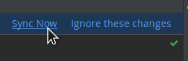

# Ejemplo 02: Visualizando modelos 3D en el proyecto

## Objetivo

* Establecer la capacidad de renderizar modelos 3D dentro de una app Android.

## Desarrollo

En este ejemplo visualizaremos modelos 3D en la app, prestación que permitirá al usuario interactuar con ellos como si realmente existieran en el mundo exterior.

Para hacerlo realizamos los siguientes pasos en el proyecto utilizado previamente.


1. Nos dirigimos al **Gradle** del módulo y agregamos las siguientes líneas de código.

    ```gradle
    implementation 'com.google.ar.sceneform.ux:sceneform-ux:1.17.1'
    implementation 'com.google.ar.sceneform:assets:1.17.1'
    ``` 

2. Abrimos el **gradle.properties** y agregamos la siguiente linea, ya que **sceneform** contiene las librerías de soporte y nuestro proyecto ya las tiene cargadas.

    ```gradle
    android.enableJetifier=true
    ```

3. Sincronizamos el proyecto.

      

4. Creamos el xml **activity_models** con la siguiente interfaz.

    ```xml
    <?xml version="1.0" encoding="utf-8"?>
    <RelativeLayout xmlns:android="http://schemas.android.com/apk/res/android"
        xmlns:tools="http://schemas.android.com/tools"
        android:layout_width="match_parent"
        android:layout_height="match_parent"
        tools:context=".ModelActivity">

        <androidx.fragment.app.FragmentContainerView
            android:id="@+id/fragment"
            android:name="com.google.ar.sceneform.ux.ArFragment"
            android:layout_width="match_parent"
            android:layout_height="match_parent" />

    </RelativeLayout>
    ```

5. Ahora creamos la clase **ModelActivity** con el siguiente código.

    ```kotlin
    class ModelActivity : AppCompatActivity() {

        private lateinit var binding: ActivityModelsBinding

        private var arFragment: ArFragment? = null
        private var modelRenderable: ModelRenderable? = null

        private val modelUrl = "https://github.com/beduExpert/Android-Avanzado-2021/raw/main/Sesion-08/Reto-02/models/Chair.glb"

        override fun onCreate(savedInstanceState: Bundle?) {
            super.onCreate(savedInstanceState)

            binding = ActivityModelsBinding.inflate(layoutInflater)
            val view = binding.root
            setContentView(view)

            arFragment = supportFragmentManager.findFragmentById(R.id.fragment) as ArFragment?

            setUpModel()
            setUpPlane()
        }

        private fun setUpModel() {
            ModelRenderable.builder().setSource(
                this,
                RenderableSource.builder()
                    .setSource(this, Uri.parse(modelUrl), RenderableSource.SourceType.GLB)
                    .setScale(0.75f).setRecenterMode(RenderableSource.RecenterMode.ROOT).build()
            )
                .setRegistryId(modelUrl)
                .build()
                .thenAccept { renderable: ModelRenderable? ->
                    modelRenderable = renderable
                }
                .exceptionally {
                    Log.i("Model", "cant load")
                    Toast.makeText(this@ModelActivity, "Model can't be Loaded", Toast.LENGTH_SHORT)
                        .show()
                    null
                }
        }

        private fun setUpPlane() {
            arFragment!!.setOnTapArPlaneListener { hitResult: HitResult, _: Plane?, _: MotionEvent? ->
                val anchor = hitResult.createAnchor()
                val anchorNode =
                    AnchorNode(anchor)
                anchorNode.setParent(arFragment!!.arSceneView.scene)
                createModel(anchorNode)
            }
        }

        private fun createModel(anchorNode: AnchorNode) {
            val node = TransformableNode(arFragment!!.transformationSystem)
            node.setParent(anchorNode)
            node.renderable = modelRenderable
            node.select()
        }
    }
    ```

6. Nos dirigimos al **ActivityMain** y agregamos el botón, con su respectivo evento, que abrirá el **ModelActivity**.

     ```kotlin
     binding.btnModels.setOnClickListener {
        val intent = Intent(this, ModelActivity::class.java)
        startActivity(intent)
    }
     ```

7. Abrimos el **AndroidManifest** y agregamos la actividad.

     ```xml
     <activity android:name=".ModelActivity" android:label="MODELS"/>
     ```

8. Ejecutamos el proyecto y hacemos clic en el botón **Models**. Necesitamos mover lentamente el dispositivo para que **ArCore** detecte la **superficie**. Una vez detectada se mostrarán puntos blancos; En ese momento hacemos clic sobre ellos, lo cual agrega una silla. 
Ahora interactúa con ella.

   

   

   

</br>

**¡Hecho!** Ahora nuestra app tiene la capacidad de renderizar modelos 3D.

</br>

[Siguiente ](../Reto-02/README.md)(Reto 2)