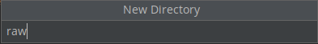
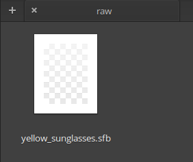
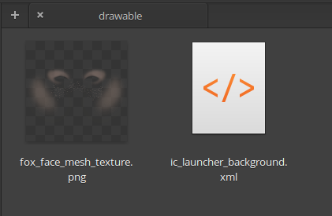

# Ejemplo 03: Mostrando rostros tipo Snapchat

## Objetivo

* Agregar modelos 3D sobre el rostro detectado por la cámara de un dispositivo android.

## Desarrollo

En el ejemplo 01 se agregaron imágenes 2D a la apariencia de rostros detectados con la cámara. Ahora se agregarán usando modelos 3D, lo que aporta una sensación más realista.

Realiza lo siguiente para renderizar los modelos.


1. Crea el directorio **raw**

     

     

2. Descarga el modelo de la [siguiente página](https://github.com/beduExpert/Android-Avanzado-2021/raw/main/Sesion-08/Ejemplo-03/models/yellow_sunglasses.sfb) y la textura de la [siguiente página](https://github.com/beduExpert/Android-Avanzado-2021/raw/main/Sesion-08/Ejemplo-03/models/fox_face_mesh_texture.png)

3. Pega el modelo en directorio raw y pega la textura en drawable.

      

      

4. Creamos la clase **CustomArFragment**.

    ```kotlin
    class CustomArFragment : ArFragment() {

        override fun getSessionConfiguration(session: Session): Config {
            val config = Config(session)
            config.augmentedFaceMode = Config.AugmentedFaceMode.MESH3D
            arSceneView.setupSession(session)
            return config
        }

        override fun getSessionFeatures(): Set<Session.Feature> {
            return EnumSet.of(Session.Feature.FRONT_CAMERA)
        }

        override fun onCreateView(
            inflater: LayoutInflater,
            container: ViewGroup?,
            savedInstanceState: Bundle?
        ): View? {
            val frameLayout =
                super.onCreateView(inflater, container, savedInstanceState) as FrameLayout?
            planeDiscoveryController.hide()
            planeDiscoveryController.setInstructionView(null)
            return frameLayout
        }
    }
    ```

5. Generamos el xml **activity_snap**. El fragment utilizado corresponde al creado previamente.

    ```xml
    <?xml version="1.0" encoding="utf-8"?>
    <androidx.constraintlayout.widget.ConstraintLayout xmlns:android="http://schemas.android.com/apk/res/android"
        xmlns:app="http://schemas.android.com/apk/res-auto"
        xmlns:tools="http://schemas.android.com/tools"
        android:layout_width="match_parent"
        android:layout_height="match_parent"
        tools:context=".MainActivity">

        <fragment
            android:id="@+id/arFragment"
            android:name="com.bedu.ar.CustomArFragment"
            android:layout_width="match_parent"
            android:layout_height="match_parent"
            tools:ignore="FragmentTagUsage" />

    </androidx.constraintlayout.widget.ConstraintLayout>
    ```

6. Ahora creamos la actividad **SnapActivity** con el siguiente código.

    ```kotlin
    class SnapActivity : AppCompatActivity() {

        private lateinit var binding: ActivitySnapBinding

        private var modelRenderable: ModelRenderable? = null
        private var texture: Texture? = null
        private var isAdded = false
        private val faceNodeMap = HashMap<AugmentedFace, AugmentedFaceNode>()

        override fun onCreate(savedInstanceState: Bundle?) {
            super.onCreate(savedInstanceState)

            binding = ActivitySnapBinding.inflate(layoutInflater)
            val view = binding.root
            setContentView(view)

            val customArFragment =
                supportFragmentManager.findFragmentById(R.id.arFragment) as CustomArFragment?

            setModels()

            if (customArFragment != null) {
                customArFragment.arSceneView.cameraStreamRenderPriority =
                    Renderable.RENDER_PRIORITY_FIRST
                customArFragment.arSceneView.scene.addOnUpdateListener {
                    if (modelRenderable == null || texture == null) {
                        return@addOnUpdateListener
                    }
                    val frame =
                        customArFragment.arSceneView.arFrame!!
                    val augmentedFaces =
                        frame.getUpdatedTrackables(
                            AugmentedFace::class.java
                        )

                    for (augmentedFace in augmentedFaces) {
                        if (isAdded) return@addOnUpdateListener
                        val augmentedFaceMode = AugmentedFaceNode(augmentedFace)
                        augmentedFaceMode.setParent(customArFragment.arSceneView.scene)
                        augmentedFaceMode.faceRegionsRenderable = modelRenderable
                        augmentedFaceMode.faceMeshTexture = texture
                        faceNodeMap[augmentedFace] = augmentedFaceMode
                        isAdded = true

                        // Remove any AugmentedFaceNodes associated with an AugmentedFace that stopped tracking.
                        val iterator: MutableIterator<Map.Entry<AugmentedFace, AugmentedFaceNode>> =
                            faceNodeMap.entries.iterator()
                        val entry =
                            iterator.next()
                        val face = entry.key
                        while (face.trackingState == TrackingState.STOPPED) {
                            val node = entry.value
                            node.setParent(null)
                            iterator.remove()
                        }
                    }
                }
            }
        }

        private fun setModels() {
            ModelRenderable.builder()
                .setSource(this, R.raw.yellow_sunglasses)
                .build()
                .thenAccept { rendarable: ModelRenderable? ->
                    modelRenderable = rendarable
                    modelRenderable!!.isShadowCaster = false
                    modelRenderable!!.isShadowReceiver = false
                }
                .exceptionally {
                    Toast.makeText(this, "error loading model", Toast.LENGTH_SHORT).show()
                    null
                }

            Texture.builder()
                .setSource(this, R.drawable.fox_face_mesh_texture)
                .build()
                .thenAccept { textureModel: Texture? ->
                    texture = textureModel
                }
                .exceptionally {
                    Toast.makeText(this, "cannot load texture", Toast.LENGTH_SHORT).show()
                    null
                }
        }
    }
    ```

7. Nos dirigimos al **ActivityMain** y agregamos el botón que abrirá el **SnapActivity** con su respectivo evento.

     ```kotlin
    binding.btnSnap.setOnClickListener {
            val intent = Intent(this, SnapActivity::class.java)
            startActivity(intent)
    }
     ```

8. Abrimos el **AndroidManifest** y agregamos el la actividad con el código siguiente.

     ```xml
     <activity android:name=".SnapActivity" android:label="SNAP"/>
     ```

9. Ejecutamos el proyecto, abrimos la pantalla de **Snap**, y apuntamos la cámara a nuestro rostro.

10. Comenta tus resultados.

    

</br>

**¡Súper!** Has concluido con la implementación para visualizar modelos 3D sobre el rostro detectado. 

</br>

[Siguiente ](../Reto-03/README.md)(Reto 3)