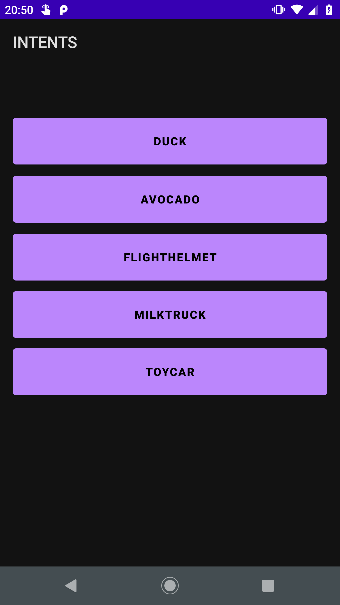
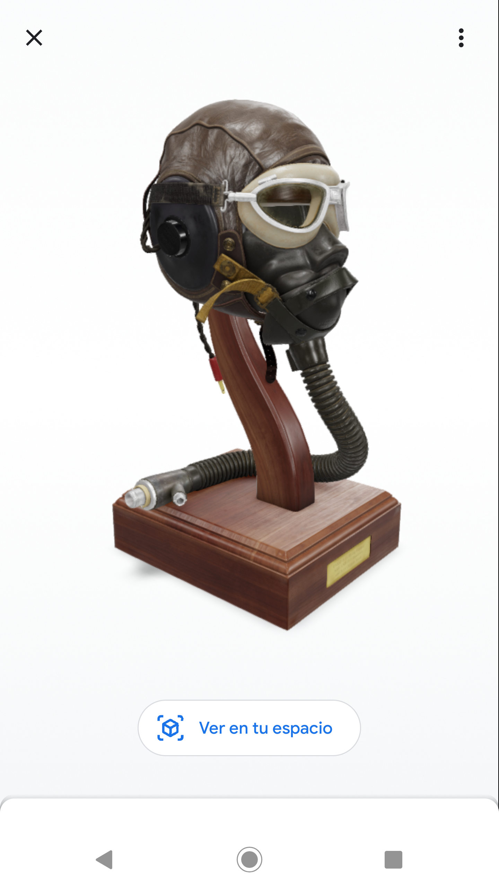

# Postwork 8 - Utilizando Scene Viewer

## Objetivo

- Hacer uso de Scene Viewer para visualizar modelos 3D en Google App y/o aplicación compatible a partir de intents.

## Desarrollo

Durante el Work de esta sesión implementamos ArCore, la cual permite agregar realidad aumentada a nuestras apps.

Scene Viewer es un visor inmersivo que permite agregar experiencias 3D y AR, permitiendo a los usuarios de dispositivos móviles Android obtener una vista previa, colocar, ver e interactuar fácilmente en su entorno con modelos 3D alojados en la web.

La mayoría de los navegadores de Android son compatibles con Scene Viewer, recientemente integrada con Google App. Scene Viewer ha sido implementado con éxito por muchos socios de Google para admitir de manera confiable experiencias 3D y AR, y también potencia estas experiencias para la Búsqueda de Google.

</br>

**La implementación es sencilla:**

- Las experiencias basadas en la web sólo requieren enlaces con el formato adecuado en una página web.
- Las experiencias basadas en aplicaciones sólo requieren la integración de unas pocas líneas de código Kotlin / Java.

</br>

**Requisitos de tiempo de ejecución de Scene Viewer:**

- Un dispositivo compatible con ARCore que ejecute Android 7.0 Nougat (API nivel 24) o posterior.
- Una versión actualizada (reciente) de Google Play Services para AR . Este servicio se instala automáticamente y se mantiene actualizado en la gran mayoría de los dispositivos compatibles con ARCore.
- Una versión actualizada de la aplicación de Google. Esta aplicación viene preinstalada y también se mantiene actualizada automáticamente en la gran mayoría de los dispositivos compatibles con ARCore.

Puedes encontrar más información en la documentación oficial.
[Haz clic aquí para abrir la documentación oficial de scene-viewer](https://developers.google.com/ar/develop/java/scene-viewer)

A continuación se presentan los requerimientos para este Postwork en el proyecto base y en el proyecto personal.

</br>

### Indicaciones generales:

- Parte 1 - Pantalla intents:
  
  - Los cinco botones deben enlazar intents a diferentes url’s, las cuales deben abrir Google App o el navegador con el modelo 3D.

  - Recuerda apoyarte con la documentación oficial, la cual muestra las opciones de personalización, que incluyen las siguientes. 
  
    Todos los botones deben de aplicar estas personalizaciones.

      - Nombre
      - Archivo
      - Modo de visualización
      - Permitir cambio de tamaño
    
  - Puedes encontrar algunos modelos en el [repositorio](https://github.com/beduExpert/Android-Avanzado-2021/tree/main/Sesion-08/Postwork/models)

- Parte 2 - Proyecto personal:

    - Agrega alguna sección a tu proyecto que contenga intents que se enlacen a Scene Viewer. Esta actividad es similar a la realizada en la primera parte de este postwork.

</br>
</br>

<details>
    <summary>Solución</summary>

1. Personalizar botones del xml **activity_intent**.

    ```xml
    <?xml version="1.0" encoding="utf-8"?>
    <androidx.constraintlayout.widget.ConstraintLayout xmlns:android="http://schemas.android.com/apk/res/android"
        xmlns:app="http://schemas.android.com/apk/res-auto"
        android:layout_width="match_parent"
        android:layout_height="match_parent"
        android:padding="16dp">

        <Button
            android:id="@+id/btnDuck"
            android:layout_width="0dp"
            android:layout_height="70dp"
            android:layout_marginTop="30dp"
            android:text="Duck"
            android:textStyle="bold"
            app:layout_constraintBottom_toBottomOf="parent"
            app:layout_constraintEnd_toEndOf="parent"
            app:layout_constraintStart_toStartOf="parent"
            app:layout_constraintTop_toTopOf="parent"
            app:layout_constraintVertical_bias="0.030" />

        <Button
            android:id="@+id/btnAvocado"
            android:layout_width="0dp"
            android:layout_height="70dp"
            android:text="Avocado"
            android:textStyle="bold"
            app:layout_constraintBottom_toBottomOf="parent"
            app:layout_constraintEnd_toEndOf="parent"
            app:layout_constraintStart_toStartOf="parent"
            app:layout_constraintTop_toBottomOf="@+id/btnDuck"
            app:layout_constraintVertical_bias="0.006" />

        <Button
            android:id="@+id/btnFlightHelmet"
            android:layout_width="0dp"
            android:layout_height="70dp"
            android:text="FlightHelmet"
            android:textStyle="bold"
            app:layout_constraintBottom_toBottomOf="parent"
            app:layout_constraintEnd_toEndOf="parent"
            app:layout_constraintStart_toStartOf="parent"
            app:layout_constraintTop_toBottomOf="@+id/btnAvocado"
            app:layout_constraintVertical_bias="0.006" />

        <Button
            android:id="@+id/btnMilkTruck"
            android:layout_width="0dp"
            android:layout_height="70dp"
            android:text="MilkTruck"
            android:textStyle="bold"
            app:layout_constraintBottom_toBottomOf="parent"
            app:layout_constraintEnd_toEndOf="parent"
            app:layout_constraintStart_toStartOf="parent"
            app:layout_constraintTop_toBottomOf="@+id/btnFlightHelmet"
            app:layout_constraintVertical_bias="0.006" />

        <Button
            android:id="@+id/btnToyCar"
            android:layout_width="0dp"
            android:layout_height="70dp"
            android:text="ToyCar"
            android:textStyle="bold"
            app:layout_constraintBottom_toBottomOf="parent"
            app:layout_constraintEnd_toEndOf="parent"
            app:layout_constraintStart_toStartOf="parent"
            app:layout_constraintTop_toBottomOf="@+id/btnMilkTruck"
            app:layout_constraintVertical_bias="0.006" />

    </androidx.constraintlayout.widget.ConstraintLayout>
    ```

2. Agregar función genérica para crear y enviar los **intents** dentro del **IntentActivity**.

    ```kotlin
    private fun startSceneView(file: String, onlyAr: Boolean, title: String) {
        val sceneViewerIntent = Intent(Intent.ACTION_VIEW)

        val intentUri =
            if (onlyAr) Uri.parse("https://arvr.google.com/scene-viewer/1.0").buildUpon()
                .appendQueryParameter("file", file)
                .appendQueryParameter("mode", "ar_only")
                .appendQueryParameter("title", title)
                .appendQueryParameter("resizable", "true")
                .build()
            else Uri.parse(
                "https://arvr.google.com/scene-viewer/1.0?file=$file"
            )
        sceneViewerIntent.data = intentUri

        sceneViewerIntent.setPackage("com.google.android.googlequicksearchbox")
        startActivity(sceneViewerIntent)
    }
    ```

3. Agregar eventos a los botones, y además ejecutar la función creada anteriormente. Se agrega dentro del **onCreate** del **IntentActivity** lo siguiente.

    ```kotlin
    binding.btnDuck.setOnClickListener {
        startSceneView(
            "https://github.com/beduExpert/Android-Avanzado-2021/raw/main/Sesion-08/Postwork/models/Duck/glTF/Duck.gltf",
            false,
            "Duck"
        )
    }
    binding.btnAvocado.setOnClickListener {
        startSceneView(
            "https://github.com/beduExpert/Android-Avanzado-2021/raw/main/Sesion-08/Postwork/models/Avocado/glTF/Avocado.gltf",
            true,
            "Avocado"
        )
    }
    binding.btnFlightHelmet.setOnClickListener {
        startSceneView(
            "https://github.com/beduExpert/Android-Avanzado-2021/raw/main/Sesion-08/Postwork/models/FlightHelmet/glTF/FlightHelmet.gltf",
            false,
            "FlightHelmet"
        )
    }
    binding.btnMilkTruck.setOnClickListener {
        startSceneView(
            "https://github.com/beduExpert/Android-Avanzado-2021/raw/main/Sesion-08/Postwork/models/CesiumMilkTruck/glTF/CesiumMilkTruck.gltf",
            false,
            "MilkTruck"
        )
    }
    binding.btnToyCar.setOnClickListener {
        startSceneView(
            "https://github.com/beduExpert/Android-Avanzado-2021/raw/main/Sesion-08/Postwork/models/ToyCar/glTF/ToyCar.gltf",
            false,
            "ToyCar"
        )
    }
    ```

4. Ejecutamos el proyecto, abrimos la pantalla **Intents**, y al hacer clic en alguno de los botones abre Google App con el modelo 3D asignado. 

</details>

</br>

Propuesta visual:



 

 

 

</br>
</br>

[Regresar ](../)(Sesion 8)

[Ir a incio ](../../README.md)(Android-Avanzado-2021)