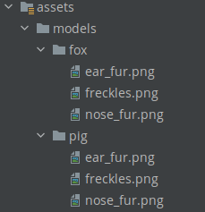

# Reto 01: Agregando nuevo rostro

## Objetivo

* Agregar nueva apariencia digital al rostro a partir de imágenes y de una nueva interfaz.

## Desarrollo

En el ejemplo 1 se incorporaron las imágenes de un zorro para visualizarlas cuando se detecte un rostro. 

Ahora, para completar este reto necesitas sumar los siguientes puntos al proyecto:

1. Dentro de **FaceActivity**, agrega dos botones: “Pig y Fox” los cuales mostrarán el rostro según la opción elegida.

    - **a. Pig:** Muestra la “cara”, es decir orejas y boca, de un puerco.
    - **b. Fox:** Muestra lo agregado en el ejemplo 01.

    </br>

    Puedes buscar en Google los recursos, o bien tomarlos del siguiente recurso [zip con los archivos](./pig.zip).

</br>

Propuesta visual:

 

</br>
</br>

<details>
    <summary>Solución</summary>

1. Crea la carpeta **Pig** y agrega los archivos del zip.
      

2. Crea los botones en el xml **activity_face**.

    ```xml
    <Button
        android:id="@+id/btnPig"
        android:layout_width="wrap_content"
        android:layout_height="wrap_content"
        android:layout_alignParentBottom="true"
        android:text="Pig" />

    <Button
        android:id="@+id/btnFox"
        android:layout_width="wrap_content"
        android:layout_height="wrap_content"
        android:layout_alignParentEnd="true"
        android:layout_alignParentBottom="true"
        android:text="Fox" />
    ```

3. Agrega los eventos de los botones, y dentro agrega las llamadas para renderizar los elementos.

    ```kotlin
    binding.btnFox.setOnClickListener {
        earFur = "models/fox/ear_fur.png"
        freckles = "models/fox/freckles.png"
        noseFur = "models/fox/nose_fur.png"

        surfaceView.onPause()
        surfaceView.onResume()
    }
    binding.btnPig.setOnClickListener {
        earFur = "models/pig/ear_fur.png"
        freckles = "models/pig/freckles.png"
        noseFur = "models/pig/nose_fur.png"

        surfaceView.onPause()
        surfaceView.onResume()
    }
    ```

4. Se ejecuta el proyecto. Se hace clic en **Faces** y ahora se prueban los botones. Verás que cada uno muestra una apariencia de rostro diferente.

</details>

</br>
</br>

[Siguiente ](../Ejemplo-02/README.md)(Ejemplo 2)
