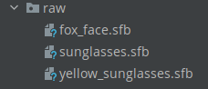

# Reto 03: Personalizando opciones

## Objetivo

* Agregar modelos 3D sobre el rostro detectado por la cámara de un dispositivo android.

## Desarrollo

En el ejemplo 03 se agregó un modelo 3D que se incorpora al rostro detectado por la cámara. Para completar este reto debes agregar dos modelos 3D y el usuario debe tener la opción de seleccionar estos modelos desde la interfaz. Puedes agregar botones que realicen estos cambios.

Recomendaciones y recursos para la resolución:

- Modifica la función setModels.
- El siguiente bloque de código limpia los modelos agregados a la vista..

  ```kotlin
  val iterator: MutableIterator<Map.Entry<AugmentedFace, AugmentedFaceNode>> =
                faceNodeMap.entries.iterator()
            while (iterator.hasNext()) {
                val entry = iterator.next()
                val node = entry.value
                node.setParent(null)
                iterator.remove()
            }
  ```

- Para forzar la actualización puedes pausar y reactivar el fragmento. 
- Los modelos están disponibles en el repositorio de la sesión.

    [Haz clic aquí para abrir el repositorio de la sesión](https://github.com/beduExpert/Android-Avanzado-2021/tree/main/Sesion-08/Ejemplo-03/models)

</br>

Propuesta visual:

 

</br>
</br>

<details>
    <summary>Solución</summary>

1. Agrega los modelos en **raw**.

      

2. Modifica la función **setModels**.

    ```kotlin
    private fun setModels(rawId: Int, fromButtonClick: Boolean, customArFragment: Any?) {
        ModelRenderable.builder()
            .setSource(this, rawId)
            .build()
            .thenAccept { rendarable: ModelRenderable? ->
                modelRenderable = rendarable
                modelRenderable!!.isShadowCaster = false
                modelRenderable!!.isShadowReceiver = false
            }
            .exceptionally {
                Toast.makeText(this, "error loading model", Toast.LENGTH_SHORT).show()
                null
            }

        Texture.builder()
            .setSource(this, R.drawable.fox_face_mesh_texture)
            .build()
            .thenAccept { textureModel: Texture? ->
                texture = textureModel
            }
            .exceptionally {
                Toast.makeText(this, "cannot load texture", Toast.LENGTH_SHORT).show()
                null
            }

        if (fromButtonClick && (customArFragment is CustomArFragment)) {
            customArFragment.onPause()
            customArFragment.onResume()
            removeAll = true
            isAdded = false
        }
    }
    ```

3. Agrega los botones a la interfaz.

    ```xml
    <Button
        android:id="@+id/btnOne"
        android:layout_width="wrap_content"
        android:layout_height="wrap_content"
        android:text="1"
        app:layout_constraintBottom_toBottomOf="parent"
        app:layout_constraintStart_toStartOf="parent" />

    <Button
        android:id="@+id/btnTwo"
        android:layout_width="wrap_content"
        android:layout_height="wrap_content"
        android:text="2"
        app:layout_constraintBottom_toBottomOf="parent"
        app:layout_constraintEnd_toEndOf="parent"
        app:layout_constraintStart_toStartOf="parent" />

    <Button
        android:id="@+id/btnThree"
        android:layout_width="wrap_content"
        android:layout_height="wrap_content"
        android:text="3"
        app:layout_constraintBottom_toBottomOf="parent"
        app:layout_constraintEnd_toEndOf="parent" />
    ```

4. Agrega los eventos de los botones y reemplaza la llamada a **setModels** desde el **onCreated**.

    ```kotlin
    setModels(R.raw.yellow_sunglasses, false, null)

    binding.btnOne.setOnClickListener { setModels(R.raw.yellow_sunglasses, true, customArFragment) }
    binding.btnTwo.setOnClickListener { setModels(R.raw.sunglasses, true, customArFragment) }
    binding.btnThree.setOnClickListener { setModels(R.raw.fox_face, true, customArFragment) }
    ```

5. Limpia los modelos agregados, dentro del **UpdateListener**.

    ```kotlin
    if (removeAll) {
        val iterator: MutableIterator<Map.Entry<AugmentedFace, AugmentedFaceNode>> =
            faceNodeMap.entries.iterator()
        while (iterator.hasNext()) {
            val entry = iterator.next()
            val node = entry.value
            node.setParent(null)
            iterator.remove()
        }
        removeAll = false
    }
    ```

6. Agrega la variable que servirá como bandera.

    ```kotlin
    private var removeAll = false
    ```

7. Ejecuta el proyecto, haz clic en **Snap**, acerca tu rostro al teléfono y presiona los botones. Deberías notar que la apariencia cambia de acuerdo al modelo seleccionado.

</details>

</br>
</br>

[Siguiente ](../Postwork/README.md)(Postwork)
